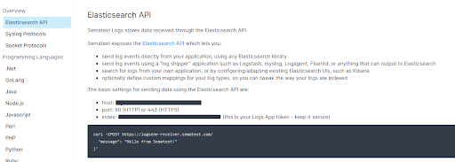
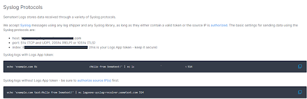

title: Sending Log Events
description: Send new log events to Sematext using Elasticsearch API or syslog, and log shippers such as  Logstash, Fluentd, rsyslog, syslog-ng, Fluentbit and more

The simplest way to ship logs to Sematext is via the [Discovery](discovery/intro/) screen after the [initial setup](discovery/setup/).  Alernatively, there are many other ways to ship log events to Sematext.  Because Sematext exposes an API compatible with Elasticsearch and OpenSearch, any of the numerous log shippers or log libraries that have Elasticsearch outputs (or "adapters") can be used to ship logs.  Sematext also accepts syslogs.

  - HTTP / HTTPS (ports 80 / 443), by using the Elasticsearch API on
    **logsene-receiver.sematext.com** / **logsene-receiver.eu.sematext.com**
  - UDP / TCP / RELP / TLS, by using the syslog receiver on
    **logsene-syslog-receiver.sematext.com** / **logsene-syslog-receiver.eu.sematext.com**
  - UDP / TCP by using the socket receiver for JSON on 
    **logsene-syslog-receiver.sematext.com** / **logsene-syslog-receiver.eu.sematext.com**

All options work with log shippers such as
[Logstash](logstash),
[Fluentd](https://github.com/uken/fluent-plugin-elasticsearch),
[Fluent Bit](fluentbit),
[rsyslog](rsyslog) or
[syslog-ng](syslog-ng)... and many, many more.  Instructions for a lot more log shipping methods are inside Sematext Cloud itself.

Additionally, you can always write your own application or script that works with
[Elasticsearch](index-events-via-elasticsearch-api) or syslog or any other tool that can send data to
[Sematext's Elasticsearch API](index-events-via-elasticsearch-api).

### Elasticsearch API

The easiest way to **send logs is with** [Sematext Agent](../agents/sematext-agent), [Logstash](../logs/logstash), or Filebeat. Have in mind any log shipper will get the job done. You can also use **any tool that works with Elasticsearch's REST API**, for both [indexing](../logs/index-events-via-elasticsearch-api) and [searching](../logs/search-through-the-elasticsearch-api). 

If you're using a particular **programming language**, configuring your **logging framework to send data to Sematext Logs** is also an option.

The only condition is to **use the App's token as the index name**, and `https://logsene-receiver.sematext.com:443`, or `https://logsene-receiver.eu.sematext.com:443` as the Elasticsearch endpoint.

Here's how to send a message from the terminal.
```bash
curl -XPOST https://logsene-receiver.sematext.com/YOUR-TOKEN-GOES-RIGHT-HERE/example/ -d '{
  "message": "Hello from Sematext!"
}'
```

Here `example` represents the desired type. It can be anything from `log`, `event`, `host`, `node`, and anything in between, giving freedom to create custom types for logs. This value gets stored in the `logsene_type` field allowing for easy filtering on types when needed.



[This guide](../logs/index-events-via-elasticsearch-api/) will show you more details on using the Elasticsearch REST API with Sematext.

### Syslog

You can forward syslog via **UDP** (port 514), **TCP** (port 514), **RELP** (port 20514) and **TLS** (port 10514). The host name is **logsene-syslog-receiver.sematext.com** / **logsene-syslog-receiver.eu.sematext.com**

To get started with syslog shipping quickly, you can use our configuration script and add your App token as a parameter:

``` bash
curl -O https://apps.sematext.com/logsene/configure-syslog.py
sudo python configure-syslog.py $YOUR-TOKEN-GOES-RIGHT-HERE
```

You can also use this snippet:

```bash
echo 'example.com eed460a3-9516-458c-8c5c-8e7c495665cd:Hello from Sematext!' | nc logsene-syslog-receiver.sematext.com 514
```



For more details, take a look at the [Syslog](../logs/syslog) page, and the pages that are linked from it.
