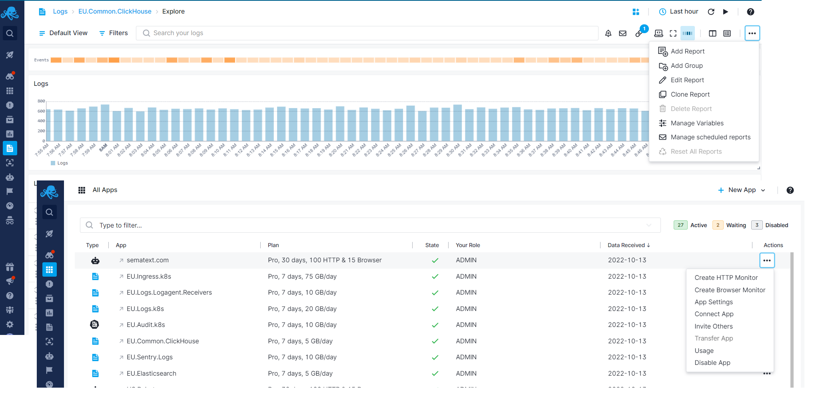
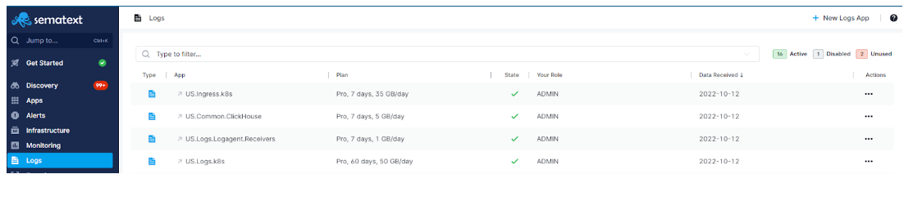
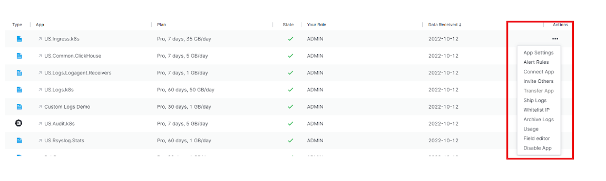

title: Sematext Logs Settings
description: Learn more about how Sematext Logs works, all settings and configuration options, but also how to use the interface efficiently.

The settings include:

  - inviting new users to your App
  - [authorizing public IPs to send data to your app via syslog](../logs/authorizing-ips-for-syslog)
  - adjusting data retention time, daily volume, and limits
  - [changing your App's plan](../logs/faq/#plans-prices)
  - checking how much data is, or has been shipped to your App

  

## Side Navigation

The persistent region on the left that can be collapsed, is used to easily switch across monitoring, log management, real user monitoring, and other user & team features. All side navigation tabs are selectable. If they have chevrons, it indicates that the top level section is collapsible and contains additional subitems. The subitems will let you explore all your Apps, or choose a particular App.

Side navigation top level sections for infrastructure and application performance monitoring, log management, and real user monitoring:

- [Discovery](https://sematext.com/docs/logs/discovery/intro/)
- [Infrastructure](https://sematext.com/docs/monitoring/infrastructure/)
- [Monitoring](https://sematext.com/docs/monitoring/)
- [Logs](https://sematext.com/docs/logs/)
- [Synthetics](https://sematext.com/docs/synthetics/)
- [Experience](https://sematext.com/docs/experience/)
- [Alerts](https://sematext.com/docs/experience/)
- [Events](https://sematext.com/docs/events/)
- [Dashboards](https://sematext.com/docs/dashboards/)

Side navigation sections for team features and settings:

- [Team](https://sematext.com/docs/team/)
- Settings

## App Actions

The Logs App view allows for easy interaction between various App settings.
From the App Actions drop down menu, the horizontal elipsis icon shows your App options and lets you open various App-specific function, like, **App Settings, alert rules, connect App, invite team members, ship logs, whitelist IPs, archive logs, see usage, and transfer App ownership.**

## Report Selector

Once you create a Logs App, and start shipping data, you will get a **default Report created for you named Explore**. It will have the default data and default [component](#components) configuration. You can edit this Report, clone it, or create new ones. 

### Report Settings
 - **Report Actions** - Your customized logs report can be better described using meta name and description, and you can assign a unique URL Alias to identify that report.
 - **Legends Position and Extended Charts features** - Except in the default overview mode, each **report can have legends** for each metric name, arranged below, to the left, or hidden entirely for better chart interaction. Extended charts are also displayed below and provide a comparative view into a longer time span relative to the time frame displayed in the main chart. Just like report legends, the extended view can be hidden and only the chart with X and Y values will be displayed.

## Logs Search and Report Menu

Alerts and Logs are integrated into a single reports pane, and used to search logs, create alerts for anomalies, and much more. 

Our [log management platform](https://sematext.com/logsene/) gives you the ability to create your own queries through its [Elasticsearch API](https://sematext.com/docs/logs/search-through-the-elasticsearch-api/) as well as using simple query syntax very much like the [query syntax](https://sematext.com/docs/logs/search-syntax/) used by Google.

You can also create and integrate [alerts](https://sematext.com/docs/alerts/) with commonly used collaboration and messaging software such as [Hipchat](https://sematext.com/docs/integration/alerts-hipchat-integration/), [Slack](https://sematext.com/docs/integration/alerts-slack-integration/), [Big Panda](https://sematext.com/docs/integration/alerts-bigpanda-integration/), [PagerDuty](https://sematext.com/docs/integration/alerts-pagerduty-integration/), [VictorOps](https://sematext.com/docs/integration/alerts-victorops-integration/), [OpsGenie](https://sematext.com/docs/integration/alerts-opsgenie-integration/) or simply by using your email address(es). Use these services to continuously monitor large volume of data and logs, and ensure that you are alerted in time.

## Integrations

You will need to install **a Log Shipper or Library** so data can be shipped to your Logs App. This section will guide you through installing and running a Log Shipper.
	
Please refer to the [Integrations](https://sematext.com/docs/integration/) documentation pages for particular tech you wish to monitor. Learn more about how to monitor various programming languages, operating systems, containers (Docker, Kubernetes, Mesos), Cloud IaaS / PaaS services, iOS, Android, AWS EC2, AWS s3, and how to integrate log management with log shippers. You'll find detailed information on how to install and configure different agents required to start sending your logs and metrics data to Sematext Cloud there.

The next section describes the Logs reports & components and help you discover how to add new components, correlate your logs and events with your Logs App, do report specific actions, connect your Apps and more.
