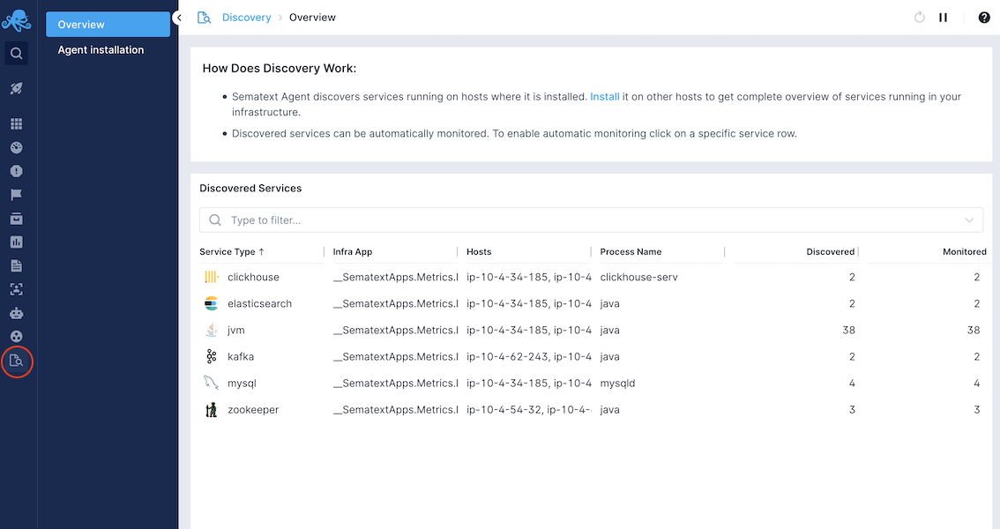
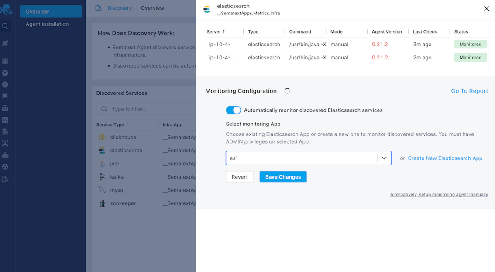

title: Sematext Autodiscovery Monitoring
description: Sematext Autodiscovery Monitoring automatically scans for services that can be monitored using Sematext Agent and, depending on your configuration, automatically sets up monitoring agents. 

## Autodiscovery Monitoring

The centerpiece of Autodiscovery feature is Sematext Agent which scans for services that can be monitoring by Sematext supported integrations. It works in both bare-metal/virtualMachine and in container environments. The data about such discovered services is sent to Sematext backend and displayed in UI under Discovery option in the menu on the left.

Autodiscovered services can be monitored in two ways:
- **Manually** - in case of bare-metal/virtualMachine setups, you can use classic Agent installation instructions known from the past. In container environments you can just add MONITORING_TOKEN as environment variable to your container and Sematext Agent will automatically match it to the type of discovered service and set up monitoring agent container specifically for that service. In some cases you'll also have to provide credentials (like MySQL username/password) as environment variable or (in case of k8s) as a secret. Again, just follow the classic monitoring installation instructions in UI to set this up.
- **Automatically** - this new feature is available via UI when clicking on discovered service in Discovery view. In many cases Sematext Agent will be able to set up monitoring agent without requiring any changes from you and without restart of service you wish to monitor. As services appear over time, Sematext Agent automatically ensures new monitoring agents are created when the rule specified in the UI defines so. For each discovered service type you can enable or disable automatic monitoring at any point. For example, if Sematext Agent discovered your Elasticsearch cluster and you see it in Discovery UI, you can easily start its monitoring by a single click in the UI, no actions are required from you on Elasticsearch nodes. Similarly, if you decide to stop monitoring the cluster, single click in the UI will do the trick again. Automatic autodiscovery monitoring is supported both in bare-metal/virtualMachine and container environments. 

### How to start the Autodiscovery?

Simply visit Discovery option in the menu on the left side. You will be presented with instructions to install Sematext Agent. On each machine (or k8s/swarm cluster) Sematext Agent
is installed, it will instantly start discovering services that can be monitored. Those services will be displayed in Autodiscovery table from where you can click on it to enable automatic monitoring. In most cases Sematext Agent knows how to set up the monitor without requiring any additional actions from you, which means the metrics will start appearing few seconds after you enable automatic monitoring. In other cases you may have to provide credentials so monitoring agents can connect to the service you wish to monitor (in any case, Autodiscovery UI will tell you exactly what to do).

### How does Sematext Autodiscovery Monitoring work in bare-metal/virtualMachine environments?

It is enough to install sematext-agent rpm/deb package and set up one of your Infra App tokens (just follow UI instructions for this). This will start Sematext Agent which will
automatically start scanning for known service types. Separately, it will connect to Sematext backend to fetch info about any automatic monitoring rules you may have defined in UI.

In bare-metal/vritualMachine environments, Sematext Agent will automatically create monitoring agents only if configured so in the UI.

### How does Sematext Autodiscovery Monitoring work in container environments? 

The Sematext Agent container gets distributed to every Kubernetes, Docker Swarm or Docker Enterprise node. Then it starts watching container events and compares the image or process name of started containers with a list of application names defined in a configuration template. Then Sematext Agent connects the container network and configures Sematext Agent for the right IP-address and port and other settings according to the configuration template.

In container environments, Sematext Agent will create a monitoring agent if it finds MONITORING_TOKEN in environment variables or labels of your service or if you enabled automatic monitoring for specific service type in the UI. 

Example: Steps required to monitor a containerized application like Elasticsearch manually: 
1. Visit SematextCloud UI, create new Elasticsearch App, open container env instructions
2. Following the UI instructions, deploy Sematext Agent container (as a standalone container, as Kubernetes DaemonSet or as global Swarm Service)
3. Add the Elasticsearch MONITORING_TOKEN as label or environment variable to your Elasticsearch container
4. Restart your Elasticsearch container to apply the label/environment variable

Example: Steps required to monitor a containerized application like Elasticsearch automatically: 
1. Visit Discovery in UI - open instructions to install Sematext Agent in container env
2. Following the UI instructions, deploy Sematext Agent container (as a standalone container, as Kubernetes DaemonSet or as global Swarm Service)
3. From Discovery UI, click on any of discovered services and enable automatic monitoring option

As soon Sematext Agent discovers the Elasticsearch container (having a MONITORING_TOKEN set or having automatic monitoring option enabled) it will set up monitoring agent container which will start to collect the Elasticsearch metrics. 

### Can I have a mix of manually and automatically monitored services?

Yes. In case of bare-metal/virtualMachine environments, just follow the classic installation instructions to set up "manually" monitored service agent. Sematext Agent will recognize it as manually set up and will not apply any of automatic monitoring rules on it. Automatic monitoring can be specified on service type level in Discovery UI and will be applied for any instance of that service except those that already have manually set up agent.

In container envs just add MONITORING_TOKEN environment variable (or label) to container of the service you wish to monitor manually. Automatic monitoring can again be enabled in UI and Sematext Agent will again "know" which service instances have manually set up agent and which should get automatic monitoring rule applied.  

In all environments this makes it possible to use different monitoring tokens (and different Sematext Apps) for the same service type running on the same machine (or in the same k8s/swarm cluster).

### Additional info

- Defining monitoring agent [credential sets](../agents/sematext-agent/autodisco/credential-sets) in Kubernetes.
- Providing [MySQL JDBC driver](../agents/sematext-agent/autodisco/mysql-driver) in container environments.
- [Removing stale](../agents/sematext-agent/autodisco/removing-stale-resources) Sematext Agent resources after deinstallation.
