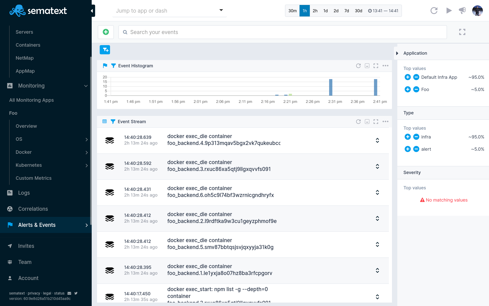

title: Sematext Core Container Monitoring
description: Monitor Docker and containerd containers, container orchestration systems like kubernetes, swarm and nomad, or cloud container orchestration services EKS, ECS, AKS, GKE with Sematext by installing simple Docker Certified Agents and using our interface that shows everything in one simple screen.

Monitor [Docker](https://www.docker.com/) and containerd containers, container orchestration systems like kubernetes, swarm and nomad, or cloud container orchestration services EKS, ECS, AKS, GKE with Sematext by installing simple [Docker Certified Agents](https://hub.docker.com/_/sematext-agent-monitoring-and-logging) and using our interface that shows everything in one simple screen.

## Create a Sematext Monitoring App
Creating a Sematext Monitoring App is as easy as choosing the Infra integration and giving the App a name.

<video style="display:block; width:100%; height:auto;" controls autoplay>
  <source src="https://cdn.sematext.com/videos/sematext-create-infra-app.mp4" type="video/mp4" />
</video>

## Install the Sematext Agent
Sematext can easily monitor your containers with the Sematext Agent. [Installing](../agents/sematext-agent/containers/installation) the Agent is as simple as running one command on each host.

- [Docker](../agents/sematext-agent/containers/installation/#docker)
- [Docker Compose](../agents/sematext-agent/containers/installation/#docker-compose)
- [Docker Swarm](../agents/sematext-agent/containers/installation/#docker-swarm-enterprise)

## See Container data in Sematext Monitoring
Sematext Agent collects a plethora of metrics about hosts (CPU, memory, disk, network, processes), containers (Docker, containerd) and orchestrator platforms and ships that to Sematext Cloud.

<video style="display:block; width:100%; height:auto;" controls>
  <source src="https://cdn.sematext.com/videos/sematext-shipping-docker-metrics.mp4" type="video/mp4" />
</video>

You can see host and container metrics or have a high-level overview of all your containers in Infrastructure reports.

Check out the [Sematext Agent installation for containers](../agents/sematext-agent/containers/installation) guide for more info.

## Container Alerting
To save you time Sematext automatically creates a set of default alert rules such as alerts for low disk space. You can [create additional alerts](../alerts) on any metric.

There are 3 types of [alerts](../alerts) in Sematext:

- **Heartbeat alerts**, which notify you when a server is down
- **Threshold-based alerts** that notify you when a metric value crosses a predefined threshold
- **Alerts** based on statistical **anomaly detection** that notify you when metric values suddenly change and deviate from the baseline

## Container Events
Events reflect changes in your infrastructure, from node restarts to container deployments, or changes in running containers. Events can track every Docker command. **Sematext Agent collects Events from the Docker Engine and Kubernetes API.** Whenever something goes wrong in your container stack, you can **correlate Logs or Metrics with the time of Docker events!**

Here's the list of Docker container events Sematext collects:

### Container lifecycle events

- Create – when a container is created
- Start – when a container starts
- Restart – when a container gets restarted
- Stop – when a container stops
- Oom – when a container runs out of memory
- Pause – when a container gets paused
- Unpause – when a container continues to run after a pause
- Die – when the main process in a container dies
- Kill – when the container gets killed
- Destroy – when a container gets destroyed

### Container runtime events

- Commit – when changes to the container filesystem are committed. Modifying deployed containers in production is not a common practice, therefore the commit could - indicate a “hack” and should be watched carefully.
- Copy – when files are copied from/to a container. Could indicate a potential data leak.
- Attach – when a process connects to container console – somebody is reading your container logs
- Detach – when a process disconnects from container console streams
- Exec – when a command is executed in container console, very helpful to investigate in potential hacker attacks
- Export – when a container gets exported
- Health_status – when health_status is checked
- Rename – when a container gets renamed
- Resize – when a container gets resized
- Top – when somebody list top processes in a container
- Update – when a container is updated e.g. with new labels

### Container image events

- Delete – when an image gets deleted
- Import – when an image gets imported
- Load – when an image is loaded
- Pull – when an image is pulled from a registry
- Push – when an image is pushed to a registry
- Save – when an image is saved
- Tag – when an image is tagged with labels
- Untag – when an image tag is removed

### Container plugin events

- Enable – when a plugin gets enabled
- Disable – when a plugin gets disabled
- Install – when a plugin gets installed
- Remove – when a plugin gets removed

### Container volume events

- Create – when a volume is created
- Destroy – when a volume gets destroyed
- Mount – when a volume is mounted to a container
- Unmount – when a volume is removed from a container

### Container network events

- Create – when a  network is created
- Connect – when a container connects to a network
- Remove – when the network is removed
- Destroy – when a network is destroyed
- Disconnect – when a container disconnects from a network

### Container daemon events

- Reload

### Container services, nodes, secrets, and config events

- Create – on the creation of a resource
- Remove – on the removal of a resource
- Update – on the creation of a resource

## Container Metrics Overview

The following information is collected and transmitted to Sematext.

<table>
<tbody>
<tr class="odd">
<td><strong>Type</strong></td>
<td><strong>Description</strong></td>
</tr>
<tr class="even">
<td><strong>Operating System Metrics</strong></td>
<td>
Host machine metrics

<ul>
<li>CPU Usage</li>
<li>Memory Usage</li>
<li>Network Stats</li>
<li>Disk I/O Stats</li>
</ul></td>
</tr>
<tr class="odd">
<td><strong>Container Metrics/Stats</strong></td>
<td><ul>
<li>CPU Usage / limits</li>
<li>Memory Usage / Limits / Fail Counters</li>
<li>Network Stats</li>
<li>Disk I/O Stats</li>
</ul></td>
</tr>
<tr class="even">
<td><strong>Events</strong></td>
<td> </td>
</tr>
<tr class="odd">
<td> Agent Startup Event</td>
<td>server-info – created by spm-agent framework with node.js and OS version info on startup. Please note the agent is implemented in node.js.</td>
</tr>
<tr class="even">
<td> </td>
<td>Docker-info – Docker Version, API Version, Kernel Version on startup</td>
</tr>
<tr class="odd">
<td>Docker Events</td>
<td>Container Lifecycle Events| create, exec_create, destroy, export, ...</td>
</tr>
<tr class="even">
<td>Container Runtime Events</td>
<td>die, exec_start, kill, pause, restart, start, stop, unpause, ...</td>
</tr>
<tr class="odd">
<td><strong>Docker Logs</strong></td>
<td> </td>
</tr>
<tr class="even">
<td>Default Fields</td>
<td><ul>
<li>hostname / IP address</li>
<li>container id</li>
<li>container name</li>
<li>image name</li>
<li>message</li>
</ul></td>
</tr>
<tr class="odd">
<td>
Log formats

(detection and log parsers)
</td>
<td><ul>
<li>NGINX</li>
<li>APACHE httpd, Kafka, Solr, HBase, Zookeeper, Cassandra</li>
<li>MySQL</li>
<li>MongoDB</li>
<li>Redis</li>
<li>Elasticsearch</li>
<li>NSQ  / <a href="http://Nsq.io" class="external-link">Nsq.io</a></li>
<li>patterns are maintained here: 
<ul>
<li><a href="https://github.com/sematext/logagent-js" class="uri" class="external-link">https://github.com/sematext/logagent-js</a></li>
</ul></li>
</ul></td>
</tr>
<tr class="even">
<td> </td>
<td>JSON, Plain Text</td>
</tr>
</tbody>
</table>

**Supported Platforms**

  - Docker Engine \>= 17.0.0
  - Platforms using Docker:  
      - Docker Data Center
      - Docker Enterprise
      - Kubernetes
      - AWS ECS, AWS EKS
      - AKS
      - GKE
      - Red Hat OpenShift
      - Nomad
      - Docker Swarm
      - Mesos
      - Rancher
      

## Container Metrics Fields

|Name|Type|Unit|Numeric Type|Label|Description|
|----|----|----|------------|-----|-----------|
|container.memory.usage|gauge|bytes|long|memory|container memory usage in bytes|
|container.memory.fail.count|counter||long|memory|the number of times that memory cgroup limit was exceeded|
|container.memory.limit|gauge|bytes|long|memory|the max allowed memory limit for the container cgroup|
|container.memory.limit.soft|gauge|bytes|long|soft memory limit|soft memory limit represents the initial memory reservation for the container|
|container.memory.rss|gauge|bytes|long|RSS memory|number of bytes of anonymous (file unmapped memory) and swap cache memory|
|container.cache.usage|gauge|bytes|long|cache memory|number of bytes of page cache memory|
|container.memory.pages.in|counter||long|memory pages in|memory pages in,description=the number of events each time the page is accounted to the cgroup|
|container.memory.pages.out|counter||long|memory pages out|memory pages out,description=the number of events each time a page is unaccounted from the cgroup|
|container.memory.pages.fault|counter||long|memory page faults|the number of page faults accounted to the cgroup|
|container.memory.pages.fault.major|counter||long|major memory page faults|the number of major page faults accounted to the cgroup|
|container.swap.size|counter|bytes|long|swap|the number of bytes of swap usage|
|container.swap.limit|gauge|bytes|long|swap limit|the swap memory usage limit|
|container.io.read|gauge||long|disk read|the number of bytes read from the disk|
|container.io.read.time|gauge|ns|long|disk read time|the total amount of time (in nanoseconds) between request dispatch and request completion|
|container.io.read.wait.time|counter|ns|long|disk read wait time|total amount of time the IO operations for this cgroup spent waiting in the scheduler queues|
|container.io.write|counter|bytes|long|disk write|the number of bytes written to the disk|
|container.io.write.time|counter|ns|long|disk write time|the total amount of time (in nanoseconds) between request dispatch and request completion|
|container.io.write.wait.time|counter|ns|long|disk write wait time|total amount of time the IO operations for this cgroup spent waiting in the scheduler queues|
|container.io.weight|gauge|ns|long|disk io weight|specifies the relative proportion of block I/O access ranging from 100 to 1000|
|container.cpu.percent|gauge|%|double|CPU usage|container CPU usage|
|container.cpu.throttled.time|counter|microseconds|long|CPU throttled time|the total amount of time that processes have been throttled in the container cgroup|
|container.cpu.shares|gauge|ns|long|CPU shares|represents the weight of the cgroup that translates into the amount of CPU it is expected to get. Upon cgroup creation each group gets assigned a default of 1024|
|container.cpu.quota|gauge|microseconds|long|CPU quota|enforces a hard limit to the CPU time allocated to processes|
|container.cpu.period|gauge|microseconds|long|CPU period|is the time window expressed in microseconds that represents the period for which processes are allowed to run under specific quota|
|container.network.rx.bytes|counter|bytes|long|network received|received amount of bytes on the network interface|
|container.network.rx.packets|counter||long|network packets received|received amount of packets on the network interface|
|container.network.rx.errors|counter||long|network rx errors|received amount of errors on the network interface|
|container.network.rx.dropped|counter||long|network packets rx dropped|amount of dropped inbound packets on the network interface|
|container.network.tx|counter||long|network transmitted|transmitted amount of bytes on the network interface|
|container.network.tx.bytes|counter|bytes|long|network received|transmitted amount of bytes on the network interface|
|container.network.tx.packets|counter||long|network packets transmitted|transmitted amount of packets on the network interface|
|container.network.tx.errors|counter||long|network tx errors|transmitted amount of errors on the network interface|
|container.network.tx.dropped|counter||long|network packets tx dropped|amount of dropped outbound packets on the network interface|

## More about container Monitoring
* [Container Monitoring with Sematext Agent](../agents/sematext-agent/)
* [Docker Container Monitoring with Sematext](https://sematext.com/blog/docker-container-monitoring-with-sematext/)
* [Docker Container Monitoring and Management Challenges](https://sematext.com/blog/docker-container-monitoring-management-challenges/)
* [Docker Container Performance Metrics](https://sematext.com/blog/top-docker-metrics-to-watch/)

