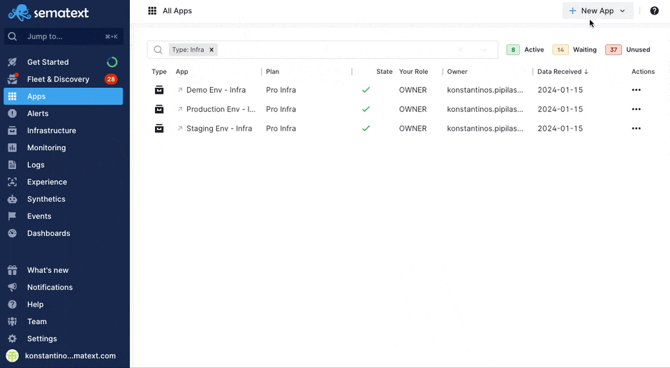
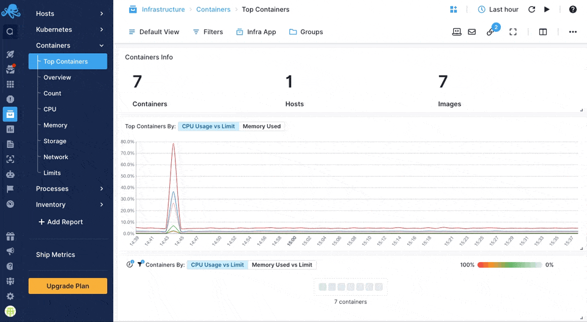
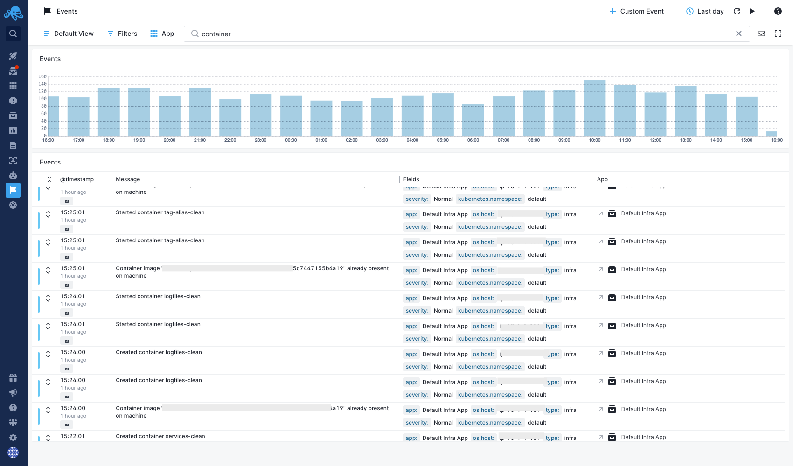

title: Sematext Container Monitoring
description: Monitor Docker and containerd containers, container orchestration systems like Swarm and Momad, or cloud container orchestration services EKS, ECS, AKS, GKE with Sematext by installing Sematext Agent and using our interface that shows everything in one simple screen.

Monitor [Docker](https://www.docker.com/) and containerd containers, container orchestration systems like Swarm and Nomad, or cloud container orchestration services EKS, ECS, AKS, GKE with Sematext by installing [Sematext Agent](https://sematext.com/docs/agents/sematext-agent/) and using our interface that shows everything in one simple screen.

## Create a Sematext Monitoring App
Creating a Sematext Infra App is as easy as choosing one of our integrations and giving the App a name.

Sematext can easily monitor your Infrastructure with the Sematext Agent. You can install the agent during the Infra App creation process by following the Container instructions during environment selection.

Check also:
- [Docker](../agents/sematext-agent/containers/installation/#docker)
- [Docker Compose](../agents/sematext-agent/containers/installation/#docker-compose)
- [Docker Swarm](../agents/sematext-agent/containers/installation/#docker-swarm-enterprise)

## See Container data in Sematext Monitoring
Sematext Agent collects a plethora of metrics about containers (Docker, containerd) and orchestrator platforms and ships that to Sematext Cloud.

You can see host and container metrics or have a high-level overview of all your containers in Infrastructure reports.

Check out the [Sematext Agent installation for containers](../agents/sematext-agent/containers/installation) guide for more info.

## Container Alerting
To save you time Sematext automatically creates a set of default alert rules such as alerts for low disk space. You can [create additional alerts](../alerts) on any metric.

There are 3 types of [alerts](../alerts) in Sematext:

- **Heartbeat alerts**, which notify you when a server is down
- **Threshold-based alerts** that notify you when a metric value crosses a predefined threshold
- **Alerts** based on statistical **anomaly detection** that notify you when metric values suddenly change and deviate from the baseline

## Container Events
[Events](../events/) reflect changes in your infrastructure, from node restarts to container deployments, or changes in running containers. Events can track every Docker command. Sematext Agent collects Events from the Docker Engine and Kubernetes API. Whenever something goes wrong in your container stack, you can [correlate Logs or Metrics with the time of Docker events](../events/correlation/).

Here's the list of Docker container events Sematext collects:

### Container lifecycle events

- Create – when a container is created
- Start – when a container starts
- Restart – when a container gets restarted
- Stop – when a container stops
- Oom – when a container runs out of memory
- Pause – when a container gets paused
- Unpause – when a container continues to run after a pause
- Die – when the main process in a container dies
- Kill – when the container gets killed
- Destroy – when a container gets destroyed

### Container runtime events

- Commit – when changes to the container filesystem are committed. Modifying deployed containers in production is not a common practice, therefore the commit could - indicate a “hack” and should be watched carefully.
- Copy – when files are copied from/to a container. Could indicate a potential data leak.
- Attach – when a process connects to container console – somebody is reading your container logs
- Detach – when a process disconnects from container console streams
- Exec – when a command is executed in container console, very helpful to investigate in potential hacker attacks
- Export – when a container gets exported
- Health_status – when health_status is checked
- Rename – when a container gets renamed
- Resize – when a container gets resized
- Top – when somebody list top processes in a container
- Update – when a container is updated e.g. with new labels

### Container image events

- Delete – when an image gets deleted
- Import – when an image gets imported
- Load – when an image is loaded
- Pull – when an image is pulled from a registry
- Push – when an image is pushed to a registry
- Save – when an image is saved
- Tag – when an image is tagged with labels
- Untag – when an image tag is removed

### Container plugin events

- Enable – when a plugin gets enabled
- Disable – when a plugin gets disabled
- Install – when a plugin gets installed
- Remove – when a plugin gets removed

### Container volume events

- Create – when a volume is created
- Destroy – when a volume gets destroyed
- Mount – when a volume is mounted to a container
- Unmount – when a volume is removed from a container

### Container network events

- Create – when a  network is created
- Connect – when a container connects to a network
- Remove – when the network is removed
- Destroy – when a network is destroyed
- Disconnect – when a container disconnects from a network

### Container daemon events

- Reload

### Container services, nodes, secrets, and config events

- Create – on the creation of a resource
- Remove – on the removal of a resource
- Update – on the creation of a resource

## Container Metrics 

Check out the all the [supported Container metrics](https://sematext.com/docs/agents/sematext-agent/containers/metrics/) shipped by Sematext Agent.

## More about container Monitoring
* [Container Monitoring with Sematext Agent](../agents/sematext-agent/)
* [Docker Container Monitoring with Sematext](https://sematext.com/blog/docker-container-monitoring-with-sematext/)
* [Docker Container Monitoring and Management Challenges](https://sematext.com/blog/docker-container-monitoring-management-challenges/)
* [Docker Container Performance Metrics](https://sematext.com/blog/top-docker-metrics-to-watch/)

