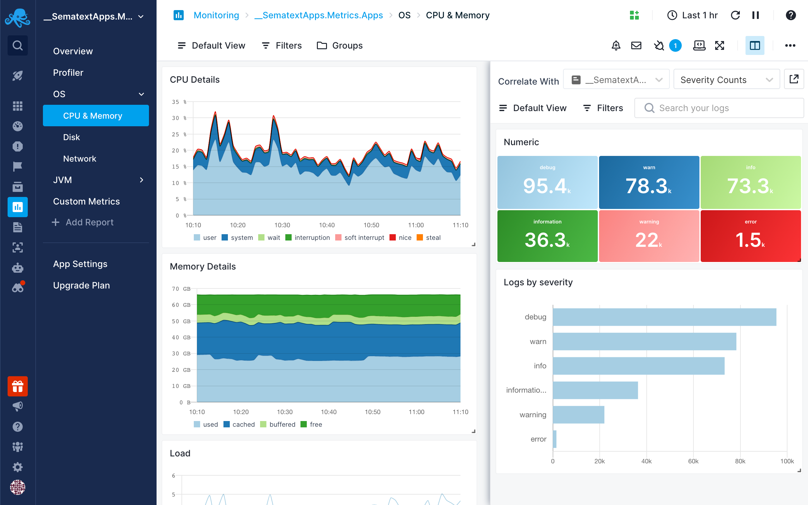

title: Performance metrics correlation in Sematext
description: How to use Split screen to correlate performance metrics with any other metrics, logs, events, or any other observability data.

## Why and When to Correlate Performance Metrics

Correlating performance metrics is a great way to troubleshoot faster.

## What to Correlate

When troubleshooting (performance) issues you will most likely want to correlate performance metrics with [logs](../logs/) or [events](../events/). 

### Correlating with Logs

Often times performance issues correlate with an increase in error or warning logs.  Correlating a performance spike, dip, or any other anomaly with logs will often lead you to error logs that will either immediately explain what is going on or will at least guide you in the right direction.  You can correlate any Monitoring App's report with any Log App's report, but any [Connected Apps](../guide/connected-apps/) will be more easily accessible during correlation.

### Correlating with Events

If you are [tracking your deployments in Sematext](../events/event-examples/#application-deployment-tracking) then you will be able to correlate changes in performance with your deployments.  Given that performance profiles can change after deployments, this is a great way to track a change in performance back to a deployment and all the way down to invididual commits that were included in the deployment.

## How to Correlate: Use the Split Screen

Performance metrics can be correlated with other observability data in Sematext and is best done using the [Split Screen](../guide/split-screen) feature. With Split Screen can compare and correlate selected Monitoring report with any Logs, Infrastructure or Experience reports. Correlation is also possible with [Events](../events/) or Synthetic Monitors. It can be used to correlate even with the same Monitoring report but with different filters and groups in the two different screens.

Once you select a report you want to correlate with, it’ll be remembered so you can quickly toggle it.
