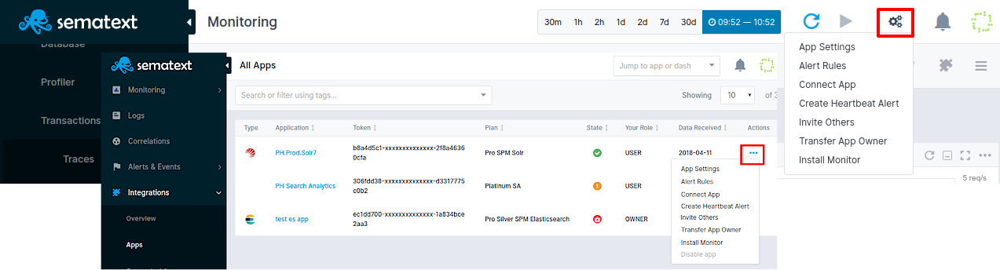

###Sematext Monitoring 

Welcome to Sematext Monitoring documentation!

In order to start using monitoring tools it is crucial to set up SPM Client to collect data. 

SPM Monitor or SPM Client is monitoring agent available in two versions:

  - [Embedded](spm-monitor-javaagent) (aka Javaagent-based, aka in-process)
  - [Standalone](spm-monitor-standalone)
  
The [API Reference](spm-api-reference) provides more detailed information on account and apps management as well as automation of certain tasks, such as creation of new apps, definition of alert rules, etc.
  
These are available [Monitoring Integrations](../integration) and for general SPM Monitoring information check [FAQ](spm-faq) page.

###Creating Monitoring Apps

The first step is to create an app. Go  to [monitoring view](https://apps.sematext.com/ui/monitoring), click on add new app button, select your integration and create monitoring app.

###Sending Data to Your App

In order to start sending data to your app you need:
 
Step 1 - Install Client Package

SPM client packages are available for various Linux distributions. After you are done with package installation, proceed to Client Configuration Setup.

Step 2 - Configure Client

Monitoring Agent collects performance metrics of your application. It can run in two different modes: In-process as a javaagent or Standalone as a separate process. The benefit of the In-process mode is a bit simpler initial setup and ability to see data on tracing related reports. The benefit of Standalone is that later SPM Monitor upgrades don't require you to restart your application and SPM Monitor not having any effect on your app (since it runs in its own process).

You should start seeing your performance data in SPM in a few minutes. If you do not see performance charts in 5 minutes, have a look at <a href="http://sematext.com/docs/monitoring/spm-faq/">Troubleshooting</a> page.

###App Settings

App settings include, but are not limited to:

  - inviting new users to your application
  - alert rules
  - changing your app's plan
  - connecting apps
  - create heartbeat alert
  - transfer app owner
  - subscriptions
  

<h2>App Settings Menu </h2>

<a href="#modal-close" title="Close" class="modal-close">&times; Close</a>

  
<!-- ###Visualizing and Analyzing Your Data -->

###Additional Features

To help you manage your metrics, hosts, and containers, and to help you create more useful dashboards, you can assign metadata to each host/server/container in the form of tags.

Check [Tag Support](tag-support) page for different ways of Tags organization.

Network Map can help you visualize the network topology of a system monitored by SPM.  It can discover hosts and collect information about communication between them, such as the amount of received/transmitted data on each port.

For more information on Network Map check [Network Map](network-map) page.

On-demand profiling lets you profile your own JVM-based applications or even any 3rd party JVM-based applications (e.g. Spark, Elasticsearch, Solr, Kafka, Hadoop, Storm, Cassandra, HBase, etc.).

It works with both embedded and standalone agent and you can find more information [here](on-demand-profiling).

[SPM](http://sematext.com/spm/) also exposes APIs and provides libraries that let you send custom metrics (any numerical data, not just performance metrics) into SPM and graph it along other reports.

For more information on how to extend standard performance metrics reports check [Custom Metrics](custom-metrics) page.

###Getting Support

We hope you enjoy using Sematext App and Infrastructure Monitoring and Log Management tools. If you need further support or have any feedback regarding our products, please don't hesitate to [contact us](mailto:support@sematext.com) ! You can also contact / talk to us using chat widget at the bottom right corner of the page or give us a shout [@Sematext](http://twitter.com/sematext). 
