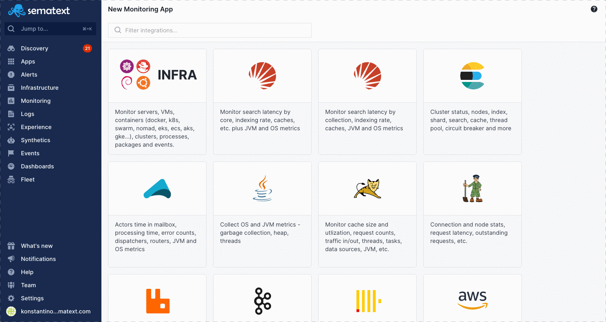
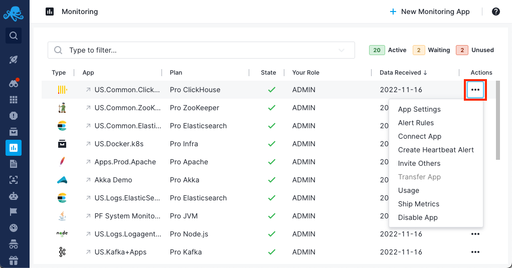
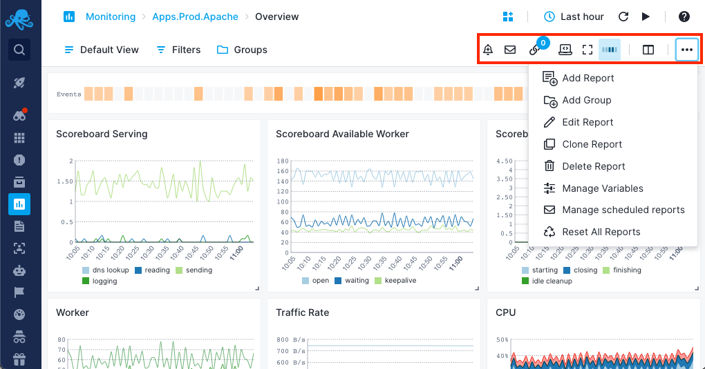
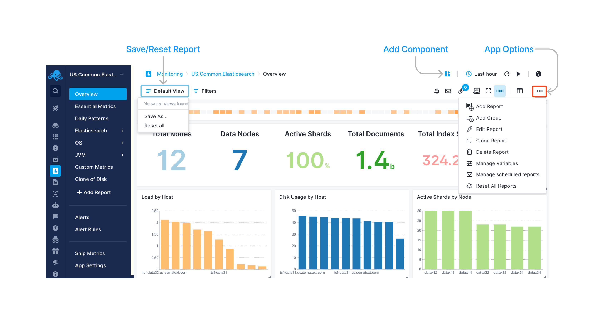

title: Sematext Monitoring
description: Sematext Monitoring covers server, kubernetes, database, container, and application monitoring with alerts and events. It's available as a SaaS or on-premise. Out-of-the-box integrations let you view and report data from various services and give you real-time insight of your entire DevOps ecosystem

Sematext [**Application**](../monitoring/service-monitoring/) and [**Infrastructure Monitoring**](../monitoring/infrastructure), with over [100 integrations](https://sematext.com/docs/integration/), allows you to collect an extensive set of **events** and thousands of metrics across your entire stack.

Get started in minutes with **out-of-the-box dashboards** that include prebuilt charts and other numeric components for the most notable metrics. Get notified with automatic [**alerts**](https://sematext.com/alerts/) powered by [**anomaly detection**](https://sematext.com/alerts/) rules, and ability to **analyze metrics** by a number of context-aware filters.

## Application and Service Monitoring
No matter how complex your infrastructure is, you can benefit from service autodiscovery functionality and get all the important metrics from your applications and services easily and quickly. Simply choose one of the available monitoring integrations and monitor performance and health metrics for all your applications. 

Get dedicated dashboards and reports for each application to extract the most value from the metrics we track. Useful tips are presented alongside the charts and other report components. Of course, if you prefer to be notified of important events, we have you covered with automatic alert rules. Read more in the [Application Monitoring Overview](https://sematext.com/docs/monitoring/service-monitoring/).

## Infrastructure Monitoring
Monitor your core infrastructure in minutes, simply install [Sematext Agent](../agents/sematext-agent). Get performance and health metrics from a single (Infra) Monitoring App. Keep an eye on everything, from servers and Kubernetes clusters to cloud instances, containers, processes, inventory, events, and beyond. Read more in the [Infrastructure Monitoring Overview](https://sematext.com/docs/monitoring/infrastructure/).

Sematext Monitoring goes beyond just collecting metrics. 

Use [**Database Monitoring**](https://sematext.com/database-monitoring/) to get a complete overview of your database health whether you are running it on your own infrastructure or using AWS RDS. 

[**Transaction Tracing**](https://sematext.com/tracing/) will show slow database operations, full SQL statements, end-to-end HTTP transaction context, top 10 operations by throughput, latency, or time consumed, filter database operations, and much more...

You can create [**custom dashboards**](../dashboards/) with real-time data that helps you understand important trends, summarize top values and view the frequency of conditions.

And you can additionally send any kind of [**custom metrics**](./custom-metrics).

If you haven't [signed up for free](https://apps.sematext.com/ui/registration) yet, check it out or [sign in](https://apps.sematext.com/ui/login/) to get started by creating a Sematext Monitoring App with a wide selection of integrations to choose from.

## Creating Monitoring Apps

The first step to monitoring with Sematext is to create a Monitoring App. Go to [monitoring view](https://apps.sematext.com/ui/monitoring), click on New Monitoring App button, select your integration and create monitoring App.

Follow along the [Quick Start](./quick-start) guide to learn how.

## App Settings

App settings and actions include, but are not limited to:

  - changing your App's plan
  - [managing alert rules](../alerts)
  - [connecting Apps](../guide/connected-apps)
  - [heartbeat alert creation](../alerts/creating-heartbeat-alerts)
  - [inviting others to your App](../team/app-guests)
  - [App ownership transfer](../team/transfer-apps)
  - [setting up a Sematext Monitoring Agent to ship metrics](./quick-start/#setting-up-monitoring-agents)
  - [scheduled report emails](../guide/scheduled-reports)

Check out the [Settings](./settings) guide to learn more.

## Reports And Components

Every Monitoring App can have multiple Reports that act as buckets for your metrics and data. The distinct metrics in one report are separated into components.

Read more in the [Reports and Components](./reports-and-components) guide.

## Additional Features

To help you manage your metrics, hosts, and containers, and to help you create more useful dashboards, you can assign metadata to each host/server/container in the form of tags.

Check the [Tags](./tags) page for different ways to use tags.

You can [create custom dashboards](../dashboards) with real-time data that helps you understand important trends, summarize top values and view the frequency of conditions.

## Getting Support

We hope you enjoy using Sematext App and Infrastructure Monitoring and Log Management tools. If you need further support or have any feedback regarding our products, please don't hesitate to [contact us](mailto:support@sematext.com)! You can also contact / talk to us using chat widget at the bottom right corner of the page or give us a shout [@Sematext](https://twitter.com/sematext). 
