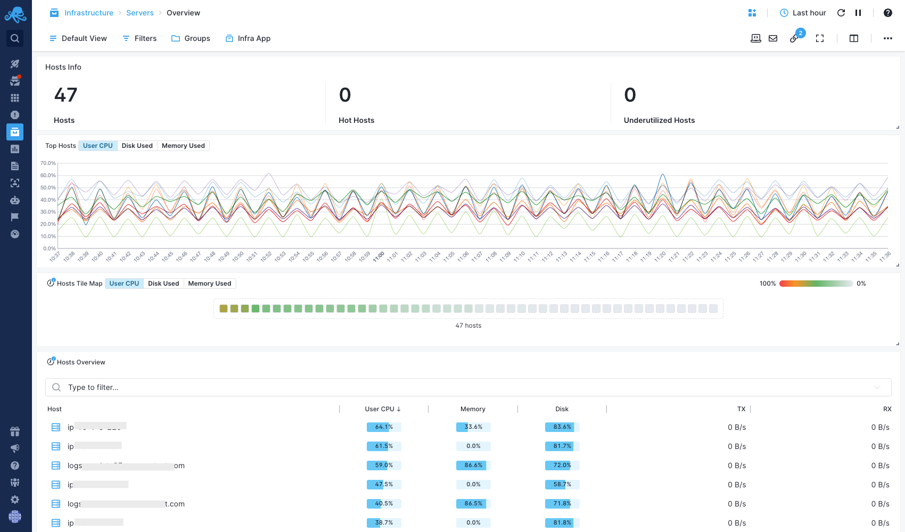
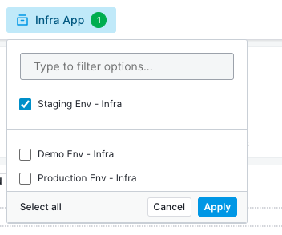
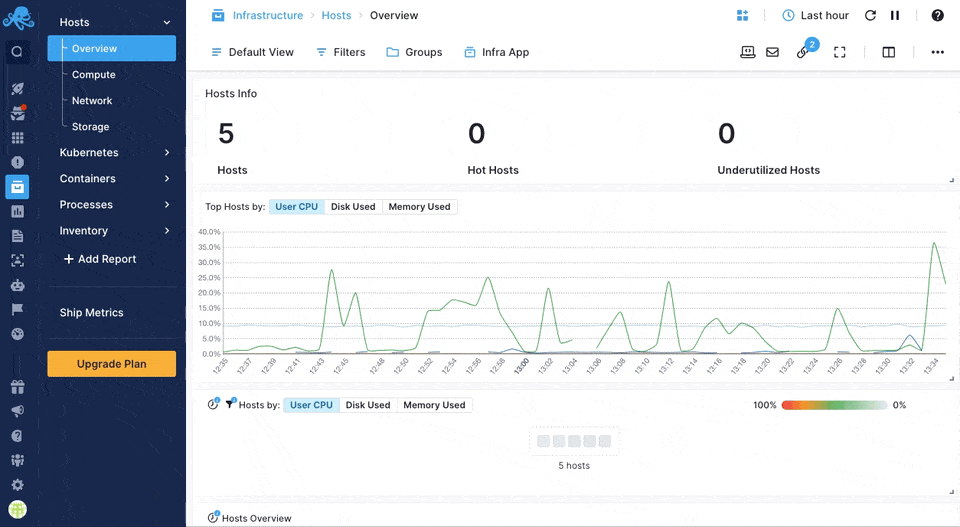

title: Sematext Core Infrastructure Monitoring
description: Sematext Infrastructure Monitoring gives you insight into your whole infrastructure automatically based on the applications, containers, servers and general infrastructure you are monitoring.

Sematext Infrastructure Monitoring provides complete insight into your infrastructure:

- [servers](https://sematext.com/docs/monitoring/servers/)
- [Kubernetes clusters](https://sematext.com/docs/integration/kubernetes/)
- [containers](https://sematext.com/docs/monitoring/containers/)
- [processes](https://sematext.com/docs/monitoring/processes/)
- [inventory](https://sematext.com/docs/monitoring/inventory/)
- [events](https://sematext.com/docs/events/), etc.

For application and service monitoring, make sure to check our [dedicated guide](https://sematext.com/docs/monitoring/service-monitoring/).

The centerpiece is an Infra App which acts as a container for all data about your infrastructure. As with other App types, you can create as many Infra Apps under your account as you wish.

Each Infra App is typically used to gather data from one environment. For example, one Infra App for production environment, one for test environment and one for development environment.

Sematext Cloud will automatically create one Infra App named "Default Infra App" the first time you might need it. 

You can also create Infra App on your own under Apps > New App > Monitoring. Check below for more information.

## How it works

A Golang-based [Sematext Agent](../agents/sematext-agent) will be installed on your machine. This Agent sends all infrastructure data to an Infra App whose token is configured during the Agent's installation.

The Infra App also includes data about your containerized environments. Installation instructions for container monitoring include an Infra App token. That way when installing Sematext Agent, an Infra App will be installed as well.

## Create an Infra App

Creating a new Infra App is the same process as with any App in Sematext. In the Apps screen you choose New App > Monitoring > Infra App. Give it a name and click 'Create App'.

During the Infra App creation process, you will get a screen displaying Sematext Agent installation instructions for various supported environments. You will need to follow these instructions to use of the Infra App.

## Infra App Metrics

Metrics will start shipping to your new Infra App in a few moments. You can see metrics from all your servers, Kubernetes clusters, containers, etc.

## Enabling Infra Monitoring

Infra Monitoring is enabled by default as soon as you install Sematext Agent.

If you've set up Sematext Monitoring at some point in the past, you can easily enable Infra Monitoring by:

- [Upgrading](./spm-faq/#agent-updating) your Sematext Agent to the [latest version](https://sematext.com/docs/agents/sematext-agent/releasenotes/)
- Setting up Infra App token on each of your machines by running the `setup-infra` command

When doing a clean installation, regardless of whether you're installing in containerized environment or not, follow monitor installation instructions displayed in Sematext Cloud. Those instructions will always include everything needed to set up an Infra App, either on its own or alongside some other App Agent.

### The `setup-infra` command

Setting up or changing which Infra App should receive infrastructure data and metrics from a particular machine can be done with the <b>setup-infra</b> command.

To see which Infra Apps exist in your account visit Sematext Cloud > Apps. You can choose any of the existing Infra Apps or create a new one.

Once you do that you'll have the token of that particular App. To set up the token run the following command on each machine that you wish to update:

<pre>sudo bash /opt/spm/bin/setup-infra --infra-token YOUR_INFRA_APP_TOKEN_HERE</pre>

## Features

Infrastructure Monitoring provides:

- [OS](../agents/sematext-agent/os-metrics/) metrics and details
- [Container](../agents/sematext-agent/containers/metrics/) metrics and details
- [Kubernetes](https://sematext.com/docs/agents/sematext-agent/kubernetes/metrics/) metrics and details
- [Inventory](./inventory)
- [Processes details and metrics](./processes)
