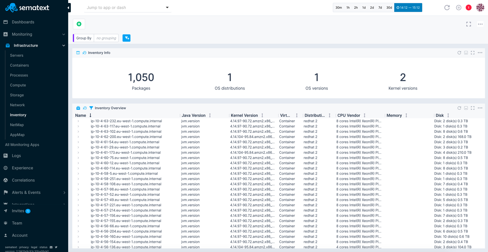
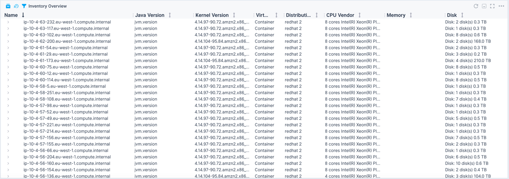
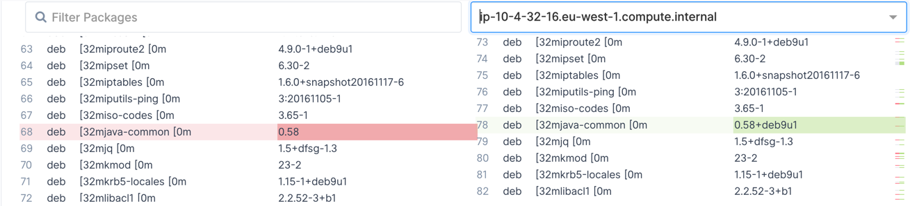

title: Sematext Inventory Monitoring
description: Sematext Inventory Monitoring gives you insight into your whole infrastructure automatically based on the applications, containers, servers and general infrastructure you are monitoring.

The [Sematext Agent](/agents/spm-client/) provides a simple and versatile way of gathering machine-related information such as host, VM, or container properties, kernel versions, and installed packages. It presents them on a per-host basis allowing you not only to view the data but also search and compare different hosts. All of this, in the same place, shipped automatically without any effort from an operations point of view.

The Inventory information is available in the Monitoring *Infrastructure* section of the *Monitoring* tab of your Sematext Cloud account - your main place for hosts, virtual machines and containers information. 



### Inventory Info

The Inventory Info information provides a summarized view of your inventory information allowing you to see:

- Number of different packages in your monitored environment,
- Number of different OS distributions,
- Number of different OS versions,
- A number of different kernel versions.


### Inventory Overview

The Inventory overview provides a per-host view of each host, virtual machine, and container along with the operating system and its version, number of CPUs, their type, memory, number of hard disk drives and total capacity.



Expanding each row gives detailed information about the system including:

- Unique identifier of the system,
- OS version,
- Kernel version,
- Java virtual machine version,
- System type (bare metal, virtual machine, container),
- Total memory size, 
- Memory slot information,
- Total disk size, 
- Hard disk drives information.

In addition, an overview of all the installed packages on a given system is available. This includes:

- Installation source, 
- Package name, 
- Package version.


### Comparing Hosts

The Inventory UI allows comparing different systems to quickly and efficiently see differences between them:



## How does it Work?

Inventory Monitoring part of the Monitoring Agent keeps track of the changes done on the file system when installing, upgrading or removing packages on the host system, in the virtual machine or in the container when using coming from:

- Node.JS (when using NPM package manager)
- Python (when using PIP package manager)
- DEB (for example, when using APT package manager)

In addition, the Monitoring Agent periodically checks the state of the packages and ships that information to Sematext Cloud to ensure that the state of packages is always up to date and visible in the UI.

## Enabling Inventory Monitoring

To enable inventory monitoring you need to adjust your `st-agent.yml` file located in the `/opt/spm/properties` directory and set the following section:

```
pkg:
  enabled: true
  interval: 10m
```

After that the Monitoring Agent needs to be restarted by running the following command:

```
service spm-monitor-st-agent restart
```

## Gathered Data

Sematext Monitoring Agent gathers the following data about the system:

- OS version,
- Kernel version,
- Java virtual machine version,
- System type (bare metal, virtual machine, container),
- Total memory size, 
- Memory slot information,
- Total disk size, 
- Hard disk drives information.

In addition, the following information about the packages is gathered for NodeJS, Python and DEB sources:

- Installation source, 
- Package name, 
- Package version.

## Solving Problems With Inventory Monitoring

The Inventory monitoring allows you to quickly solve the following issues:

- Finding obsolete packages,  
- Seeing differences in environments for troubleshooting behavior discrepancies, 
- Finding packages mentioned in the [CVE](https://pl.wikipedia.org/wiki/Common_Vulnerabilities_and_Exposures) reports,
- And many, many more. 