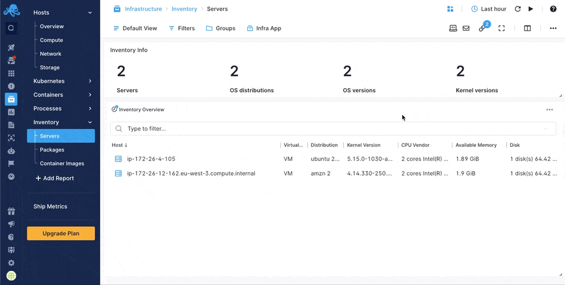
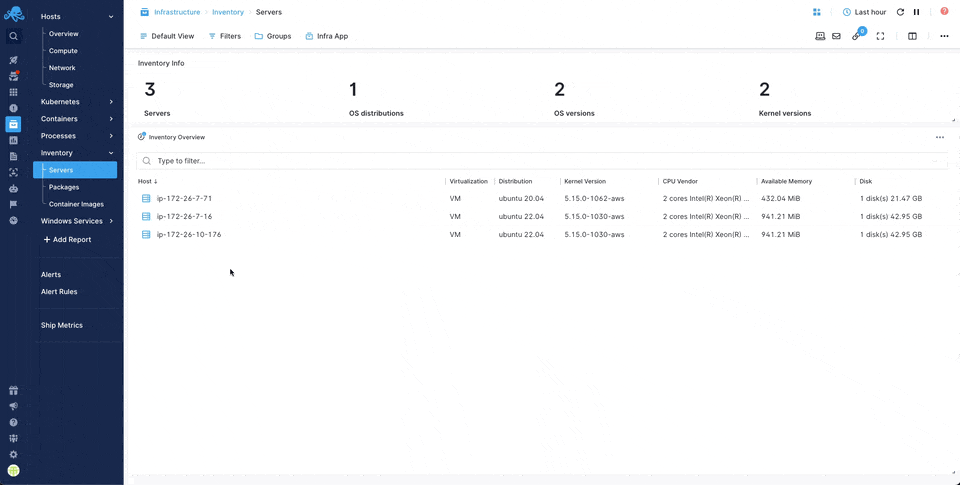
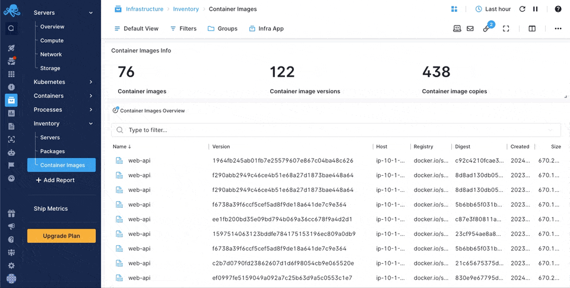

title: Sematext Inventory Monitoring
description: Sematext Inventory Monitoring gives you insight into your whole infrastructure automatically based on the applications, containers, servers and general infrastructure you are monitoring.

The [Sematext Agent](../agents/sematext-agent) provides a simple and versatile way of gathering machine-related information such as host, VM, or container properties, kernel versions, and installed packages. It presents them on a per-host, per-package or per-container-image basis allowing you not only to view the data but also search and compare different hosts. All of this, in the same place, shipped automatically and effortlessly, without any operational overhead.

The Inventory information is available in the *Inventory* section of the *Infrastructure* tab of your Sematext Cloud account - your main place for servers, packages and container images information.

## Enabling Inventory Monitoring

Inventory Monitoring is enabled by default in the Sematext Agent. Check out enabling and disabling Inventory Monitoring [here](../agents/sematext-agent/packages/configuration/). 

Make sure to select the [appropriate plan](https://sematext.com/pricing/#infrastructure) to access the Inventory Reports.

## Servers

Provides quick insight into how unified your servers are by showing:

- Number of servers/VMs
- Number of different OS distributions
- Number of different OS versions
- A number of different kernel versions

### Overview

The Servers overview provides a per-host view of each server or virtual machine, along with the operating system and its version, number of CPUs, their type, memory, number of disk drives and their total capacity.

Clicking on each row shows detailed information about the whole system, including:

- Unique identifier of the system
- OS version
- Kernel version
- Java virtual machine version
- System type (bare metal, virtual machine, container)
- Total memory size
- Memory slot information
- Total disk size
- Disk drives information

In addition, an overview of all the installed packages on a given system is available. This includes:

- Installation source
- Package name
- Package version

### Comparing Different Hosts

The Inventory UI enables you to compare various hosts within your infrastructure. By examining key attributes such as kernel versions, operating systems, memory, disk space, and virtualization settings, you can easily pinpoint compatibility issues across your hosts. This comparison helps in:

- Detect changes in configurations between hosts
- Verify that all hosts are compliant to required specifications
- Quickly find differences that may be causing performance or compatibility issues

### Comparing Packages

The Inventory UI also allows you to compare software packages installed on different hosts. This is important to:

- Ensure that all hosts have the required software versions installed
- Verify that all hosts have the latest security updates and patches
- Identify and resolve dependency issues that might arise due to different package versions

### Grouping Hosts By Installed Packages

Hosts can be filtered and grouped by tags. One of the available tags for grouping is the `installed.packages` tag, which will put servers with exactly the same packages installed in the same group. This can be useful to quickly check if all servers that should have the same packages installed are indeed the same.

## Packages

Provides quick insight into how unified your packages are by showing:

- Number of package types
- Number of different packages
- Number of package installations

### Overview

The Packages overview provides a per-package view of all package installations across hosts. Find out how many installations of each package there are, where they are installed and in which version.

## Container Images

Provides quick insight into how unified your container images are by showing:

- Number of different container images
- Number of different container image versions
- Total number of container images

### Overview

The Container Images overview provides a view of all container images across hosts. Find out how many copies of each container image there are, where they are installed and which version they are tagged with.

## How does it Work?

The [Sematext Agent](../agents/sematext-agent) tracks all changes done on the file system. Such changes are displayed in the Inventory Monitoring UI. Package installs, upgrades and removals are also captured. They are displayed as Events. The following types of packages are supported:

- Node.js (e.g. when using NPM package manager)
- Python (e.g. when using PIP package manager)
- DEB (e.g., when using APT package manager)
- RPM (e.g., when using RPM package manager)

The Agent checks the state of packages on machines and containers where it's running to ensure all package info is up to date.

## Gathered Data

The [Sematext Agent](../agents/sematext-agent) gathers the following data about the system:

- OS version
- Kernel version
- Java virtual machine version
- System type (bare metal, virtual machine, container)
- Total memory size
- Memory slot information
- Total disk size
- Disk drives information

The following information about packages is gathered for Node.js, Python, DEB and RPM sources:

- Installation source
- Package name
- Package version

And for container images:
- Image name
- Version
- Registry
- Digest
- Size
- Date created

## Solving Problems With Inventory Monitoring

Here are some of the common use cases and issues that Inventory Monitoring helps solve:

- Finding obsolete packages
- Seeing differences in environments for troubleshooting behavior discrepancies
- Finding packages mentioned in the [CVE](https://en.wikipedia.org/wiki/Common_Vulnerabilities_and_Exposures) reports
- And many, many more
