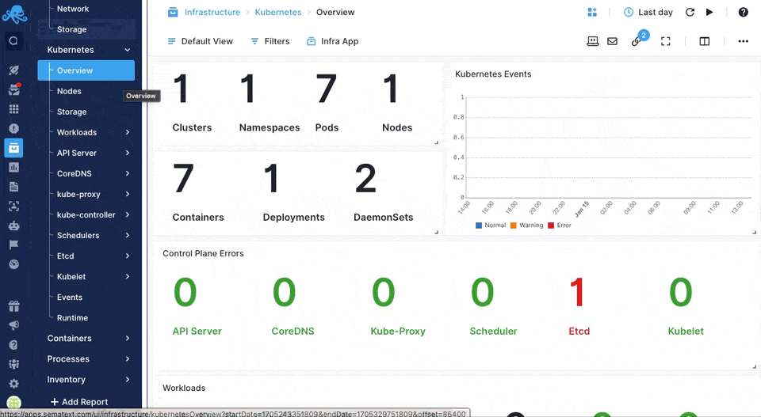

title: Sematext Kubernetes Monitoring
description: Monitor Kubernetes clusters with a simple Agent and use Sematext Cloud to show everything in a single App.

Monitor Kubernetes clusters with a simple [Agent](https://sematext.com/docs/agents/sematext-agent/) and use Sematext Cloud to show everything in a single App.

For more info, check out our [Kubernetes Monitoring](https://sematext.com/docs/integration/kubernetes/) integration that comes pre-loaded with every Infra App.