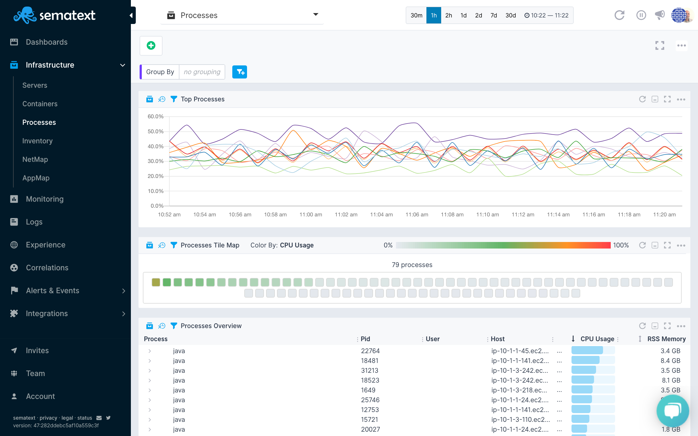

title: Sematext Process Monitoring
description: Sematext Inventory Monitoring gives you insight into your whole infrastructure automatically based on the applications, containers, servers and general infrastructure you are monitoring.

Process Monitoring gives you visibility into processes that use the most CPU or memory, regardless of whether they are running inside containers, in the cloud, your own VMs or bare-metal servers.

The process information is available in the Monitoring *Infrastructure* section of your Sematext Cloud account - your central place for hosts, virtual machines, containers, and process information. 



### Process Info

The process view provides you similar information as the Linux `top` command, but for your entire infrastructure: 

- Top N processes in your entire infrastructure
- Grouping metrics by hosts, process names, containers, etc. 
- Filtering by tags

### Process Overview

The process overview provides a real-time view of the top N processes. A time series chart, heatmap, and a list with the process details help you to identify the processes with the highest resource usage. 

Expanding each row in the process list gives detailed information about the processes including:

- PID
- User
- Group
- Process name
- Command 
- Start time
- Umask
- Gid
- Tid
- Tags like container id, container name etc. 

Also, a real-time view of all process metrics is available in the metrics tab. This includes:

- CPU usage
- RSS memory 
- IO read/write bytes 
- IO read/write operations 

## How does it Work?

The [Sematext Agent](../agents/sematext-agent) tracks all processes and ships the metrics of the top N processes. The agent tags all metrics with process and container metadata and ships the metrics to your [Infra App](../infrastructure/).  

Sematext UI provides visualizations, grouping and filter functionality. 


## Enabling Process Monitoring

Process Monitoring is enabled by default in the [Sematext Agent configuration](../agents/sematext-agent/containers/configuration/). 
In case you want to *disable* Process Monitoring set the following option in the config file: 

```
process:
 enabled: false
```

After that the [Sematext Agent](../agents/sematext-agent) needs to be restarted by running the following command:

```
service spm-monitor-st-agent restart
```

## Gathered Data

The [Sematext Agent](../agents/sematext-agent) gathers the following data about the process:

- CPU usage
- RSS memory 
- IO read/write bytes 
- IO read/write operations 
- Process metadata
- Container metadata

## Solving Problems With Process Monitoring

Here are some of the common use cases and issues that Process Monitoring helps to solve:

- Real-time process monitoring
- Extended visibility for at least 30 minutes 
- Save time to identify processes with the highest resource in your entire infrastructure
- Replace time-consuming operations to check system resources with `ssh` and `top` Linux commands
- Identify processes, containers or service with high resource usage

