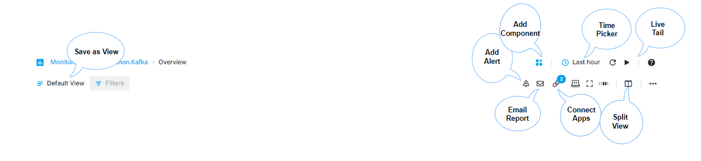
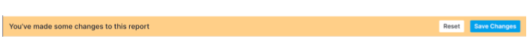
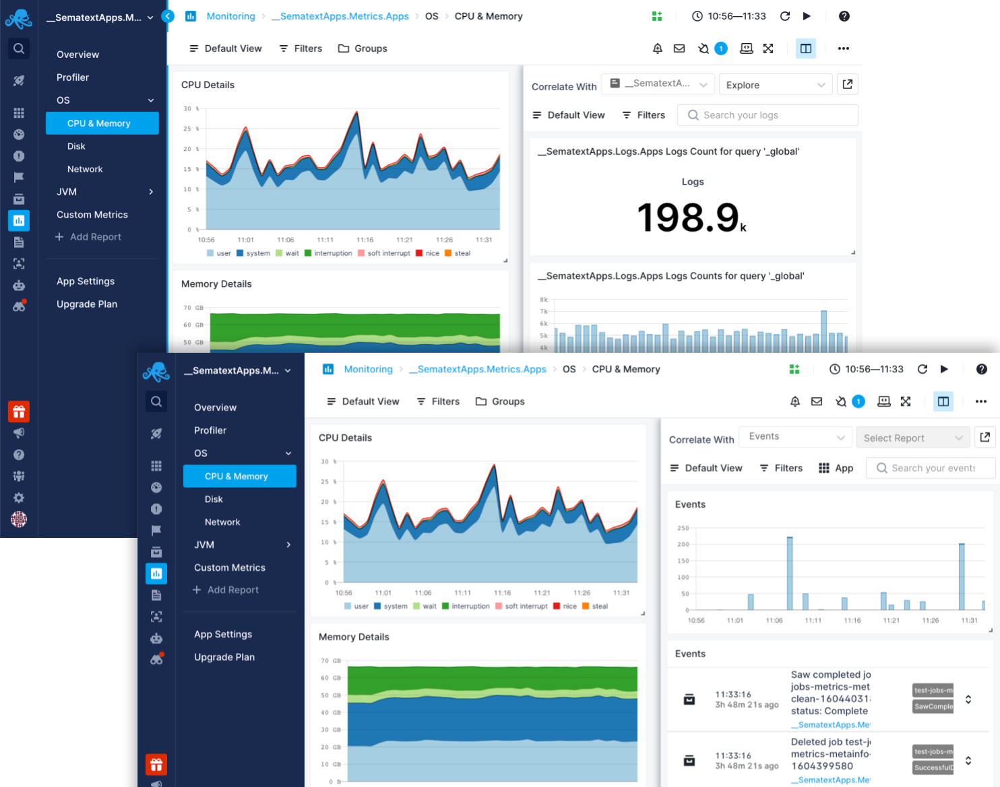
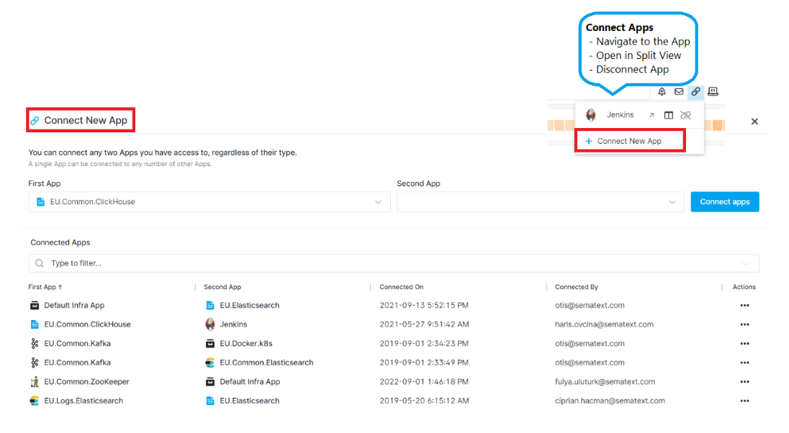
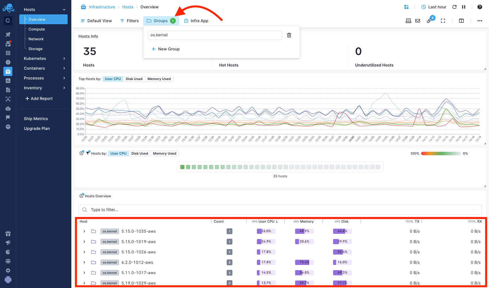
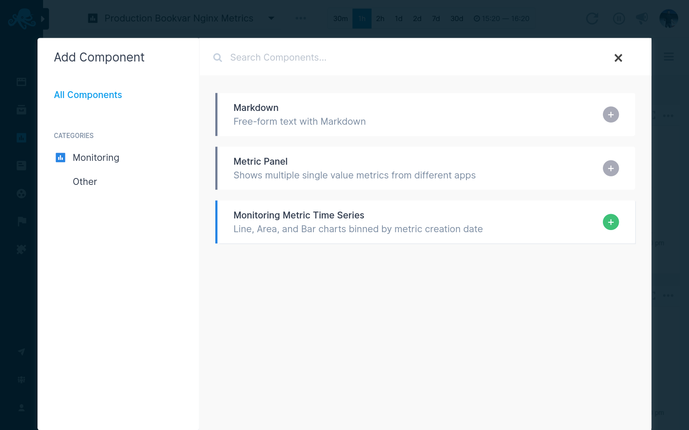

title: Sematext Monitoring Reports and Components
description: Sematext Cloud is a modern monitoring, log management, and real user monitoring system that includes over 40 monitoring integrations. It is a suite of products that combine high-quality logging experience with other monitoring and alerting devops tools helping fix IT production issues

## Monitoring Report Menu

The **Monitoring Report Menu** is where the true power of Sematext Performance and Infrastructure Monitoring lies. This is where Observability comes to life. It lets you add additional components to a report, create alerts, connect apps and quickly filter or group data. You can also correlate monitoring data with your logs, events or experience data using **[Split Screen](#split-screen)**.

 

### App State

If a **new component is added** or any existing **component is edited or removed**, the **Save and Reset buttons will appear** in the report menu and allow for changes to be saved or reset to the initial state.

 

If your browser is suddenly closed, and no changes were saved or reset, the App will preserve its initial state.

### Split Screen

[Split Screen](../guide/split-screen) gives you a single view for Metrics, Logs, and Events. This is a huge time saver to let you move from **Metrics spikes** to **drill down to Logs and Events** that caused them.

 

Combined with the **Metric Reports**, and with the help of a **charting hairline**, zoom and chart navigation tools, it is easy to see how using our **Monitoring and Logging tools in a single page** is a must-have for any DevOps team! Learn more about **[Split Screen](/guide/split-screen)**.

The set of icons in the logs search and report menu let you:

- **Save as View** - Filtering and grouping data is a central part of the Sematext Cloud user interface. With Saved Views you can save your filters and groups for faster access later. If you find yourself often applying the same filters on your data then this feature can be a time saver.
- **Add Alert** - Every query can be use as an **alert query**. The ability to save alerts is part of the essential tools for searching, correlating and investigating logs data..
Each alert query is visible in the Alert Rules list.

- **Scheduled Reports** - There are E-mail and Subscription types available with time, frequency, and time range defined so your team can get automatated reports about your logs and system health. Learn more about **[Scheduled Reports](/guide/scheduled-reports)**.

- **Full Screen Mode** - Entering full screen mode brings only the component you choose into view. It's useful for presentations and viewing detailed info of a single component. All charts have zoom, crosshair, and time navigation tools with tooltips available for effective chart interaction and data analysis.

- **Connected Apps** - Connecting a Logs App to a Monitoring App will **pre-select that Logs App when you decide to correlate metrics from the connected Monitoring App**. When you receive an alert notification for an App, the **alert notification will automatically include information and charts from connected Apps**, and thus provide more information and context for you. You can connect any two Apps you have access to, regardless of their type. **Any App can be connected to any number of other Apps**.

 

- **Time Picker** - The Time Picker is available whenever an App is selected as well as when any custom dashboards are being used. **One minute is the shortest time increment** you can select. **Thirty minutes, one and two hours, and one, two, seven, and thirty days time-span shortcuts** are exposed as well.
**A custom time range can be selected using the time picker dropdown menu.** The Logs App will automatically refresh upon selection and update all the reports accordingly.

- **Live Tail** - Refresh data and Live Tail options are located next to the time picker. The **Live Tail feature provides real-time insights as soon as your data is consumed and indexed.** It can also be stopped so the auto-refresh does not update the data, in case you need to inspect specific incidents or anomalies within a certain time segment.

- **Monitor Installation** - You will need to install Sematext Agent so metrics are sent to your Monitoring App. Please refer to [Integrations](https://sematext.com/docs/integration/) to configure what you wish to monitor. 

By checking out the [Integrations documentation](https://sematext.com/docs/integration/) you can learn more about how to monitor various programming languages, operating systems, containers (Docker, Kubernetes, Mesos), Cloud IaaS / PaaS services, iOS, Android, AWS EC2, AWS S3, Log Management, and log shippers. There you will find detailed information on how to install and configure different agents required to start sending your logs and metrics data to Sematext Cloud.

### Groups
Report components can be grouped by tags using the `Groups` drop down menu in the Monitoring Report Menu. One of the [available tags](https://sematext.com/docs/tags/common-schema/) for grouping is the `os.kernel` tag, which will put hosts running the same Linux kernel in the same group. This can be useful to check whether some hosts need to be upgraded with a newer kernel.

 

Similar customized group menus can be created using [`Group By` report variables](https://sematext.com/docs/dashboards/report-variables/groups).

## Components

Using custom components you can add **monitoring metrics time series**, **metric panel**, **markdown notes**, and create custom reports with rich data visualizations and chart tools to analyze your data.

Each component can also be added to a custom dashboard you define.

### Monitoring Components

Line, Area, Bar charts binned by metric creation date, bar chart binned by event creation date, table of events in reverse chronological order are available for your Monitoring App.

Use them together with out-of-the-box metrics reports and visualizations, generated when your Monitoring App is created, and you will go from metric spikes to your apps’ and servers’ logs in seconds and get to the root cause in minutes. 

### Monitoring Component Settings

Each Component can be added to a custom Dashboard, and you can organize reports from one or several applications, both Monitoring Apps as well as Logs Apps. Creating rich data and visualization reports based on various metrics and logs data has never been easier.

Here's an image of **Metrics Component** dropdown menu. You can edit the component metrics, add it to a custom Dashboard, create alerts, and much more.

