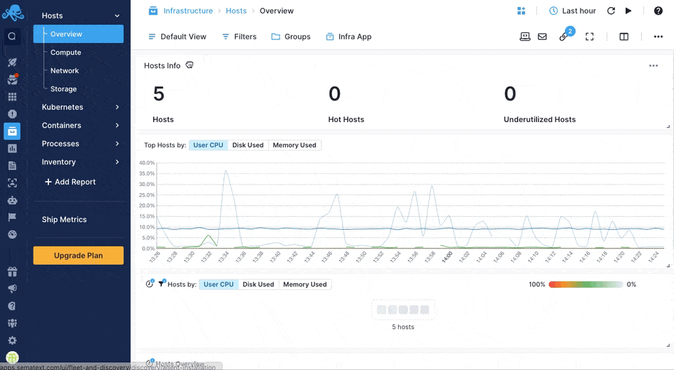

title: Sematext Server Monitoring
description: Monitor bare metal servers and VMs with a simple Agent and use Sematext Cloud to show everything in a single App.

Monitor bare metal servers with a simple [Agent](https://sematext.com/docs/agents/sematext-agent/) and use Sematext Cloud to show everything in a single App.

## Create a Sematext Infra App
Creating a Sematext Infra App is as easy as choosing one of our integrations and giving the App a name.

Sematext can easily monitor your Infrastructure with the Sematext Agent. You can install the agent during the Infra App creation process by following the Bare-Metal / VM instructions.

## See host metrics in Sematext Monitoring
Sematext Agent collects a plethora of metrics about hosts (CPU, memory, disk, network, processes).

Check also how you can monitor [containerized](https://sematext.com/docs/monitoring/containers/) and [Kubernetes](https://sematext.com/docs/monitoring/kubernetes/) environments.

## Core Infrastructure Alerting
As soon as you create an Infra App, Sematext automatically creates a set of default alert rules based on pre-defined conditions in important metrics. That way you get notified when there is no available disk space or memory is low, etc. Below you can see a list of default alert rules for server monitoring:

- High average CPU usage: Monitor the average CPU usage, to maintain system responsiveness and prevent the CPU being maxed out for too long without noticing it
- High and Critical CPU iowait time: Identify high CPU I/O wait times for efficient I/O operations and to prevent latency
- High and Critical system CPU steal time: High steal time can cause significant problems, including slow I/O, slower processing and slower database querying time
- High system load: Get insights into high system load levels to maintain resource availability
- Low and Critical system available memory: Detect low and critically low available system memory to prevent performance issues, crashes and out-of-memory failures
- High and Critical system used swap: Monitor high system swap usage to prevent excessive swap usage and system slowdown
- High and Critical disk space utilization: Receive notifications about high disk space utilization to prevent storage space issues and data loss
- High and Critical system process space utilization: Monitor high process space utilization (PID limit) for efficient process management and system stability

You can [create additional alerts](../alerts) on any metric.
