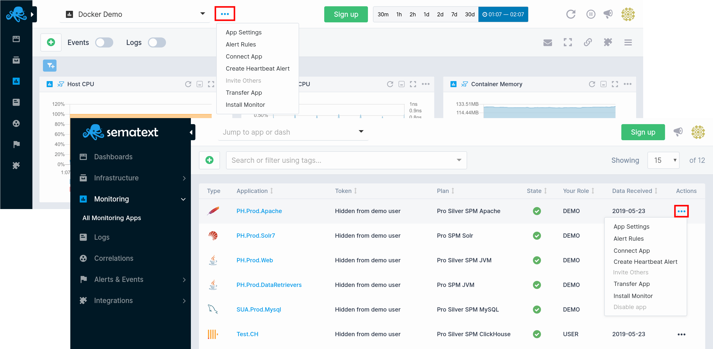
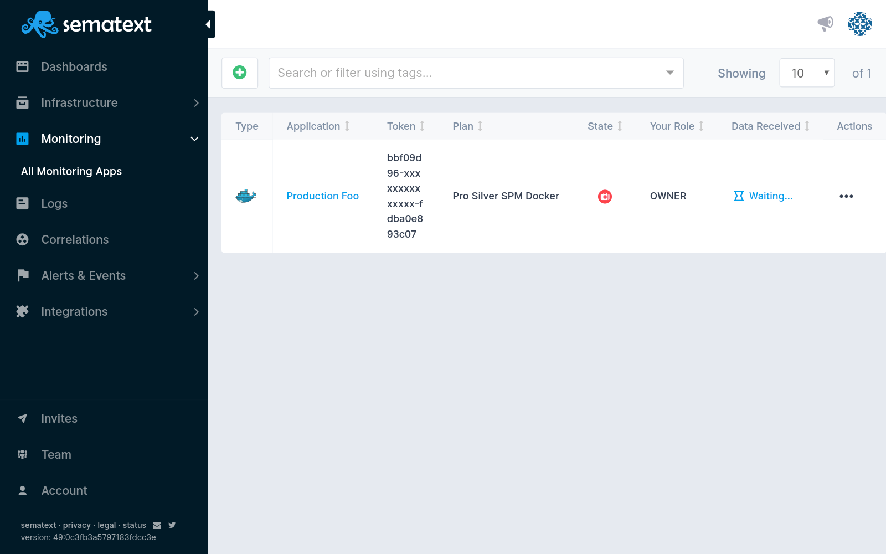
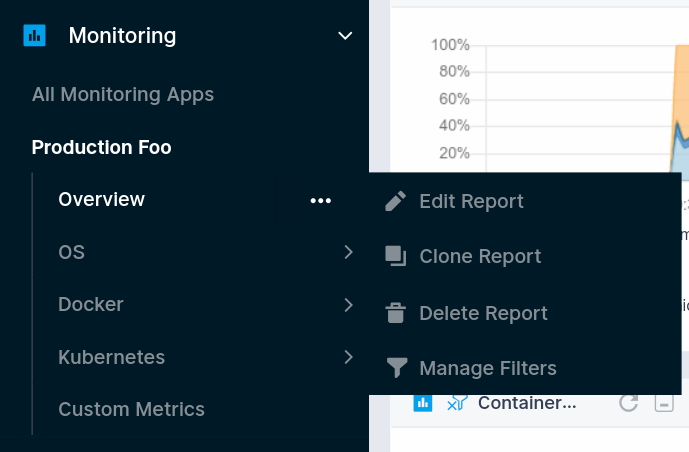

title: Sematext Monitoring App Settings
description: Sematext Cloud is a modern monitoring, log management, transaction tracing, and real user monitoring system that includes over 40 monitoring integrations. It is a suite of products that combine high-quality logging experience with other monitoring and alerting devops tools helping fix IT production issues

App settings and actions include, but are not limited to:

  - inviting others to your App
  - [alert rules](../alerts)
  - changing your App's plan
  - connecting Apps
  - heartbeat alert cration
  - App ownership transfer
  - scheduled report emails (aka Subscriptions)
  
<!--  -->

<!--  -->

## Side Navigation

The persistent region on the left that can be collapsed, is used to easily switch across monitoring, log management, transaction tracing, real user monitoring, and other user & team features. All side navigation tabs are selectable. If they have chevrons, it indicates that the top level section is collapsible and contains additional subitems. The subitems will let you explore all your Apps, or choose a particular App.

Side navigation top level sections for infrastructure and application performance monitoring, log management, transaction tracing, and real user monitoring:

- Dashboards
- Infrastructure
- Monitoring
- Logs
- Correlations
- Alerts and Events
- Integrations

Side navigation sections for user and team features:

- Invites
- Team
- Account 

## App Selector

The App dropdown selector lets you **choose any Logs or Monitoring App** as well as any **Dashboards and Reports** that you have generated from those Apps. Infrastructure views such as AppMap, NetMap, Servers, and Containers are also available for selection, and together provide seamless switching and navigation between logs, application and infrastructure monitoring, which is essential when rushing to fix production issues.

## App Actions

Right next to the App Selector is the **App Actions dropdown menu** and **horizontal ellipsis icon**. 

The App Actions dropdown menu allows you to **quickly switch between your Dashboards, Logs and Monitoring Apps**. While the horizontal ellipsis icon shows your App options and lets you open various app specific functions, like instructions to **install monitors and start sending metrics, app settings, alert rules, heartbeat alerts, as well as ability to connect two different apps, invite team members, and transfer app ownership**.

All App Actions open in a modal dialogue window as temporary UI regions and let you adjust and edit settings or create various alerts. The Monitoring App view remains unchanged and allows for easy interaction between various system settings and reports views.

## Report Selector

Once you create a Monitoring App, and start your Agent, you will get a **default Report created for you named Overview**. It will have the default data and default [component](#components) configuration. You can edit this Report, clone it, or create new ones. 

Based on what type of Monitoring Integration you chose, more Reports get created by default. In this Docker sample you can see three more Reports are created by default.

## Time Picker

The Time Picker is available whenever a Logs or Monitoring App is selected as well as when any custom dashboards are being used. **One minute is the shortest time increment** you can select. **Thirty minutes, one and two hours, and one, two, seven, and thirty days time-span shortcuts** are exposed common observability defaults.

A **custom time range can be selected using the time picker dropdown menu**. The Logs App will automatically refresh upon selection and update all the reports accordingly.

## Refresh and Live Tail

Refresh data and Live Tail options are located next to the time picker. The **Live Tail feature provides real-time insights as soon as your data is consumed and indexed**. It can be also stopped so the auto-refresh does not update the data, in case you need to inspect specific incidents or anomalies within a certain time segment.

## Notifications

The megaphone icon in the right section of the header is used to open the notifications. If your plan is in need of an upgrade, a new feature is announced, or similar system and service updates require your attention, they'll be shown in the notifications view.

## User Settings

The User Settings is the last right aligned item in the header. **Switching accounts, Inviting team members, Billing, Help, Subscriptions**, and other user related system functionalities are located in the user settings dropdown menu. They are also top level items easily accessible from the left sidebar. 

Here you can see the main navigation sections:

- Side navigation 
- App & Dash Selector dropdown menu
- App Actions dropdown menu
- User Settings dropdown menu
- Time Picker component 

The next section describes the monitoring report menu located just below the top navigation menu, and help you discover how to add new components, correlate your logs and events with your monitoring app, do report specific actions, connect your apps, and more.

