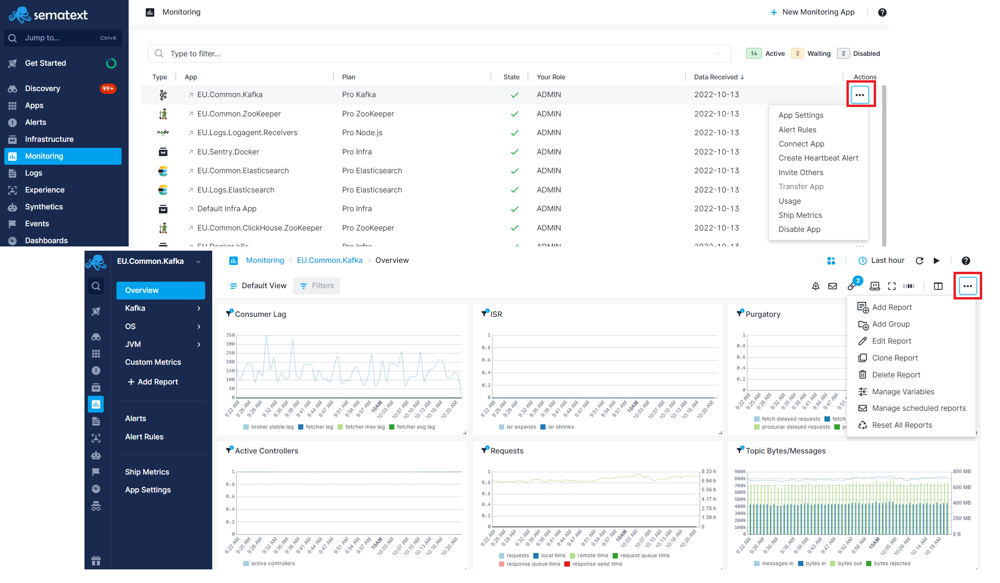
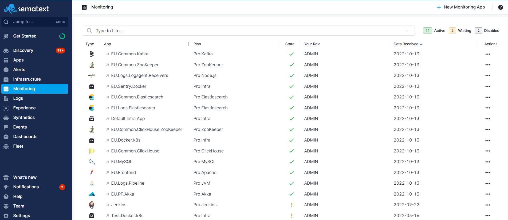

title: Sematext Monitoring App Settings
description: Sematext Cloud is a modern monitoring, log management, transaction tracing, and real user monitoring system that includes over 40 monitoring integrations. It is a suite of products that combine high-quality logging experience with other monitoring and alerting devops tools helping fix IT production issues

App settings and actions include, but are not limited to:

  - inviting others to your App
  - [alert rules](../alerts)
  - changing your App's plan
  - connecting Apps
  - heartbeat alert creation
  - App ownership transfer
  - scheduled report emails (aka Subscriptions)
  
<!--  -->

<!--  -->

## Side Navigation

The persistent region on the left that can be collapsed, is used to easily switch across monitoring, log management, real user monitoring, and other user & team features. All side navigation tabs are selectable. If they have chevrons, it indicates that the top level section is collapsible and contains additional subitems. The subitems will let you explore all your Apps, or choose a particular App.

Side navigation top level sections for infrastructure and application performance monitoring, log management, and real user monitoring:

- [Discovery](https://sematext.com/docs/logs/discovery/intro/)
- [Infrastructure](https://sematext.com/docs/monitoring/infrastructure/)
- [Monitoring](https://sematext.com/docs/monitoring/)
- [Logs](https://sematext.com/docs/logs/)
- [Synthetics](https://sematext.com/docs/synthetics/)
- [Experience](https://sematext.com/docs/experience/)
- [Alerts](https://sematext.com/docs/experience/)
- [Events](https://sematext.com/docs/events/)
- [Dashboards](https://sematext.com/docs/dashboards/)

Side navigation sections for team features and settings:

- [Team](https://sematext.com/docs/team/)
- Settings

## App Actions

The Monitoring App view allows for easy interaction between various App settings.
From the App Actions drop down menu, the horizontal elipsis icon shows your App options and lets you open various App-specific function, like, **App Settings, alert rules, connect App, invite team members, ship metrics, create heartbeat alert, see usage, and transfer App ownership.**

## Report Selector

Once you create a Monitoring App, and start your Agent, you will get a **default Report created for you named Overview**. It will have the default data and default [component](#components) configuration. You can edit this Report, clone it, or create new ones. 

Based on what type of Monitoring Integration you chose, more Reports get created by default. In this Docker sample you can see three more Reports are created by default.

### Report Settings

- **Report Actions** - Your customized monitoring report can be better described using meta name and description, and you can assign unique URL Alias to identify that report.

- **Legends Position** and **Extended Charts** features - Except in the **default Overview Report**, each report can have legends for better chart interaction. Extended charts are also displayed below and provide a comparative view about the longer time span relative to the time frame displayed in the main chart. Just like report legends, the extended view can be hidden and only the chart with X and Y values displayed.

The next section describes the monitoring report menu located just below the top navigation menu, and help you discover how to add new components, correlate your logs and events with your Monitoring App, do report-specific actions, connect your Apps, and more.

