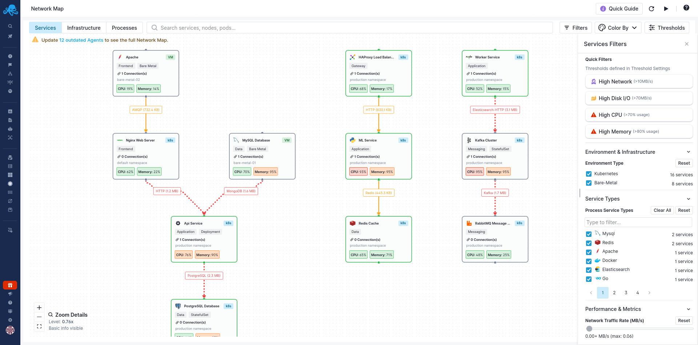
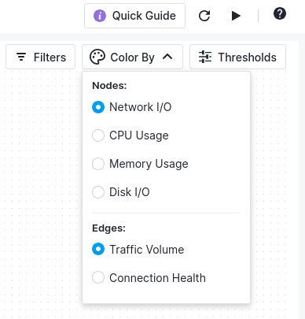

title: Filtering & Search
description: Find and filter specific services, infrastructure, and connections in Network Map.

When you're managing dozens or hundreds of services, you need ways to focus on what matters. Network Map provides powerful filtering and search capabilities that help you cut through the noise and find exactly what you're looking for.

## Finding Services with Search

The search bar at the top of Network Map lets you quickly find specific services, nodes, pods, or hosts by name. Just start typing and matching elements are highlighted on the map.

## Quick Filters for Common Problems

Click the Filters button to open the Services Filters panel. At the top, you'll find Quick Filters - pre-configured filters based on your [threshold settings](/docs/network-map/thresholds/) that highlight common problem areas:

**High Network** (>10MB/s) shows services with high network I/O. Use this to find services that might be bandwidth-constrained or experiencing unusual traffic.

**High Disk I/O** (>70MB/s) reveals services with elevated disk activity. This helps identify storage bottlenecks or services that might benefit from caching.

**High CPU** (>70% usage) filters to services consuming significant CPU. When your cluster is running hot, this immediately shows you where the load is coming from.

**High Memory** (>80% usage) displays services approaching their memory limits. Catching these early helps prevent OOM kills and service disruptions.

These quick filters are especially useful during incident response - instead of scanning the entire map, click "High CPU" to immediately see which services are struggling. The threshold values shown are defined in your [Threshold Settings](/docs/network-map/thresholds/).

## Filtering by Environment

The Environment & Infrastructure section lets you focus on specific parts of your infrastructure:

Use the **Environment Type** checkboxes to filter by **Kubernetes** or **Bare-Metal** (standalone hosts) services. Each option displays a count of matching services, so you know how many elements will appear after filtering. You can select both to see your entire infrastructure, or focus on just one environment type.

## Filtering by Service Type

The **Service Types** section lets you filter by specific technologies. Use the checkboxes to select one or more service types from the paginated list:

Looking for database issues? Select MySQL, PostgreSQL, or MongoDB to show only your database services. Troubleshooting messaging? Filter to Kafka and RabbitMQ. Investigating web traffic? Select Nginx and Apache.

The list shows counts next to each service type (like "2 services"), helping you understand your infrastructure composition at a glance. Use the search box to quickly find a specific service type, or use the pagination controls to browse through all available types.

## Filtering by Performance Metrics

The **Performance & Metrics** section provides sliders to filter based on resource consumption:

- **Network Traffic Rate (MB/s)** - Filter by network traffic volume to find your busiest services or investigate bandwidth issues
- **Disk I/O Rate (MB/s)** - Filter by disk throughput to identify I/O-intensive services
- **Connection Count** - Filter by the number of active connections to find services with many connections

These sliders work as minimum thresholds - services above your selected value appear on the map.

## Color Coding Options

The "Color By" dropdown in the top-right corner controls how services and connections are visually represented:

**Nodes** (service cards and infrastructure elements):

- Network I/O
- CPU Usage
- Memory Usage
- Disk I/O

**Edges** (connection lines):

- Traffic Volume
- Connection Health

Choose the metric most relevant to your current investigation. Traffic volume helps identify your busiest connections, while connection health highlights latency or reliability issues.

The color scale uses green for healthy values (below your warning threshold), yellow for warning levels (between warning and critical), and red for critical values (above your critical threshold). Gray indicates no data is available.

This color coding works with your [threshold configuration](/docs/network-map/thresholds/), so you can customize what "healthy" and "critical" mean for your environment.

## Combining Filters

Filters combine to narrow your view progressively. For example, you might:

1. Select "Kubernetes" to focus on containerized services
2. Filter to "PostgreSQL" service type to see only your databases
3. Apply the "High CPU" quick filter to find which databases are working hardest

The map updates immediately as you apply each filter, showing you only the services that match all your criteria.

## Clearing Filters

To reset your view, click "Clear All" in the filters panel or close the panel to return to showing all services. Individual filter sections also have their own clear options if you want to remove just one filter while keeping others.

## Practical Examples

**During an incident**: Open Quick Filters and click "High CPU" and "High Memory" to immediately see which services are resource-constrained. This is much faster than scanning the entire map.

**Capacity planning**: Filter by service type to see all instances of a particular technology. Examine their resource usage to determine if you need to scale.

**Investigating a namespace**: Use search to find services in a specific namespace, or filter by Kubernetes and then examine the namespace tags on each service.

**Finding connection issues**: Color edges by Connection Health, then look for red lines indicating problematic connections. Click on them to see latency and error details.

**Cost optimization**: Filter by low CPU and memory usage to find over-provisioned services that could be downsized. Look for services with minimal traffic that might be candidates for consolidation or removal. Identify redundant services running the same workload across multiple instances when fewer would suffice.

## Next Steps

- [Thresholds](/docs/network-map/thresholds/) to customize what "High CPU" and other quick filters mean for your environment
- [Services View](/docs/network-map/services-view/) to understand the tier-based service layout
- [Infrastructure View](/docs/network-map/infrastructure-view/) to drill down into Kubernetes and standalone host infrastructure
