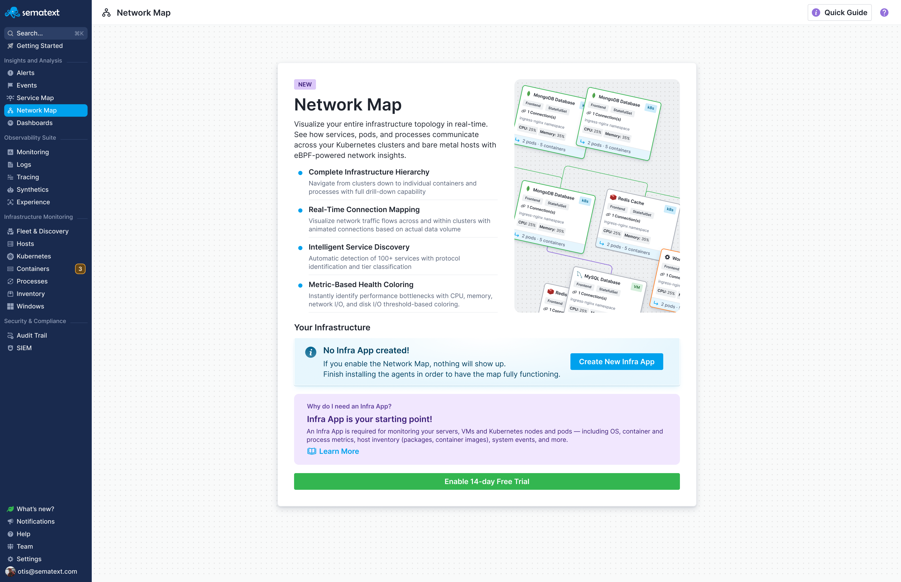
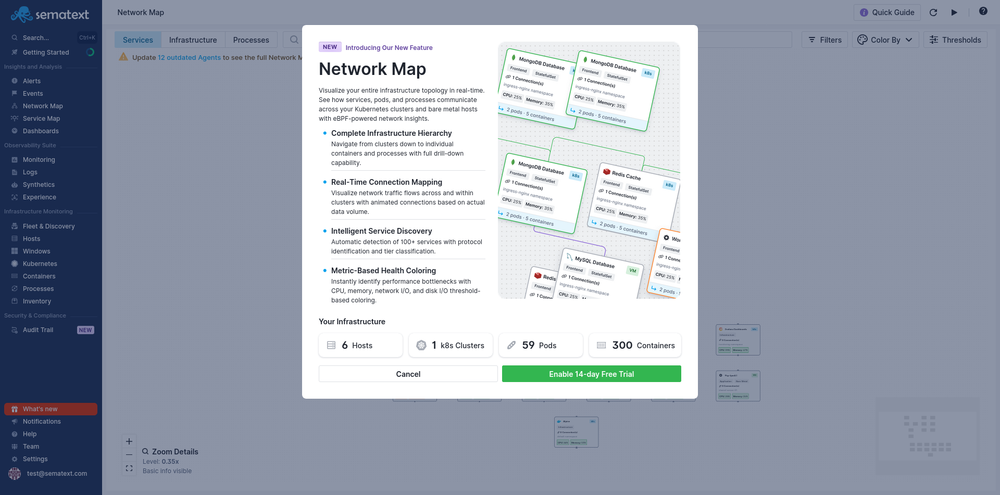

title: Getting Started with Network Map
description: Learn the prerequisites and how to enable Network Map for your infrastructure.

Getting Network Map up and running takes just a few minutes if you already have Sematext Infra Monitoring in place. If you're new to Sematext, this guide walks you through everything you need.

## What You Need

Network Map requires two things:

**An [Infra App](/docs/monitoring/infrastructure/)** to collect and store your infrastructure data. If you're already using Sematext for infrastructure monitoring, you have this. If not, you'll create one as part of the setup process.

**[Sematext Agent](/docs/agents/sematext-agent/installation/)** installed on the hosts you want to monitor. The agent collects eBPF-based network connection data that powers Network Map's topology visualization. You need version 4.1.x or later.

For best results, your hosts should be running **Linux kernel 5.8 or later**. Older kernels (4.15+) work but with some limitations. Check your kernel version with `uname -r`.

## Enabling Network Map

Navigate to Network Map in the Sematext Cloud sidebar. What you see next depends on your current setup:

### If You Don't Have an Infra App

You'll be prompted to create an Infra App first. Click "Create New Infra App" to create one, give it a name (like "Production Infrastructure" or "Staging Environment"), and you're set.

Each Infra App typically represents one environment. Many teams have separate Infra Apps for production, staging, and development.

### If You Have an Infra App But No Agents

You'll see instructions to install [Sematext Agent](/docs/agents/sematext-agent/installation/). The installation is straightforward - you'll get a command to run on each host that includes your Infra App token.

For Kubernetes environments, you'll deploy the agent as a DaemonSet so it runs on every node automatically.

### If Everything Is Ready

When you have an Infra App and agents installed, you'll see a summary of your infrastructure showing the number of hosts, Kubernetes clusters, pods, and containers that Network Map will monitor. If you've already enabled Network Map, you'll skip this screen and see your data directly.

Click the Enable button to activate Network Map. There's no need to configure anything on your agents - the backend automatically enables Network Map data collection when you enable the feature. Your agents will start sending topology data right away.

## What Happens After Enabling

Once enabled, here's what to expect:

**Data collection begins immediately.** The Sematext Agent starts observing network connections and sending topology data to Sematext Cloud.

**Initial topology appears within minutes.** You'll see your first services and connections show up in Network Map. The visualization builds as the agent observes more connections.

**The map becomes more complete over time.** Services that haven't made network connections yet won't appear until they do. As your infrastructure communicates, Network Map captures more of the topology.

**No restart required.** Your agents don't need to restart when you enable Network Map. The feature activates dynamically.

## Verifying It's Working

After a few minutes, you should see:

- Service nodes appearing on the map
- Connection lines between services showing protocols and traffic
- Your Kubernetes clusters and nodes (if applicable) in the Infrastructure view

If nothing appears after 10 minutes, check the [Troubleshooting](/docs/network-map/troubleshooting/) guide.

## Using the Quick Guide

Click the **Quick Guide** button in the top-right corner of Network Map to see a visual legend explaining the interface. The Quick Guide shows you what the different node colors mean (green for healthy, yellow for warning, red for critical), how connection lines are colored based on traffic volume and health, and what controls are available. It's a handy reference while you're learning the interface.

## Pricing

For Network Map pricing details, visit [sematext.com/pricing](https://sematext.com/pricing).

## Next Steps

Once Network Map is running:

- [Services View](/docs/network-map/services-view/) - Explore your services organized by tier
- [Infrastructure View](/docs/network-map/infrastructure-view/) - Drill down into Kubernetes clusters and standalone hosts
- [Filtering & Search](/docs/network-map/filtering-search/) - Learn to find and filter specific services
- [Thresholds](/docs/network-map/thresholds/) - Customize warning and critical levels for your environment
