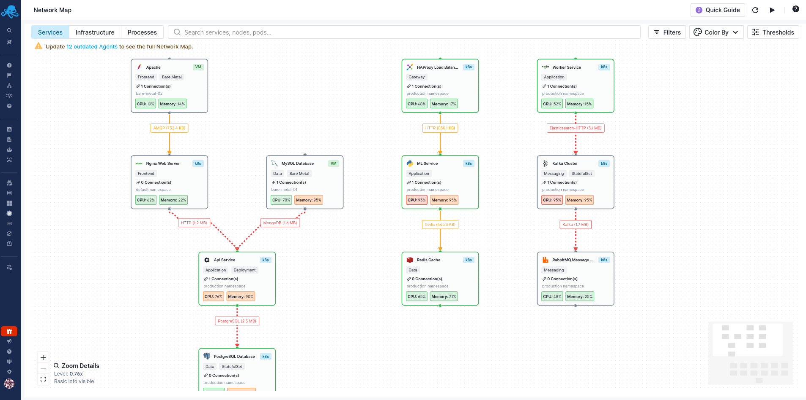

title: Network Map
description: Visualize your entire infrastructure topology in real-time with eBPF-powered network insights. See Kubernetes clusters, bare-metal hosts, and communication patterns.

Network Map gives you a real-time, visual representation of your entire infrastructure topology. Using eBPF-powered network insights collected by the Sematext Agent, you can see how your services, pods, containers, and processes communicate across Kubernetes clusters and bare-metal hosts.

Instead of mentally piecing together your infrastructure from logs, metrics, and configuration files, Network Map shows you the actual connections happening right now. When something breaks, you can immediately see which services are affected and trace the problem to its source.

## Why Use Network Map?

Traditional monitoring tells you that a service is slow or throwing errors. Network Map shows you *why* - maybe a downstream database is overloaded, or traffic is being routed through an unexpected path, or a new service deployment broke a critical connection.

With Network Map, you can:

**Understand your infrastructure at a glance.** See all your services, how they connect, and what protocols they use. No more guessing which services talk to which databases, or wondering if that new microservice is actually being called.

**Troubleshoot faster.** When an alert fires, open Network Map to immediately see the affected service and all its dependencies. Click on connections to see traffic volume, latency, and protocol details. Identify bottlenecks by spotting services with high CPU or memory usage - they're colored red so you can't miss them.

**Navigate complex Kubernetes environments.** Drill down from cluster to node to pod to container to process. See inter-node traffic, identify which pods are communicating across nodes, and understand your namespace topology.

**Discover your services automatically.** Network Map detects [over 100 service types](supported-services.md) including databases, caches, message queues, and web servers. You don't need to configure anything - it recognizes PostgreSQL, Redis, Kafka, Nginx, and many more from their network signatures.

**Reduce infrastructure costs.** Identify over-provisioned services that are consuming resources but barely being used. Spot redundant connections, find services that could be consolidated, and discover unused infrastructure. When you can see exactly what's running and how it's being used, you can make informed decisions about where to cut costs without impacting performance.

## Two Ways to View Your Infrastructure

Network Map offers two complementary views, accessible via tabs at the top of the interface:

The [Services View](services-view.md) shows your business applications and their connections. This is ideal for understanding service dependencies and troubleshooting application-level issues. You can see at a glance which services connect to your databases, how traffic flows between components, and where bottlenecks occur.

The [Infrastructure View](infrastructure-view.md) shows your physical and virtual infrastructure hierarchy. For Kubernetes, you can drill down from clusters to nodes to pods to containers. For bare-metal hosts, you see your servers and the services running on them. This view is perfect for capacity planning, identifying noisy neighbors, and understanding resource distribution.

## Getting Started

To use Network Map, you need:

1. At least one [Infra App](../monitoring/infrastructure.md) created in Sematext Cloud
2. [Sematext Agent](../agents/sematext-agent/index.md) installed on your hosts (version 4.1.x or later)

Once enabled, Network Map starts collecting data immediately. Within a few minutes, you'll see your first topology visualization.

See [Getting Started](getting-started.md) for detailed setup instructions.

## Learn More

- [Getting Started](getting-started.md) - Prerequisites and enabling Network Map
- [Services View](services-view.md) - Understand service dependencies and connections
- [Infrastructure View](infrastructure-view.md) - Navigate Kubernetes and bare-metal infrastructure
- [Filtering & Search](filtering-search.md) - Find specific services and focus on what matters
- [Thresholds](thresholds.md) - Customize warning and critical levels for your environment
- [Troubleshooting](troubleshooting.md) - Common issues and solutions
