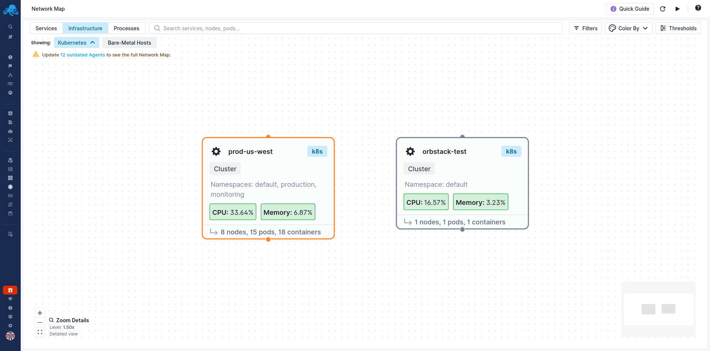
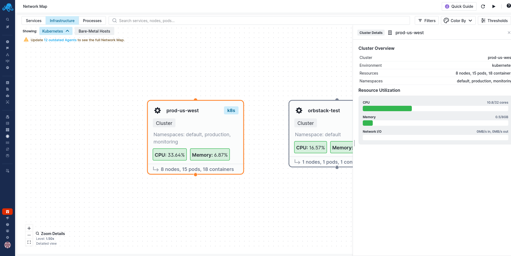
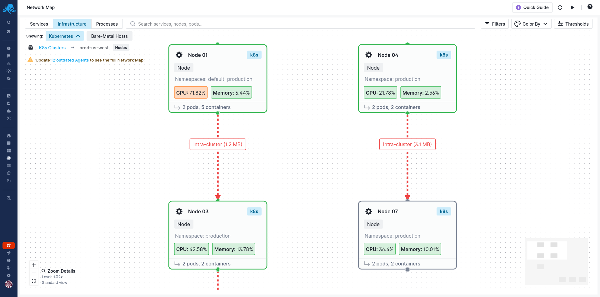
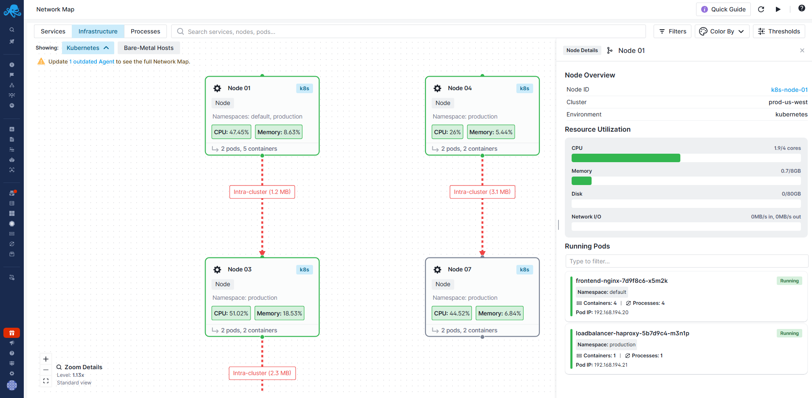
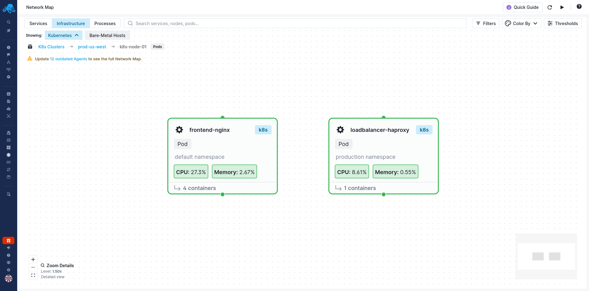
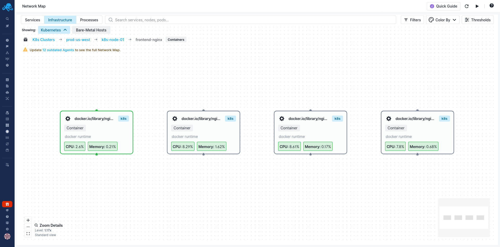
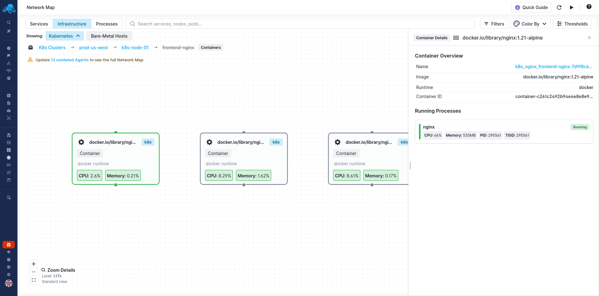
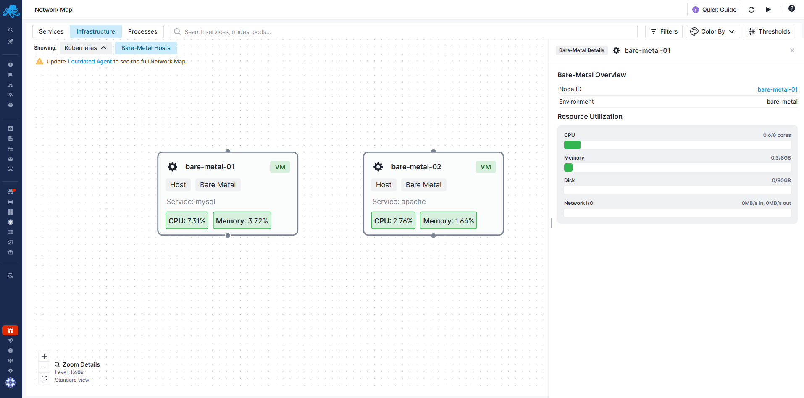

title: Infrastructure View
description: Navigate your Kubernetes clusters and standalone hosts with drill-down capabilities.

The Infrastructure View shows your physical and virtual infrastructure in a hierarchical layout. For Kubernetes environments, you can drill down from clusters to nodes to pods to containers to processes. For standalone hosts, you see your servers and what's running on them.

This view is essential for understanding resource distribution, identifying noisy neighbors, troubleshooting node-level issues, and capacity planning.

## Navigating Kubernetes Infrastructure

When you switch to the Infrastructure tab and select Kubernetes, you start at the cluster level. From here, you can drill down through four levels of hierarchy:

**Clusters** show all your Kubernetes clusters. Each cluster card displays the cluster name, namespaces, CPU and memory utilization, and the count of nodes, pods, and containers. Click on a cluster to see its nodes.

Click on a cluster to open the Cluster Details panel, which shows the cluster name, environment, total resources (nodes, pods, containers), namespaces, and resource utilization bars for CPU, memory, and network I/O.

**Nodes** display the worker nodes within the selected cluster. You can see which nodes are running hot (high CPU or memory), how many pods each node is running, and the intra-cluster traffic flowing between nodes.

The connections between nodes show intra-cluster traffic with volume labels like "Intra-cluster (1.2 MB)". This helps you identify unexpected cross-node communication patterns.

Click on a node to see the Node Details panel with resource utilization (CPU cores, memory, disk, network I/O) and a list of running pods on that node.

**Pods** appear when you click into a node. Each pod card shows its name, namespace, CPU and memory usage, and container count.

**Containers** are visible when you drill into a pod. You can see each container's image name, runtime (like Docker), and resource usage. This is useful for multi-container pods where you need to identify which specific container is causing issues.

Click on a container to see the Container Details panel with the container name, image, runtime, container ID, and a list of running processes with their CPU, memory, PID, and TGID.

A breadcrumb trail at the top tracks your navigation path. For example: `K8s Clusters → prod-us-west → k8s-node-01 → frontend-nginx → Containers`. Click any level in the breadcrumb to jump back up the hierarchy.

## Understanding Intra-Cluster Traffic

At the node level, you'll see connections between nodes with traffic volume labels like "Intra-cluster (1.2 MB)". This visualization helps you:

- Identify pods that communicate heavily across nodes, which might benefit from co-location
- Spot unexpected traffic patterns that could indicate misconfiguration
- Understand the network load between nodes for capacity planning

The connections are color-coded by traffic volume, so high-traffic connections stand out immediately.

## Standalone Hosts

Toggle to the "Bare-Metal" tab to see your non-Kubernetes infrastructure. This view shows your standalone hosts (VMs or physical servers) as cards on the canvas.

Each host card displays the hostname, a "VM" badge, the primary service detected running on that host (like MySQL or Apache), and current CPU and memory utilization.

Click on any host to open the Host Details panel, which shows the node ID, environment, and resource utilization bars for CPU, memory, disk, and network I/O.

This view is appropriate for traditional infrastructure that isn't containerized, or for mixed environments where you have both Kubernetes and standalone servers.

## Practical Use Cases

**Troubleshooting a slow service**: Start in the Services View to identify the slow service, then switch to Infrastructure View. Drill down to the pod level to check resource usage. If the pod looks fine, check the node - maybe it's overloaded or experiencing network issues with other nodes.

**Investigating a node problem**: If you receive an alert about a node, go directly to Infrastructure View, find the node, and examine its pods. The details panel shows you which pods are consuming the most resources, helping you identify whether one workload is monopolizing the node.

**Capacity planning**: Use the cluster and node views to understand resource distribution. Identify nodes that are consistently running hot and pods that might need resource limit adjustments.

**Debugging container issues**: When pod-level investigation isn't enough, drill down to the container level. The Container Details panel shows you which processes are running inside each container, helping you verify the right workloads are executing.

**Reducing infrastructure costs**: Identify nodes with low utilization that could be candidates for consolidation. Find pods consuming minimal resources that might be over-provisioned. Spot idle containers that could be shut down. When you can see actual resource usage across your entire infrastructure, you can make data-driven decisions about rightsizing and eliminate waste.

## Navigation Controls

The minimap in the bottom-right corner shows an overview of the entire topology, helping you understand where you are in relation to the full map.

Zoom controls let you adjust the detail level. When zoomed out, you see more elements but less detail per element. Zoom in to focus on a smaller area with full information.

Use the zoom indicator to see your current zoom level, which affects how much information appears on each card.

## Next Steps

- [Services View](/docs/network-map/services-view/) to understand service-level dependencies and connections
- [Filtering & Search](/docs/network-map/filtering-search/) to find specific pods, filter by namespace, or focus on resource-heavy workloads
- [Thresholds](/docs/network-map/thresholds/) to set appropriate warning and critical levels for your infrastructure
