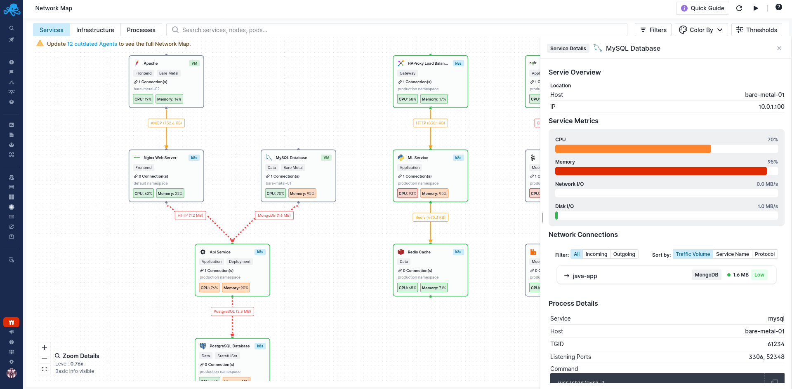
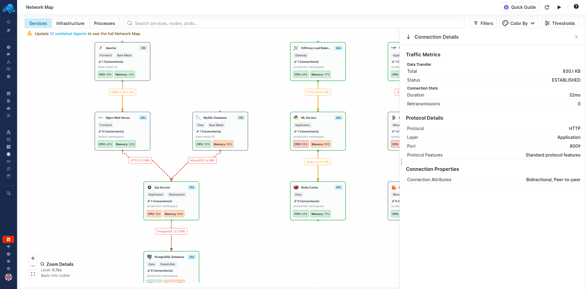

title: Services View
description: Visualize your services and their connections with real-time metrics and network insights.

The Services View shows your business applications and their connections. You can see how services communicate, identify which databases and caches your applications depend on, and trace request flows through your infrastructure.

## Understanding the Layout

Services are displayed as cards on the canvas, with connection lines showing how they communicate. The layout helps you visualize your application topology - you can see which services connect to databases, which ones communicate with message queues, and how traffic flows between components.

Each service card shows at a glance whether it's running in Kubernetes (marked with a "k8s" badge) or on a standalone host (marked with "VM"). The connections between services are labeled with the protocol and traffic volume, making it easy to identify your busiest communication paths.

## Reading the Service Cards

Each service card tells you everything you need to know at a glance:

The service name and icon tell you what type of service it is. A badge shows whether it's running in Kubernetes ("k8s") or on a standalone host ("VM"). You'll also see tags indicating the service type (like "Data" for databases or "Application" for your business services), the workload type (Deployment, StatefulSet, etc.), and how many active connections the service has.

The CPU and memory percentages show current resource usage. These numbers change color based on your [threshold settings](/docs/network-map/thresholds/) - green means healthy, yellow means warning, red means critical. When a service turns red, you know immediately where to focus your attention.

For Kubernetes services, you'll also see the namespace and the host where the service is running, giving you context about where the service lives in your infrastructure.

## Understanding Connections

The lines between services represent actual network connections. Each line shows:

The protocol being used - HTTP, PostgreSQL, MongoDB, Kafka, or any of the [dozens of protocols](/docs/network-map/supported-services/#supported-protocols) Network Map detects. The traffic volume appears as a label on the line, like "HTTP (1.2MB)", so you can see which connections are handling the most data.

Connection lines are color-coded. Green connections are healthy. Yellow indicates elevated latency or traffic approaching your thresholds. Red means the connection is experiencing problems - high latency, errors, or traffic beyond your critical threshold.

The lines animate to show active traffic flow, and a red line immediately draws your eye to a problematic connection.

## Investigating a Service

Click on any service to open its details panel:

The **Service Overview** section shows where the service is running - the host name and IP address. This helps you quickly identify the physical or virtual location of the service.

The **Service Metrics** section displays real-time resource utilization with visual bars for CPU, memory, network I/O, and disk I/O. The bars are color-coded based on your [threshold settings](/docs/network-map/thresholds/), so you can immediately see if a service is resource-constrained.

The **Network Connections** section lists every connection to and from this service. You can filter to show All, Incoming, or Outgoing connections, and sort by Traffic Volume, Service Name, or Protocol. Each connection entry shows the direction (an arrow indicates whether this service is the client or server), the connected service name, the protocol being used, and the traffic volume.

The **Process Details** section at the bottom shows the underlying process information - the detected service type, host, process ID (TGID), listening ports, and the full command line. This is invaluable for debugging configuration issues or identifying exactly what's running.

## Investigating a Connection

Click on any connection line to open the Connection Details panel:

The **Traffic Metrics** section shows the total data transferred over this connection and the connection status (like ESTABLISHED for active connections).

The **Connection Stats** section displays the connection duration and retransmission count. High retransmissions can indicate network issues or congestion.

The **Protocol Details** section shows the detected protocol (HTTP, PostgreSQL, MongoDB, etc.), the network layer (Application), the port number, and any protocol-specific features.

The **Connection Properties** section describes the connection attributes - whether it's bidirectional or unidirectional, peer-to-peer or client-server, and other characteristics that help you understand the nature of the communication.

This helps you understand not just *that* services are connected, but *how* they're communicating.

## Zoom Levels

Network Map adapts its display based on your zoom level:

When zoomed out, you see the big picture - service names, icons, and colored health indicators. This is useful for getting an overview and spotting problem areas.

As you zoom in, more details appear: metrics, connection counts, namespace information, and pod counts. At the highest zoom levels, you see everything - full service cards with all available information.

Use the zoom controls in the bottom-left corner, or scroll to zoom. The zoom indicator shows your current level.

## Automatic Service Detection

Network Map automatically recognizes [over 100 service types](/docs/network-map/supported-services/) without any configuration. It identifies services based on container images, process names, network signatures, and Kubernetes metadata.

Supported services include:

- Databases like PostgreSQL, MySQL, MongoDB, Cassandra, and Elasticsearch
- Caches like Redis and Memcached
- Message queues like Kafka, RabbitMQ, and NATS
- Web servers like Nginx, Apache, and Caddy
- Proxies and gateways like HAProxy, Traefik, Kong, and Envoy
- Monitoring systems like Prometheus and Grafana
- Runtimes for Java, Node.js, Python, Go, .NET, and more

When Network Map detects a service, it shows the appropriate icon and applies type-specific intelligence for protocol detection and visualization.

## Next Steps

Once you're comfortable with the Services View, explore:

- [Infrastructure View](/docs/network-map/infrastructure-view/) to drill down into your Kubernetes clusters and standalone hosts
- [Filtering & Search](/docs/network-map/filtering-search/) to focus on specific services or find high-resource consumers
- [Thresholds](/docs/network-map/thresholds/) to customize the warning and critical levels for your environment
