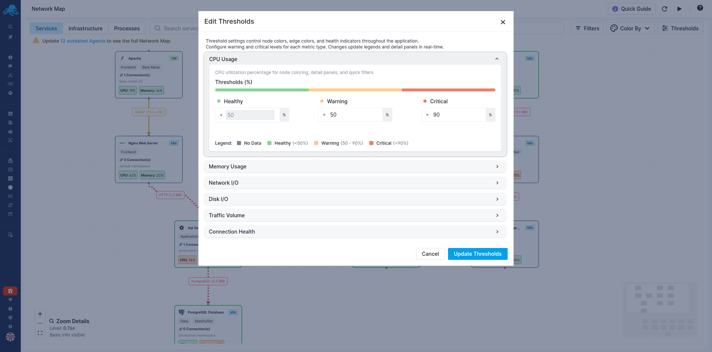

title: Threshold Configuration
description: Customize warning and critical thresholds for Network Map visualizations.

Thresholds determine when services and connections change color from green (healthy) to yellow (warning) to red (critical). By customizing these thresholds, you ensure that Network Map's visual indicators match your infrastructure's normal operating ranges.

Every environment is different. A database server that normally runs at 70% CPU is healthy, while an API server at 70% might indicate a problem. Thresholds let you define what "normal" means for your specific infrastructure.

## Accessing Threshold Settings

Click the "Thresholds" button in the Network Map header to open the Edit Thresholds dialog. You'll see expandable sections for each metric type. Click on any section to expand it and configure the threshold values.

## Understanding Threshold Levels

Each metric has three color zones defined by two threshold values:

**Healthy** (green) - Values below the warning threshold. This indicates normal operation.

**Warning** (yellow) - Values between the warning and critical thresholds. This indicates elevated usage that you should be aware of but isn't yet critical.

**Critical** (red) - Values above the critical threshold. This indicates a problem that needs attention.

For example, with CPU thresholds set to Warning at 50% and Critical at 90%:

- Below 50% CPU → Green (Healthy)
- 50-90% CPU → Yellow (Warning)
- Above 90% CPU → Red (Critical)

A visual bar in each threshold section shows how these zones are distributed.

## Configuring Each Metric

### CPU Usage

CPU thresholds are percentages. Set the Warning and Critical values based on what's normal for your environment.

If your services normally run at higher CPU levels, increase these thresholds so you don't see constant warnings. If you want earlier alerts, lower them.

Consider your workload patterns. Batch processing jobs might regularly spike to 100% CPU and that's fine. Web services running consistently above 80% might indicate capacity issues.

### Memory Usage

Memory thresholds are percentages. For services, Network Map shows RSS (Resident Set Size) - the actual physical memory allocated to the process. Watching for unexpected growth can help catch memory leaks early.

For JVM-based services, heap usage patterns differ from RSS. A JVM might show high heap usage but be perfectly healthy if garbage collection is working well.

### Network I/O

Network I/O thresholds are in MB/s. These might need significant adjustment based on your infrastructure. A file server legitimately moves terabytes of data. A microservice might consider 10 MB/s unusually high.

High network I/O isn't always bad - it might mean your service is busy doing its job. But unexpected network traffic spikes can indicate problems like runaway queries, cache misses, or attacks.

### Disk I/O

Disk I/O thresholds are in MB/s. Database servers and logging systems naturally have high disk I/O. Adjust these thresholds based on your storage tier's capabilities. An NVMe drive handles very different loads than a network-attached volume.

Sustained high disk I/O can indicate queries without proper indexes, logging verbosity issues, or storage subsystem problems.

### Traffic Volume

Traffic volume thresholds apply to connection edges. These thresholds color the lines between services. High traffic connections might indicate busy services or could suggest unexpected data flows. Lower thresholds help you spot unusual traffic patterns.

### Connection Health

Connection health thresholds are latency in milliseconds. These affect connection line colors based on response time. Adjust based on your latency expectations - internal microservices might expect sub-10ms responses, while external API calls might tolerate hundreds of milliseconds.

## How Thresholds Affect the Interface

Your threshold settings influence several parts of Network Map:

**Node colors** change based on the metric you've selected in the "Color by" dropdown. If you're coloring by CPU and a service exceeds your CPU critical threshold, it turns red.

**Connection colors** change based on traffic volume or connection health thresholds, depending on your edge coloring selection.

**Quick Filters** use your thresholds. When you click "High CPU" in the filters panel, it shows services above your CPU warning threshold. Adjusting your thresholds changes what these filters show.

**Detail panel indicators** show where current values fall relative to your thresholds. The visual bars in service details use green, yellow, and red sections based on your configuration.

## Recommendations for Setting Thresholds

Start with the defaults and adjust based on observation. Watch Network Map during normal operations for a day or two. If services are constantly yellow or red during normal operation, your thresholds are too low. If you never see warnings, they might be too high.

Consider setting different mental expectations for different service types. Unfortunately, thresholds are global - you can't set different CPU thresholds for databases versus web servers. Choose values that minimize false alarms while still catching real problems.

For critical services, consider more conservative thresholds. It's better to investigate a false alarm than to miss a real problem.

Review your thresholds after infrastructure changes. If you upgrade to faster storage, your disk I/O thresholds might need adjustment. If you scale up your services, network thresholds might need to increase.

## Saving Changes

After configuring your thresholds, click the "Update Thresholds" button to apply your changes. The changes take effect immediately across all Network Map views.

## Next Steps

- [Filtering & Search](/docs/network-map/filtering-search/) to use Quick Filters based on your threshold settings
- [Services View](/docs/network-map/services-view/) to see threshold-based coloring in action
- [Infrastructure View](/docs/network-map/infrastructure-view/) to apply these thresholds to your Kubernetes and standalone host infrastructure
