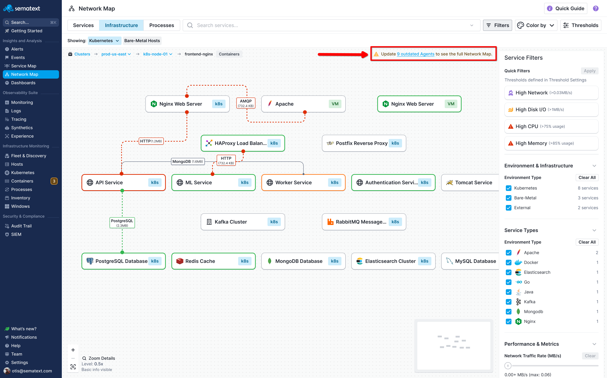

title: Troubleshooting Network Map
description: Solutions for common Network Map issues and requirements.

This guide helps you resolve common issues with Network Map and understand its requirements.

## Requirements

Network Map requires:

**An Infra App** in your Sematext Cloud account. The Infra App collects infrastructure metrics and provides the foundation for Network Map's topology visualization. If you don't have one, create one at [Sematext Cloud](https://apps.sematext.com/ui/infrastructure/create).

**[Sematext Agent](../agents/sematext-agent/installation/) version 4.1.x or later** installed on your hosts. The agent collects the eBPF-based network connection data that powers Network Map. Check your agent version with `sematext-agent --version`.

**Linux kernel 5.8 or later** for optimal performance. Network Map uses eBPF with ring buffers, which requires kernel 5.8+. Older kernels (4.15+) work but with reduced performance and some limitations. Check your kernel version with `uname -r`.

## Outdated Agents Warning



If you see a warning like "Update 9 outdated Agents to see the full Network Map", some of your agents are running older versions that don't support all Network Map features.

This typically happens when you've added Network Map to an environment where agents were installed before the feature was available, or when some hosts haven't received agent updates.

To resolve this:

1. Click the warning banner to see which hosts have outdated agents
2. Update those agents to version 4.1.x or later
3. The warning disappears once all agents are current

Follow the [Sematext Agent update instructions](../agents/sematext-agent/installation/) to upgrade your agents to the latest version.

## No Data Showing

If Network Map is enabled but shows no services or connections, work through these checks:

**Verify the agent is running:**

```bash
systemctl status sematext-agent
```

If it's not running, start it with `sudo systemctl start sematext-agent`.

**Check agent logs for errors:**

```bash
journalctl -u sematext-agent -f
```

Look for connection errors, authentication failures, or eBPF-related warnings.

**Verify your Infra App token is configured correctly.** The agent needs a valid token to send data. Check your agent configuration and ensure the token matches an Infra App in your Sematext account.

**Confirm Network Map is enabled.** Visit the Network Map page in Sematext Cloud and confirm it's enabled. If it shows options to enable, click to enable it.

**Wait for data collection.** After enabling Network Map or installing a new agent, data takes a few minutes to appear. The agent needs time to observe network connections and send the data to Sematext.

**Check kernel compatibility.** If you're running a kernel older than 4.15, eBPF features may not work. Check with `uname -r`.

## Missing Services

If some services you expect aren't appearing:

**Give it time.** New services take a few minutes to appear after they start. The agent observes network connections over time, so a service that hasn't made any connections yet won't appear.

**Verify the service is actually running** on a host with Sematext Agent installed. Services on hosts without agents won't be detected.

```bash
ps aux | grep <service-name>
```

**Check that the agent is on that host.** Each host needs its own agent instance. If you've added new hosts to your infrastructure, ensure they have agents installed.

**Look for network connectivity issues.** If the agent can't reach Sematext Cloud, data won't be transmitted. Check firewall rules and proxy settings.

**Consider unrecognized services.** Network Map detects over 100 service types, but custom or unusual services might appear with generic names rather than specific icons. They should still show up as processes or connections.

## Missing Connections

If services appear but connections between them don't:

**Ensure there's active traffic.** Connections only appear when there's actual network communication. If a service hasn't sent or received data recently, its connections won't show.

**Check if it's loopback traffic.** Connections to localhost (127.0.0.1) are filtered out by default since they're typically internal to a host.

**Verify both endpoints have agents.** For a connection to appear, the agent needs to observe it. Connections to external services outside your monitored infrastructure show differently than internal connections.

**Consider kernel limitations.** Some connection types may not be captured on older kernels. Kernel 5.8+ provides the best coverage.

## Performance Issues

If Network Map is slow or your browser struggles:

**Zoom out.** At lower zoom levels, Network Map renders less detail per element, improving performance. Use the zoom controls to find a balance between detail and responsiveness.

**Apply filters.** Instead of displaying your entire infrastructure, use [filters](filtering-search.md) to focus on specific services, namespaces, or service types. Fewer elements means better performance.

**Use Quick Filters.** If you're troubleshooting, Quick Filters like "High CPU" immediately narrow the view to relevant services.

**Try a different browser.** Network Map uses modern browser features for rendering. Chrome and Firefox typically provide the best performance.

## Incorrect Service Detection

If services are detected with wrong names or types:

Network Map identifies services using multiple signals: container image names, process names, environment variables, Kubernetes metadata, and port-based inference. Usually this works well, but sometimes:

Custom services might not match any known patterns and appear as generic processes. Services with non-standard configurations might be misidentified. Heavily customized container images might confuse image-based detection.

Currently, service detection is automatic and cannot be manually overridden. The detected service type affects the icon displayed and tier placement, but doesn't affect the underlying data collection.

## Getting More Help

If you're still experiencing issues:

Check the [Sematext Agent troubleshooting guide](../agents/sematext-agent/agent-troubleshooting/) for agent-specific issues.

Check the [Sematext status page](https://status.sematext.com) for any ongoing platform issues.

Review agent logs for specific error messages that might indicate the problem:

```bash
journalctl -u sematext-agent --since "1 hour ago" | grep -i error
```

Contact Sematext support with details about your environment, the issue you're experiencing, and any relevant log excerpts.

## Next Steps

- [Getting Started](getting-started.md) to review prerequisites and setup
- [Services View](services-view.md) to understand how services are displayed
- [Infrastructure View](infrastructure-view.md) to navigate your infrastructure hierarchy
