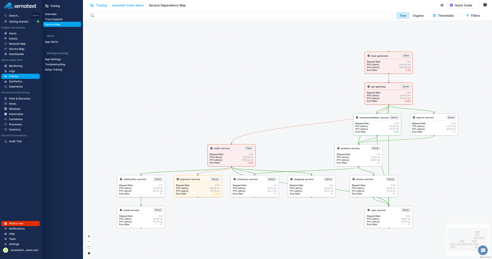
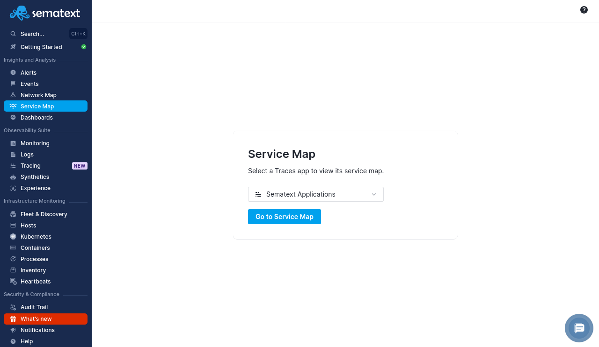
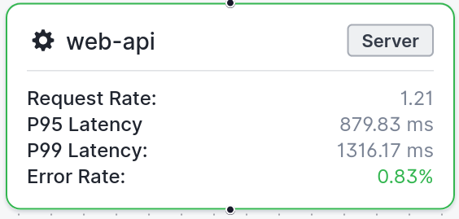
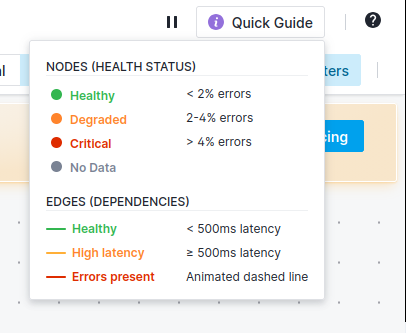
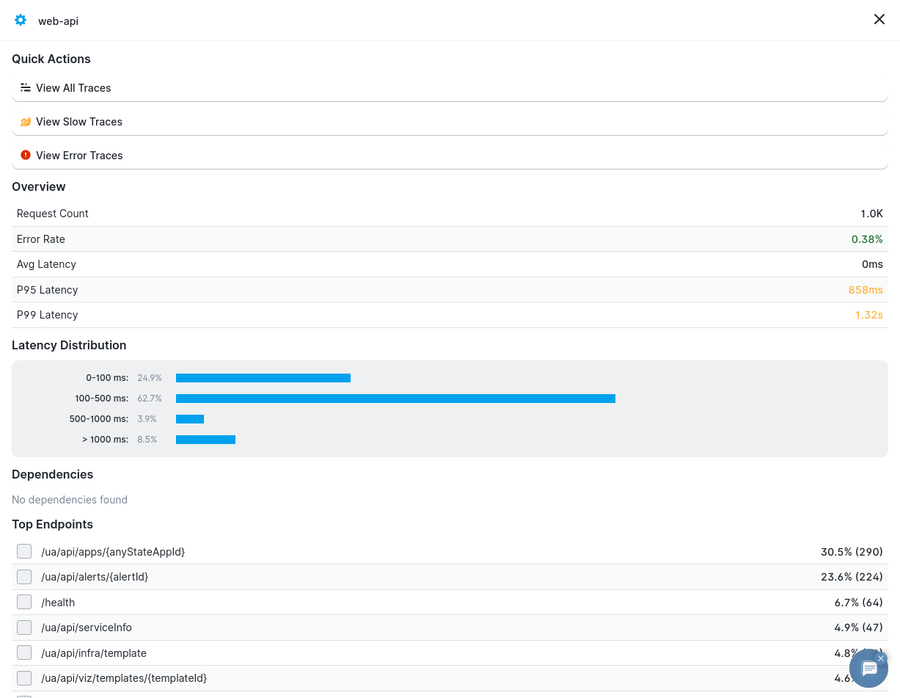
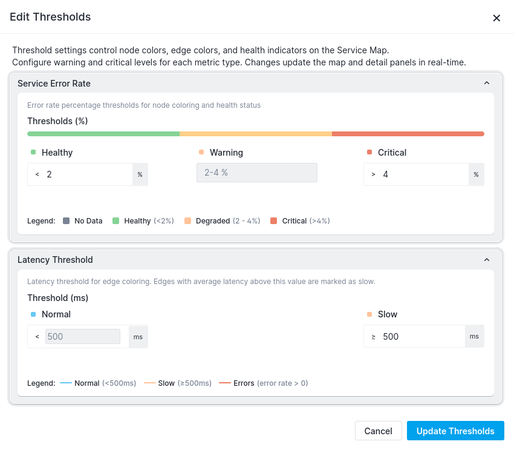

title: Service Map
description: Visualize service dependencies and communication patterns derived from distributed traces

Service Map gives you a real-time, visual representation of your service architecture based on your distributed traces. It automatically discovers services and their dependencies from OpenTelemetry trace data, showing you how requests flow through your system along with key performance indicators for each service.

Instead of digging through individual traces to understand your architecture, Service Map shows you the full picture - which services talk to each other, how they're performing, and where problems are occurring.

**Note:** Service Map is currently available as a **beta** feature. During the beta period, it is accessible to all Tracing plans at no additional cost. Pricing and tier availability will be announced before general availability.

## Why Use Service Map?

Traditional monitoring tells you that a service is slow or throwing errors. Service Map shows you the bigger picture - which services are affected, what they depend on, and where the problem originates.

With Service Map, you can:

**See your architecture as it actually is.** Service Map is built from real trace data, not static diagrams or manual configuration. Every service and dependency you see reflects actual request flow, so you're always looking at the truth.

**Investigate incidents faster.** When a service starts failing, open Service Map to immediately see its upstream callers and downstream dependencies. Spot cascading failures, identify the root cause service, and jump straight into filtered traces with one click.

**Track service health at a glance.** Color-coded nodes and edges surface degraded or critical services without digging through dashboards. Error rates above your thresholds turn nodes red, and high-latency dependencies stand out with orange or red edges.

**Understand latency patterns.** Each service node shows P95 and P99 latency, and the details panel includes a latency distribution histogram. Quickly tell whether slowness is systemic or caused by occasional outliers.

**Validate deployments and changes.** After deploying a new service or modifying communication patterns, use Service Map to verify dependencies are correct and no unexpected connections have appeared.

**Onboard faster.** New team members can open Service Map to understand how services interact without reading outdated documentation or tracing through code.

## Accessing Service Map

There are two ways to access Service Map:

1. **From the top-level navigation**: Click **Service Map** under Insights and Analysis in the left menu, select a Tracing App, and click **Go to Service Map**
2. **From within a Tracing App**: Open any Tracing App and click **Service Map** in the left sidebar

The map is generated from trace data flowing into your Tracing App, so it reflects actual service communication patterns - not static configuration.

## Understanding the Map

### Nodes (Services)

Each node on the map represents a service detected in your traces. Nodes display key metrics at a glance:

- **Service Name**: The name reported by your OpenTelemetry instrumentation
- **Role Badge**: Whether the service acts as a **Server** or **Client** in the traced interactions
- **Request Rate**: Number of requests per second handled by the service
- **P95 Latency**: 95th percentile response time
- **P99 Latency**: 99th percentile response time
- **Error Rate**: Percentage of requests resulting in errors

### Node Health Status

Nodes are color-coded based on their error rate:

| Status | Color | Default Threshold |
|--------|-------|-------------------|
| Healthy | Green | < 2% errors |
| Degraded | Orange | 2-4% errors |
| Critical | Red | > 4% errors |
| No Data | Gray | No recent trace data |

### Edges (Dependencies)

Lines connecting nodes represent service-to-service dependencies discovered from trace data. Edge appearance indicates the health of the communication:

| Status | Appearance | Default Threshold |
|--------|-----------|-------------------|
| Healthy | Green solid line | < 500ms latency |
| High Latency | Orange solid line | >= 500ms latency |
| Errors Present | Red animated dashed line | Errors detected |

The **Quick Guide** button in the toolbar provides a handy reference for these visual indicators.

## Node Details Panel

Clicking on any node opens a details panel with deeper insights into that service.

### Quick Actions

Jump directly to filtered trace views:

- **View All Traces**: Opens [Traces Explorer](/docs/tracing/reports/explorer/) filtered to this service
- **View Slow Traces**: Shows only high-latency traces for this service
- **View Error Traces**: Shows only traces with errors for this service

### Overview

Expanded metrics for the selected service:

- Request Count
- Error Rate
- Avg Latency
- P95 Latency
- P99 Latency

### Latency Distribution

A histogram showing how request latencies are distributed, helping you understand whether latency issues affect all requests or just a tail.

### Dependencies

Lists the downstream services this node communicates with, along with their top endpoints and request counts.

## Customizing Thresholds

Default health thresholds may not fit every environment. Click the **Thresholds** button in the toolbar to customize warning and critical levels for:

### Service Error Rate

Configure what error rate percentage is considered healthy, warning, or critical for node coloring.

### Latency Threshold

Configure the latency value (in milliseconds) that determines whether an edge is shown as healthy or high-latency.

Changes apply immediately to the map visualization.

## Toolbar Controls

The toolbar at the top of the Service Map provides:

- **Targets**: Filter the map to show specific services or service groups
- **Thresholds**: Customize health indicator thresholds
- **Filters**: Apply additional filtering criteria
- **Quick Guide**: Reference card for node and edge visual indicators
- **Pause/Play**: Pause or resume real-time data updates

## Common Use Cases

### Incident Investigation

When an alert fires for a service, open Service Map to immediately see:

- Which upstream services send traffic to the affected service
- Which downstream dependencies it relies on
- Whether the issue is isolated or propagating across services

### Architecture Discovery

For teams onboarding to a new codebase or reviewing their architecture, Service Map provides an always-up-to-date view of how services actually communicate - based on real traffic, not documentation that may be outdated.

### Performance Optimization

Identify services with high latency or error rates and trace the problem through their dependencies. The latency distribution in the details panel helps distinguish between systemic slowness and occasional spikes.

### Deployment Validation

After deploying a new service or making changes to service communication, use Service Map to verify that the expected dependencies are present and that no unexpected connections have appeared.

## Service Map vs. Network Map

Sematext offers two complementary topology visualization features:

| | Service Map | [Network Map](/docs/network-map/) |
|---|---|---|
| **Data Source** | OpenTelemetry traces | eBPF network probes |
| **Scope** | Application-level service dependencies | Infrastructure-level network connections |
| **Metrics** | Request rate, latency, error rate | Traffic bytes, CPU, memory, I/O |
| **Accessed From** | Tracing App or top-level nav | Infra App |
| **Best For** | Understanding request flow and service health | Understanding infrastructure topology and network traffic |

Use **Service Map** when you need to understand how your application services interact and where performance bottlenecks exist. Use **Network Map** when you need to understand infrastructure-level connectivity, resource consumption, and network traffic patterns.

## Next Steps

- [Search and analyze traces](/docs/tracing/reports/explorer/) for specific services
- [View detailed trace waterfalls](/docs/tracing/reports/trace-details/) to understand individual requests
- [Set up alerts](/docs/tracing/alerts/creating-alerts/) on latency and error rates
- [Explore Network Map](/docs/network-map/) for infrastructure-level topology

## Related Documentation

- [Tracing Overview](/docs/tracing/)
- [Traces Explorer](/docs/tracing/reports/explorer/)
- [Trace Details](/docs/tracing/reports/trace-details/)
- [Network Map](/docs/network-map/)
