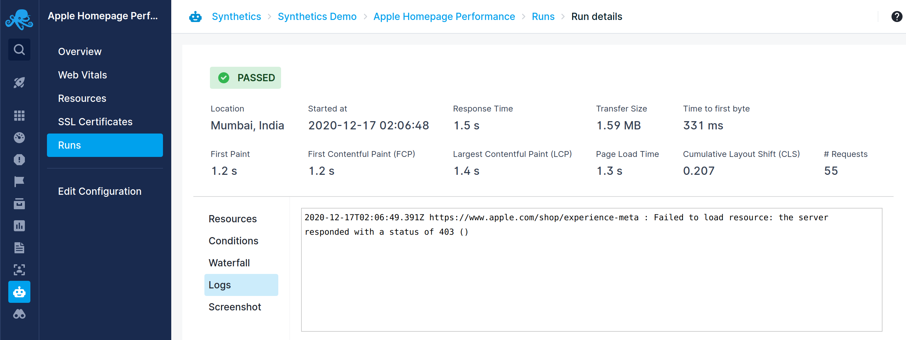
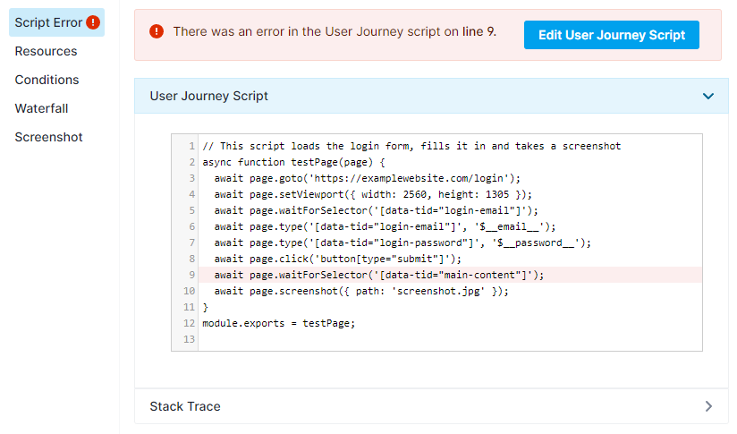
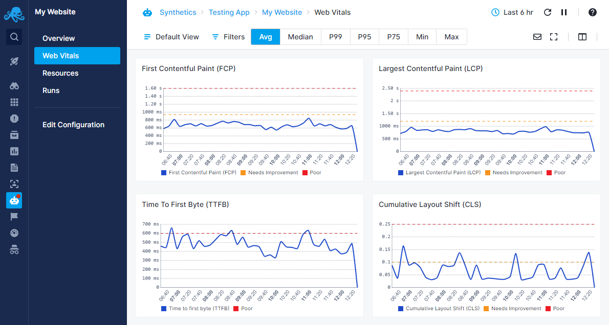

title: Browser Monitor
description: Browser monitor can monitor website performance and user journeys.

The Browser monitor can be used to monitor a single web page or a user journey across multiple pages. The Browser monitor loads the URL or executes the configured script in a Chrome browser. It records various performance metrics during the execution. The script can extract & verify the page content using the `assert` API during the execution. It can optionally collect screenshots.

## Configuration

### General

* **Name** - Name of the monitor. Max length is 255 characters.
* **Interval** - Monitor execution interval.
* **Device type** - Determines which device will be emulated during monitor execution by setting the appropriate User-Agent and Viewport/Resolution.
* **Locations** - List of locations the monitor will be run from.

Note that multiple monitors created in the same **Create Browser Monitor** flow will have different names, intervals and devices, but share the same locations, **User Journey** settings and **Alert Conditions**, which lets you quickly set up multiple monitors with different devices for the same use case.

### User Journeys / Transactions

To monitor a single website, you can directly configure the URL of the website to be monitored. To monitor a user journey across multiple pages or perform actions on your website, you configure a [User Journey script](./user-journey-scripts.md) to simulate user actions.

## Conditions

Browser monitors support the following alert condition types:

* **Error** - During each run, if there are any errors (like navigation timeout, assertion failed, etc.), they will be recorded in the error field of the response. This does not include the error returned as part of the response body. 
* **Metric** - Used to make sure the metrics are within the expected range. 

These conditions define the alert rule for your monitor. You can choose the priority of the alert rule right below the table where the alert conditions are edited. The default priority for Browser monitor alert rules is **Warning**. For more information on alerting, refer to the [Creating Synthetics Alerts](/alerts/creating-synthetics-alerts) page.

By default, the UI adds the below conditions while creating a Browser monitor. You can change them while creating or editing a Browser monitor:

* **Error** *equals* **empty**
* **Response Time** metric *less than* **20000 ms**

## Screenshots

Browser monitor scripts allow for the collection of page screenshots at any point during the execution. These screenshots can be taken using the [page.screenshot()](https://github.com/puppeteer/puppeteer/blob/main/docs/api/puppeteer.page.screenshot.md) Puppeteer method, the options for which can be found [here](https://github.com/puppeteer/puppeteer/blob/main/docs/api/puppeteer.screenshotoptions.md). The default resolution of a screenshot corresponds to the selected **Device type** (**Desktop** defaults to **1920&times;1080**). JPEG and PNG image types are supported. The number of screenshots per run varies depending on [the plan](https://sematext.com/pricing/#synthetics) you're using. On failure of the script due to errors (like navigation timeout, assertion failed, etc.), a screenshot `error.png` will be collected for analysis.

## Console Errors

The browser, which executes the Browser monitor's script, logs any errors while loading the web pages (such as JavaScript errors, network errors, etc.) in the browser console. The Browser monitor collects such errors. These errors can be used to gain some additional insight into the issues with the website, or to debug run failures. If the Browser monitor's script could successfully complete its execution, then these errors will be shown in the **Logs** section of run details. If your Browser monitor doesn't have a script defined, but is instead set to monitor a fixed URL, then any errors found there will also be shown in this section.

However, if the errors are such that the script can't properly execute, then the **Script Error** section will be displayed instead. If possible, the line in the script where the issue occurred will be highlighted and the stack trace will be displayed to aid you in diagnosing the issue.

## Web Vitals

[Web Vitals](https://web.dev/vitals/) is an initiative by Google to provide unified guidance for quality signals that are essential to delivering a great user experience on the web. These are a set of performance metrics that they consider are essential for improving user experience. The Core Web Vitals are:

* [Largest Contentful Paint (LCP)](https://web.dev/lcp/)
* [Total Blocking Time (TBT)](https://web.dev/tbt/) - Synthetic equivalent for [First Input Delay (FID)](https://web.dev/fid/)
* [Cumulative Layout Shift (CLS)](https://web.dev/cls/)

The other Web Vital metrics are:

* [First Contentful Paint (FCP)](https://web.dev/fcp/)
* [Time To First Byte (TTFB)](https://web.dev/time-to-first-byte/)

Our Synthetics Browser monitor collects all the above metrics except Total Blocking Time (TBT). The Web Vitals report under the Browser monitor displays these metrics. For each metrics, the recommended thresholds are also displayed for guidance. Since the Browser monitor tests the website in a desktop environment, these thresholds are for desktop devices.

You can filter the metrics based on locations and aggregate the results by average (default), percentile (99th, 95th, and 75th), min, and max.

## Waterfall chart

For every run, the Browser monitor collects all the resources fetched during the run. These resources are shown in a graphical waterfall chart in the individual run details page. The metrics shown for each resource are:

* **Total Time** - Total elapsed time of the request to fetch the resource in ms.
* **Started At** - Relative time when the fetch started in ms.
* **Blocked** - Time the request spent waiting before it could be sent in ms.
* **DNS** - Time taken for DNS resolution in ms.
* **Connect** - Socket connection time in ms.
* **SSL** - SSL handshake time in ms.
* **Send** - Time taken to send the request in ms.
* **Wait** - Time taken to receive the first byte of the response from the server in ms.
* **Receive** - Time taken to download the resource in ms.
* **Transfer Size** - Network size of the resource in bytes.
* **Content Size** - Actual uncompressed size of the resource.

## Run environment

Each Browser monitor run is executed in an isolated environment using a fresh instance of a headless Google Chrome browser in a Node.js environment. Versions of various dependencies are:

* **Node.js** - 14.x
* **Google Chrome** - 106.0.5249.0
* **Puppeteer** - 17.1.1

Default runtime configuration values are:

* **Chrome browser environment** - Desktop
* **Resolution** - `1920x1080`
* **Default Navigation timeout** - 30 seconds
* **Memory** - 2048 MB
* **CPU** - 1 vCPU
* **Network** - Throttled using Chrome settings. Download speed - 20 Mbps, Upload speed - 5 Mbps, Latency - 4ms.
* **User Agent** - `Mozilla/5.0 (X11; Linux x86_64) AppleWebKit/537.36 (KHTML, like Gecko) HeadlessChrome/93.0.4577.0 Safari/537.36 +SematextSyntheticsRobot`
