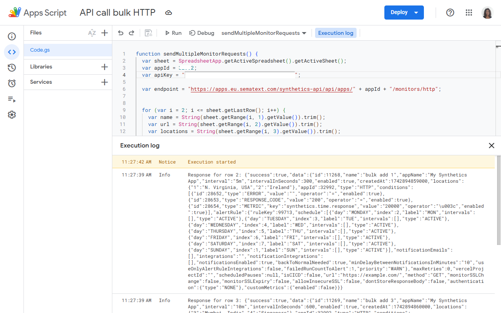
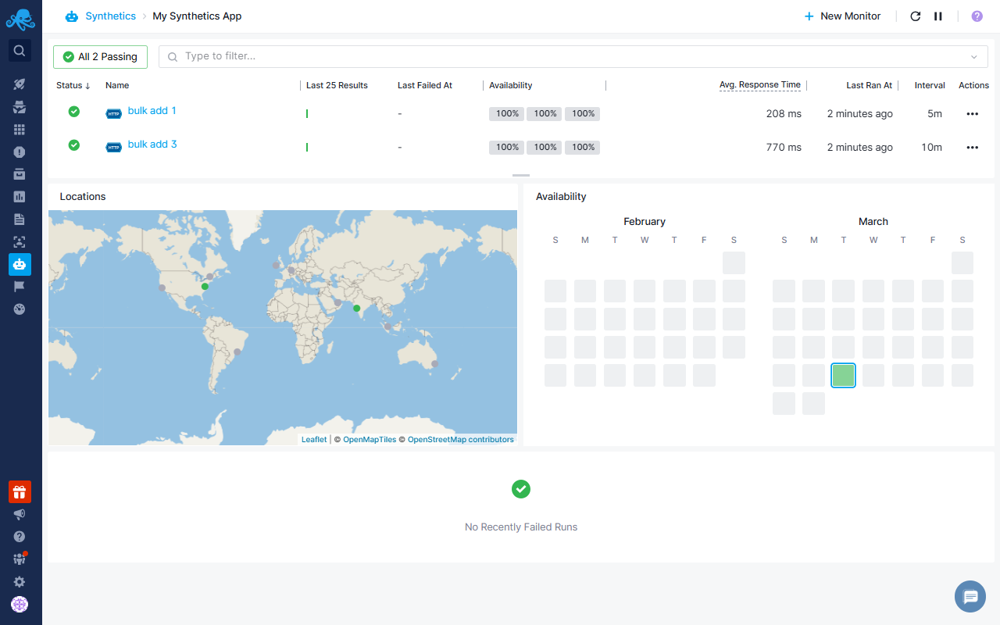

title: Bulk Add/Edit Monitors via Apps Script
description: Bulk add and edit HTTP and Browser Monitors using Google Sheets and Apps Script via the Sematext Synthetics API.

This guide explains how to use Google Sheets and [Apps Script](https://developers.google.com/apps-script) to bulk add or edit [HTTP](https://sematext.com/docs/synthetics/http-monitor/) and [Browser](https://sematext.com/docs/synthetics/browser-monitor/) Monitors. You can enter monitor details in a structured spreadsheet and use a script to send API requests for each monitor.

## Prerequisites 

- A Google account
- A Sematext account with API access
- Sematext [Synthetics App](https://sematext.com/docs/synthetics/) must be created within your Sematext Account
- A Google Sheet to store monitor details
- Google Apps Script extension

## Setting Up the Google Sheet to Bulk Add Monitors

- Create a new Google Sheet.
- Add rows for each monitor as follows:

| Monitor Name | URL |
| --- | --- |
| bulk add 1 | https://example_1.com |
| bulk add 3 | https://example_3.com | 

> You can add as many monitors as your selected plan allows. For more details, refer to the [pricing](https://sematext.com/pricing/) page. To keep this example simple, we'll demonstrate bulk adding two monitors.

- Proceed to **Extensions → Apps Script** to write the script that will bulk add monitors.

In the Apps Script, we'll write a function called `sendMultipleMonitorRequests` to iterate through all the monitors in the Google Sheet and bulk add HTTP monitors. 

> If you want to bulk add [Browser](https://sematext.com/docs/synthetics/browser-monitor/) monitors, follow these steps first, but refer to the [Bulk Add Browser Monitors](#bulk-add-browser-monitors) section for the minor changes needed to create Browser monitors.

We’ll explain each line in this guide, but in the end, your function will look like this:

```javascript
function sendMultipleMonitorRequests() {
  var sheet = SpreadsheetApp.getActiveSpreadsheet().getActiveSheet();
  var appId = YOUR_APP_ID;
  var apiKey = "YOUR_API_KEY";
  
  var endpoint = "https://apps.eu.sematext.com/synthetics-api/api/apps/" + appId + "/monitors/http";
  for (var i = 2; i <= sheet.getLastRow(); i++) {
    var name = String(sheet.getRange(i, 1).getValue()).trim();
    var url = String(sheet.getRange(i, 2).getValue()).trim();  
 
    if (!name || !url) {
      Logger.log("Skipping row " + i + " due to missing data.");
      continue;
    }

    if (!url.startsWith("http://") && !url.startsWith("https://")) {
      Logger.log("ERROR at row " + i + ": Invalid URL format.");
      continue;
    }

    // Define the configuration parameters for creating an HTTP monitor.
    var payload = {
      "name": name,
      "interval": "5m",
      "enabled": true,
      "locations": [1, 2],
      "url": url,
      "method": "GET",
      "conditions": [
        { "id": 1, "type": "ERROR", "operator": "=", "value": "", "enabled": true },
        { "id": 2, "type": "RESPONSE_CODE", "operator": "=", "value": "200", "enabled": true },
        { "id": 3, "type": "METRIC", "key": "synthetics.time.response", "operator": "<", "value": "20000", "enabled": true }
      ]
    };

    var options = {
      "method": "post",
      "headers": {
        "Authorization": "apiKey " + apiKey,
        "Content-Type": "application/json"
      },
      "payload": JSON.stringify(payload),
      "muteHttpExceptions": true
    };


    var response = UrlFetchApp.fetch(endpoint, options);
    Logger.log("Response for row " + i + ": " + response.getContentText());
  }
}
```
### Step-by-Step Guide for the Apps Script

- Get the sheet to extract monitor names and URLs from the first row. Then set the `appId` and `apiKey`:
  
```javascript
var sheet = SpreadsheetApp.getActiveSpreadsheet().getActiveSheet();
var appId = YOUR_APP_ID;
var apiKey = "YOUR_API_KEY";
```
Refer to [this link](https://sematext.com/docs/synthetics/using-the-api/#getting-the-apikey) to learn how to get your App ID and API key.

- Set the endpoint with `appId` parameter:

EU region:

```javascript
 var endpoint = "https://apps.eu.sematext.com/synthetics-api/api/apps/" + appId + "/monitors/http";
```

US region:

```javascript
var endpoint = "https://apps.sematext.com/synthetics-api/api/apps/" + appId + "/monitors/http";
```
- Iterate through all rows in the Google Sheet and send a create HTTP monitor request for each monitor:

```javascript
for (var i = 2; i <= sheet.getLastRow(); i++) {
    var name = String(sheet.getRange(i, 1).getValue()).trim();
    var url = String(sheet.getRange(i, 2).getValue()).trim();  

    // Validate the monitor name and URL; skip if invalid.
    if (!name || !url) {
      Logger.log("Skipping row " + i + " due to missing data.");
      continue;
    }
    if (!url.startsWith("http://") && !url.startsWith("https://")) {
      Logger.log("ERROR at row " + i + ": Invalid URL format.");
      continue;
    }

   // Define the configuration parameters for creating an HTTP monitor.
    var payload = {
      "name": name,
      "interval": "5m",
      "enabled": true,
      "locations": [1, 2],
      "url": url,
      "method": "GET",
      "maxRetries": 2,
      "headers": [
            {
                "name": "Authorization",
                "value": "pr-env-key"
            }
      ],
      "conditions": [
        { "id": 1, "type": "ERROR", "operator": "=", "value": "", "enabled": true },
        { "id": 2, "type": "RESPONSE_CODE", "operator": "=", "value": "200", "enabled": true },
        { "id": 3, "type": "METRIC", "key": "synthetics.time.response", "operator": "<", "value": "20000", "enabled": true }
      ],
      "monitorSSLExpiry": true,
      "monitorSSLChange": true,
      "allowInsecureSSL": false,
       "alertRule": {
        "schedule": [
            {
                "day": "Monday",
                "index": 2,
                "label": "MON",
                "intervals": [],
                "type": "ACTIVE"
            },
            {
                "day": "Tuesday",
                "index": 3,
                "label": "TUE",
                "intervals": [],
                "type": "ACTIVE"
            },
            {
                "day": "Wednesday",
                "index": 4,
                "label": "WED",
                "intervals": [],
                "type": "ACTIVE"
            },
            {
                "day": "Thursday",
                "index": 5,
                "label": "THU",
                "intervals": [
                  {
                     "start": "14:30",
                     "end": "15:00"
                   }
                ],
                "type": "CUSTOM"
            },
            {
                "day": "Friday",
                "index": 6,
                "label": "FRI",
                "intervals": [],
                "type": "INACTIVE"
            },
            {
                "day": "Saturday",
                "index": 7,
                "label": "SAT",
                "intervals": [],
                "type": "ACTIVE"
            },
            {
                "day": "Sunday",
                "index": 1,
                "label": "SUN",
                "intervals": [],
                "type": "ACTIVE"
            }
        ],
        "priority": "ERROR",
        "minDelayBetweenNotificationsInMinutes": "2",
        "backToNormalNeeded": true,
        "failedRunCountToAlert": 1,
        "notificationsEnabled": true,
        "useOnlyAlertRuleIntegrations": false
      }
    };

    var options = {
      "method": "post",
      "headers": {
        "Authorization": "apiKey " + apiKey,
        "Content-Type": "application/json"
      },
      "payload": JSON.stringify(payload),
      "muteHttpExceptions": true
    };

    var response = UrlFetchApp.fetch(endpoint, options);
    Logger.log("Response for row " + i + ": " + response.getContentText());
   }

```
Refer to [this link](https://sematext.com/docs/synthetics/using-the-api/#getting-the-locationid) to learn how to get location IDs.

#### Example Only with Required Parameters

The full example above includes all possible parameters, but some are optional. If not sent, default values will be configured. The required parameters are:

- Monitor name
- Interval
- Enabled status
- Locations
- URL
- Method
- Conditions

The payload with only the required parameters will look like this:

```javascript
var payload = {
      "name": name,
      "interval": "5m",
      "enabled": true,
      "locations": [1, 2],
      "url": url,
      "method": "GET",
      "conditions": [
        { "id": 1, "type": "ERROR", "operator": "=", "value": "", "enabled": true },
        { "id": 2, "type": "RESPONSE_CODE", "operator": "=", "value": "200", "enabled": true },
        { "id": 3, "type": "METRIC", "key": "synthetics.time.response", "operator": "<", "value": "20000", "enabled": true }
      ]
    };
```

For more details on all available parameters for HTTP and Browser monitors, refer to the [Sematext Synthetics API documentation](https://sematext.com/docs/synthetics/using-the-api/#create-monitor-api).

#### Adding more dynamic parameters

In the example above, all configuration parameters were the same for each monitor, except for the URL and monitor name, which we fetched from the Google Sheet. If you want to specify different parameters for each monitor, you should add a column for each setting in the Google Sheet. In the example below, we've configured the location and interval settings differently for each monitor.

| Monitor Name | URL | Locations | Interval
| --- | --- | --- | --- |
| bulk add 1 | https://example_1.com | 1, 2 | 5 |
| bulk add 3 | https://example_3.com | 3, 4 | 10 |

When iterating through each monitor, extract the location and interval settings for that specific monitor and add them as parameters in the payload.

```javascript
for (var i = 2; i <= sheet.getLastRow(); i++) {
    var name = String(sheet.getRange(i, 1).getValue()).trim();
    var url = String(sheet.getRange(i, 2).getValue()).trim();  
    var locations = String(sheet.getRange(i, 3).getValue()).trim();
    var intervalValue = String(sheet.getRange(i, 4).getValue()).trim();
    var interval = intervalValue + "m"; // Add "m" to interval

    // Convert locations from "1, 2, 3" to [1, 2, 3]
    var locationArray = locations.split(",").map(function(loc) {
      return parseInt(loc.trim(), 10);
    }).filter(function(num) {
      return !isNaN(num);
    });

    if (!name || !url) {
      Logger.log("Skipping row " + i + " due to missing data.");
      continue;
    }
    if (!url.startsWith("http://") && !url.startsWith("https://")) {
      Logger.log("ERROR at row " + i + ": Invalid URL format.");
      continue;
    }
    // Define the configuration parameters for creating an HTTP monitor.
    var payload = {
      "name": name,
      "interval": interval,
      "enabled": true,
      "locations": locationArray,
      "url": url,
      "method": "GET",
.
.
.

```

### Run Apps Script

After creating your Google Sheet and writing the Apps Script based on your requirements, click **Run** to create the monitors. You will see the execution log below. 



Then, go to your **Sematext → Synthetics App**, where you should see the HTTP monitors created in your Sematext account.



## Bulk Edit Monitors

After bulk adding monitors, if you want to change the configuration for each one, you can use the bulk edit API. Note that you need to pass each parameter again because the edit API overrides the existing configuration. To bulk edit all the monitors, you can clone the spreadsheet and make the necessary changes.
                                                                                                                  
> If you want to bulk edit Browser monitors, follow these steps first, but refer to the [Bulk Edit Browser Monitors](#bulk-edit-browser-monitors) section below for the minor changes needed to edit Browser monitors.

For example, to add one more location to all the monitors created by [this script](setting-up-the-google-sheet-to-bulk-add-monitors).  Clone the sheet and change the App Script and the Google Sheet according to the instructions below:

- First, add a new column in your spreadsheet for the monitor ID and enter the monitor IDs for each monitor.

| Monitor Name | URL | Monitor ID |
| --- | --- | --- |
| bulk add 1 | https://example_1.com | 12345 |
| bulk add 3 | https://example_3.com | 67891 | 

Refer to [this link](https://sematext.com/docs/synthetics/using-the-api/#getting-the-apikey) to learn how to get monitor IDs, or you can use the Synthetics API to get all the available monitors for an app: [Get all monitors for an App](https://sematext.com/docs/synthetics/using-the-api/#get-all-monitors-for-an-app).

- Then, you need to specify the monitor id within the endpoint URL.

EU region:

```javascript
var endpoint = "https://apps.eu.sematext.com/synthetics-api/api/apps/" + appId + "/monitors/browser/" + id;
```

US region:

```javascript
var endpoint = "https://apps.sematext.com/synthetics-api/api/apps/" + appId + "/monitors/browser/" + id;
```
To do this, you need to extract the monitor ID from the new column you've added. Cut the line where we set the endpoint from outside the for loop and paste it inside to change the URL for each monitor.

```javascript
for (var i = 2; i <= sheet.getLastRow(); i++) {
    var name = String(sheet.getRange(i, 1).getValue()).trim();
    var url = String(sheet.getRange(i, 2).getValue()).trim();  
    var id = String(sheet.getRange(i, 3).getValue()).trim();

    var endpoint = "https://apps.eu.sematext.com/synthetics-api/api/apps/" + appId + "/monitors/browser/" + id;
   
    if (!name || !url || !id) {
      Logger.log("Skipping row " + i + " due to missing data.");
      continue;
    }
.
.
.
```

- Locate the ```locations``` array within your payload, add the new location.

  ```javascript
  "locations": [1, 2, 3]
  ```
Refer to [this link](https://sematext.com/docs/synthetics/using-the-api/#getting-the-locationid) to learn how to get location IDs.

- Finally, change the API request method from POST to PUT, and then run the script.

  ```javascript
  var options = {
      "method": "put",
      "headers": {
        "Authorization": "apiKey " + apiKey,
        "Content-Type": "application/json"
      },
      "payload": JSON.stringify(payload),
      "muteHttpExceptions": true
    };
  ```

  ## Bulk Add Browser Monitors

In the examples above, we bulk added HTTP monitors. You can follow the same steps to bulk add Browser monitors with minor changes in the Apps Script.

The endpoint must be changed from **HTTP** to **Browser**.

**Bulk Add Browser Monitors endpoint:**

EU region:

```javascript
var endpoint = "https://apps.eu.sematext.com/synthetics-api/api/apps/" + appId + "/monitors/browser";
```

US region:

```javascript
var endpoint = "https://apps.sematext.com/synthetics-api/api/apps/" + appId + "/monitors/browser";
```

And, you must add ```"isPlaywright": true``` within your payload.

```javascript
 var payload = {
      "name": name,
      "interval": "5m",
      "enabled": true,
      "locations": [1, 2],
      "url": url,
      "method": method,
      "isPlaywright": true,
.
.
.
```

Adjust the payload based on your needs to configure your Browser Monitors and then Run the Apps Script.
For more details on all available parameters for Browser monitors, refer to the [Sematext Synthetics API](https://sematext.com/docs/synthetics/using-the-api/#create-monitor-api) documentation.

### Bulk Add Script Based Browser Monitors

If you want to create script-based Browser monitors, replace the URL column in your spreadsheet with the Script column. Paste your [user journey script](https://sematext.com/docs/synthetics/user-journey-scripts/overview/) written in Playwright into that new column for each monitor.

| Monitor Name | Script |
| --- | --- |
| bulk add 1 |``` async function testPage(page) { await page.goto("www.google.com"); await page.screenshot({ path: 'screenshot.jpg' }); } export default testPage; ``` |
| bulk add 3 |``` async function testPage(page) { await page.goto("www.google.com"); await page.screenshot({ path: 'screenshot.jpg' }); } export default testPage; ``` |

Then instead of extracting URL within  the App Script extract [user journey scripts](https://sematext.com/docs/synthetics/user-journey-scripts/overview/)

```javascript
  for (var i = 2; i <= sheet.getLastRow(); i++) {
    var name = String(sheet.getRange(i, 1).getValue()).trim();
    var script = String(sheet.getRange(i, 2).getValue()).trim(); 
```

Then, within your payload, remove the ```url``` parameter and add two new configuration parameters: ```scriptBased: true``` and ```script```.

```javascript

  "script": script,
  "scriptBased": true,
```

## Bulk Edit Browser Monitors

You can follow the same [Bulk Edit Monitors](bulk-edit-monitors)  steps to edit Browser monitors. The only changes are to update the endpoint to edit Browser monitors instead of HTTP and add ```"isPlaywright": true``` within your payload.

**Bulk Edit Browser Monitors endpoint:**

EU region:

```javascript
var endpoint = "https://apps.eu.sematext.com/synthetics-api/api/apps/" + appId + "/monitors/browser/" + id;
```

US region:

```javascript
var endpoint = "https://apps.eu.sematext.com/synthetics-api/api/apps/" + appId + "/monitors/browser/" + id;
```

