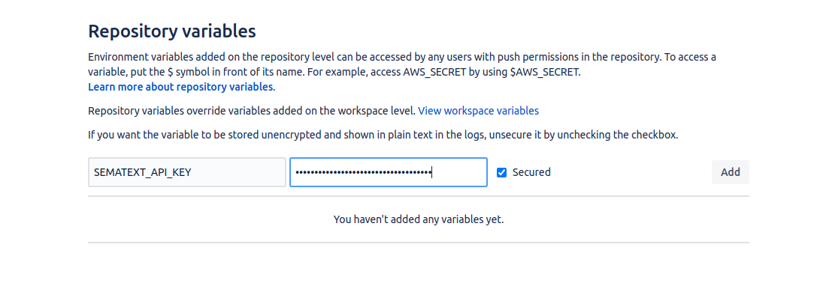

title: Bitbucket Pipelines Integration
description: Guide on how to integrate Sematext Synthetics with Bitbucket pipelines.

**Create API Key Secret**

Create a secret from the **Repository Settings** -> **Repository Variables**, for Sematext API Key.



**Add Run Monitor Job to Bitbucket Pipeline Workflow YAML**

Add Run Monitor step to `bitbucket-pipelines.yml`. Add the below steps after the deploy step in your pipeline configuration.

```yaml
image: node:10.15.3

pipelines:
  custom:
    sematext:
      - step:
          script:
            - curl -H "authorization:apiKey $SEMATEXT_API_KEY" -H "accept:text/plain" -H "content-type:application/json" -s -X POST -d "[{\"monitorId\":276}]" https://apps.sematext.com/synthetics-api/api/v3/apps/12345/monitors/runs > results.txt
            - cat results.txt
            - if [ $(head -1 results.txt | grep -c 'failed') -ne 0 ]; then exit 1; fi

```