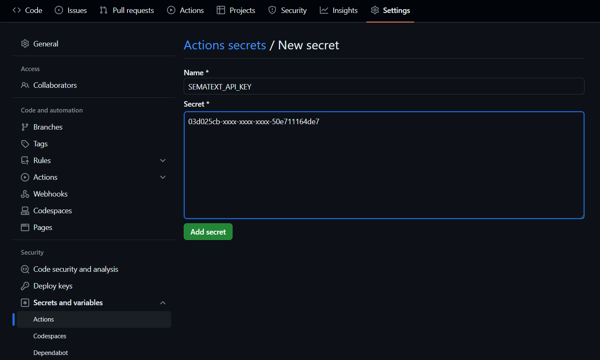
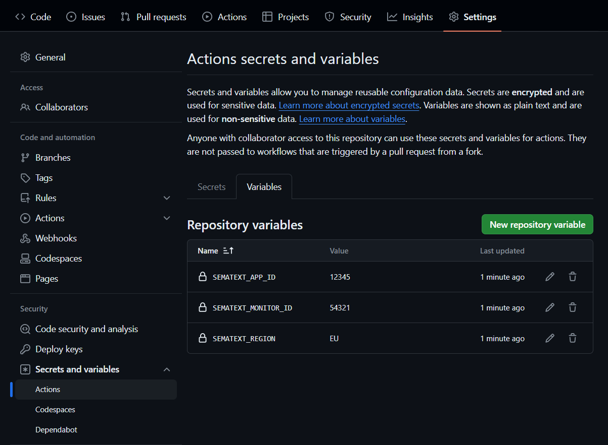
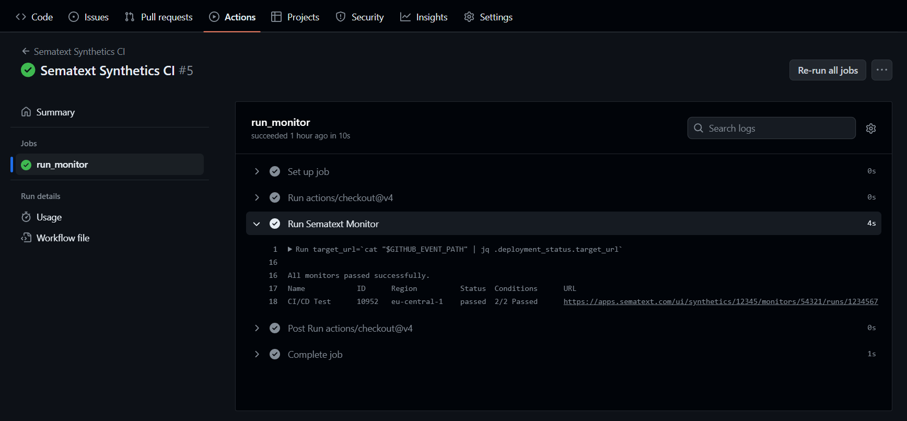

title: GitHub Actions Integration
description: Guide on how to integrate Sematext Synthetics with GitHub Actions.

## Configure repository variables for the integration
The GitHub Actions integration works by running a Job which runs a Synthetics monitor of your choice against the desired URL. In order to specify which monitor this will be, as well as the API key required to run it, you need to configure some repository variables first.

### Create API Key Secret

The first step is to create a secret from the repository's **Settings** page for the Sematext API Key, which is needed to authenticate the request to run your desired Synthetics monitor. Go to your repository's **Settings**, and then in the sidebar under **Security** click **Secrets and variables** and then **Actions**. Create a new repository secret and name it `SEMATEXT_API_KEY`, then paste in the [API key for your account](./overview.md#finding-your-sematext-cloud-accounts-api-key).




### Create Repository Variables for monitor information

Once you've set up the repository secret for the API key, you then need to configure some information regarding the monitor which will be used in the Action. This entails defining three *repository variables*:
- `SEMATEXT_MONITOR_ID` - The ID of the monitor you plan on using with the Action
- `SEMATEXT_APP_ID` - The ID of the Synthetics App associated with your monitor
- `SEMATEXT_ENVIRONMENT` - The region in which your account is registered - `US` or `EU`

A quick guide on how to find this information can be found [here](./overview.md#finding-your-monitor-information). Make sure that these are configured as *repository variables* and not *repository secrets*.




## Add the Run Monitor Job to your GitHub Action Workflow

Create the `.github/workflows/run-monitor.yml` GitHub Actions file to run your monitors on various CI/CD events. For example, to run the monitor after a deployment event, use the `deployment_status` event as a trigger. The below action uses `deployment_status.target_url` to pass the custom URL to the run monitor API. Make sure to set the appropriate values for [the APP_ID and MONITOR_ID variables](./overview.md#finding-your-synthetics-app-and-monitor-ids).


```yaml
name: 'Sematext Synthetics CI'

# Execute the run monitor job on deployment status event
on:
  deployment_status:

jobs:
  run_monitor:
    runs-on: ubuntu-latest
    outputs:
      output1: ${{ steps.run.outputs.test }}

    steps:
      - uses: actions/checkout@v4

      - name: Run Sematext Monitor
        env:
          API_KEY: ${{ secrets.SEMATEXT_API_KEY }}
          APP_ID: ${{ vars.SEMATEXT_APP_ID }}
          MONITOR_ID: ${{ vars.SEMATEXT_MONITOR_ID }}
          REGION: ${{ vars.SEMATEXT_REGION }}
        id: run
        run: |
          echo "Running job with the following variables:"
          echo " - APP_ID: ${APP_ID}"
          echo " - MONITOR_ID: ${MONITOR_ID}"
          echo " - REGION: ${REGION}"
          target_url=`cat "$GITHUB_EVENT_PATH" | jq .deployment_status.target_url`
          echo "Running monitor for target URL: $target_url"
          echo " --------------------------------"

          if [ "${REGION}" = "EU" ]; then
            sematext_base_url="https://apps.eu.sematext.com"
          else
            sematext_base_url="https://apps.sematext.com"
          fi

          url="${sematext_base_url}/synthetics-api/api/v3/apps/${APP_ID}/monitors/runs"
          curl -s --request POST \
            --url $url \
              --header 'authorization: apiKey '${API_KEY} \
                --header 'accept: text/plain' \
                  --header 'content-type: application/json' \
                    --data '[{"monitorId": '${MONITOR_ID}', "url":'$target_url'}]' > results.txt

          cat results.txt
          if [ $(head -1 results.txt | grep -c 'passed') -ne 1 ]; then exit 1; fi
```

On every deployment event, the action will be invoked and the action logs will contain the results.

