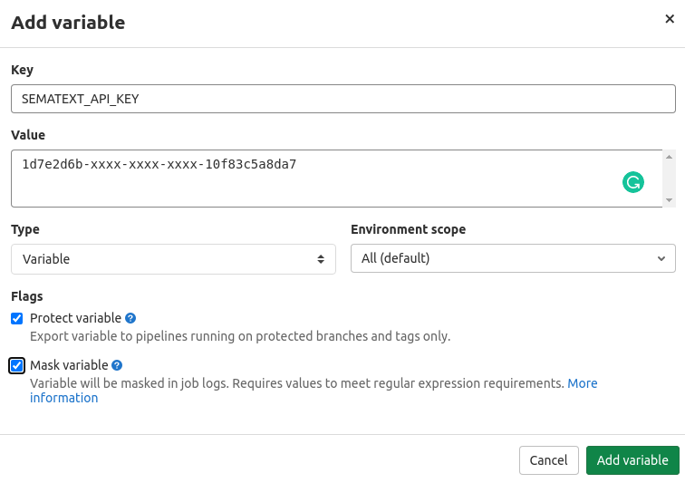

title: GitLab CI/CD Integration
description: Guide on how to integrate Sematext Synthetics with GitLab CI/CD.

**Create an API Key Variable**

Create a CI/CD variable from **Settings** -> **CI/CD** -> **Variables** for the Sematext API Key.



**Configure Run Monitor Step in Pipeline YAML**

Configure the run monitor stage in `.gitlab-ci.yml` to trigger a run after deployment and upload the artifacts.

```yaml
stages:
  - deploy
deploy-app:
    stage: deploy
    image: docker:stable
    script:
      - echo "script to deploy your App"
run-sematext-monitor:
    stage: .post
    image: docker:stable
    before_script:
    - apk add --update curl && rm -rf /var/cache/apk/*
    script:
        - curl -H "authorization:apiKey $SEMATEXT_API_KEY" -H "accept:text/plain" -H "content-type:application/json" -s -X POST -d "[{\"monitorId\":276}]" https://apps.sematext.com/synthetics-api/api/v3/apps/12345/monitors/runs > results.txt
        - cat results.txt
        - if [ $(head -1 results.txt | grep -c 'failed') -ne 0 ]; then exit 1; fi
    artifacts:
        expose_as: 'Sematext Monitor Results'
        paths: ['results.txt']
```