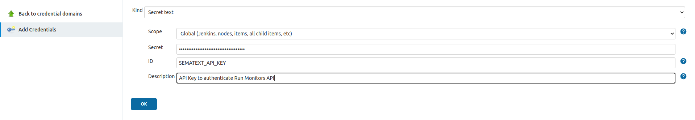

title: Jenkins Integration
description: Guide on how to integrate Sematext Synthetics with your Jenkins pipeline.

**Create an API Key Secret**

Create a secret credential for Sematext API Key to be used in the run monitor API request.



**Add Run Monitor stage to the pipeline in Jenkinsfile**

Add a stage in the Jenkinsfile to invoke the run monitor API, check the results, and exit the pipeline on failure. 

```groovy
stage('Run Sematext monitors') {
      withCredentials([string(credentialsId: 'SEMATEXT_API_KEY', variable: 'SEMATEXT_API_KEY')]) {
        sh """
            curl -s --request POST \
              --url https://apps.sematext.com/synthetics-api/api/v3/apps/12345/monitors/runs \
                --header 'authorization: apiKey ${SEMATEXT_API_KEY}' \
                  --header 'accept: text/plain' \
                    --header 'content-type: application/json' \
                      --data '[{"monitorId": 276}]' > results.txt
            cat results.txt
            if [ \$(head -1 results.txt | grep -c 'failed') -ne 0 ]; then exit 1; fi
          """
      }
    }
```
