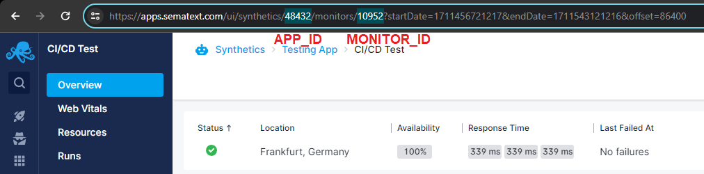

title: CI/CD Integration
description: Guide for running HTTP and Browser monitors from your CI/CD pipeline.

In addition to scheduled monitor runs, you can also trigger monitor runs by using an API. You can use this API to trigger monitor runs as part of your CI/CD pipeline and block deployments if runs fail. When a run fails, you'll be alerted via your configured alert [notification hooks](../../alerts/alert-notifications.md).

If you're interested in using our API, you can find more information about it on the [Using the API](../using-the-api.md) page.

## Collecting necessary information

Before we discuss the specifics of setting up the various integrations, you first need to collect some information specific to your Sematext Cloud account.

### Finding your Synthetics Monitor information

The first thing you'll need to get is the ID of the Synthetics Monitor that will be in charge of running the check, as well the ID of its associated Synthetics App. You can find these easily by navigating to the desired monitor in the Sematext Cloud UI and then taking a look at the URL, like in the image below. The first number in the URL after `/synthetics/` will be the ID of your Synthetics App, while the second one is the ID of your monitor. The URL also contains information on which region your account is in - if it's `apps.eu.sematext.com`, then it's `EU`, otherwise it's `US`. 

### Finding your Sematext Cloud account's API key

Once that's done, you'll also need the API key for your Sematext Cloud account. You can copy your API key from the **Settings** -> **API** page in the UI, which can be found:

- [here](https://apps.sematext.com/ui/account/api), if your account is registered in the US region, or
- [here](https://apps.eu.sematext.com/ui/account/api), for the EU region

## Integrations

Using the run monitor API, you can integrate [Sematext Synthetics](../index.md) to your CI/CD pipeline. Below are the steps to trigger monitor runs from various CI/CD tools.

- [Jenkins](./jenkins/)
- [Travis CI](./travis-ci/)
- [Circle CI](./circle-ci/)
- [GitHub Actions](./github-actions/)
- [Bitbucket Pipelines](./bitbucket-pipelines/)
- [GitLab CI/CD](./gitlab-ci-cd/)
- [Vercel](./vercel/)
- [Netlify](./netlify/)
