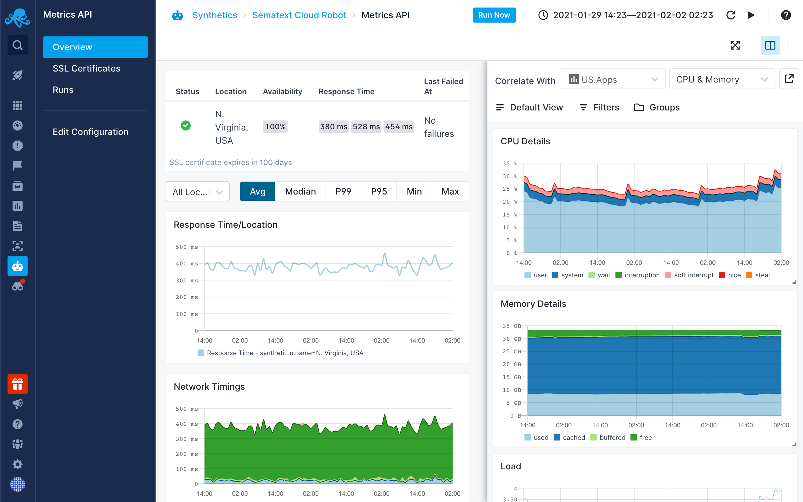

title: Correlation
description: Split Screen is product-wide correlation and data-pivoting feature. With Split Screen you can compare a selected Synthetics Monitor with any other report or dashboard, even with the same report but with different filters on the two different screens.

### Manual Correlation
Manual correlation can be performed by using the [Split Screen](../guide/split-screen) feature. With [Split Screen](../guide/split-screen) you can compare and correlate the selected Synthetic Monitor with any Monitoring, Logs, Infrastructure or Experience reports. Correlation is also possible with Events. It can even be used to correlate the same Synthetic Monitor but with different filters in the two different screens.

Once you select a report you want to correlate with, it’ll be remembered so that you can quickly toggle it.

### Connect Apps
When you receive an alert notification for an App, the **alert notification will automatically include information and charts from connected Apps**, and thus provide more information and context for you. You can connect any two Apps you have access to, regardless of their type. **Any App can be connected to any number of other Apps**.
Connecting a Synthetics App to any other App will **let you easily open it in a [Split Screen](../guide/split-screen) when you decide to correlate metrics or logs from the connected App**. When your website or API fails you can easily see the metrics or logs from the services that are hosting the API and dig deeper into troubleshooting.

