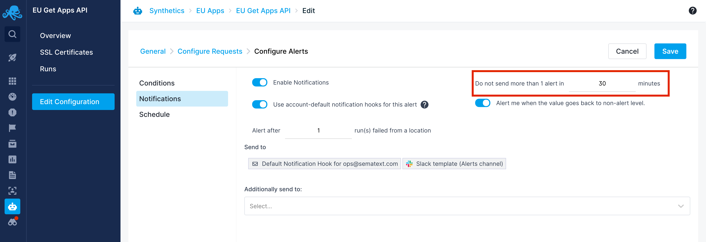

title: Sematext Synthetics FAQ
description: FAQ about Sematext Synthetics, a synthetics monitoring solution for APIs and websites

## General 

### What should I do if I can't find the answer to my question in this FAQ?
Check the [general FAQ](/faq) for questions that are not strictly
about Sematext Synthetics.  If you can't find the answer to your
question please email <support@sematext.com> or use our live chat.

### When should I use a Browser Monitor and when an HTTP Monitor?
Use a [Browser monitor](./browser-monitor.md) when you want to:

* Monitor the performance of your web pages (page load time, web vitals, resource performance, and [many more](./metrics/#browser-monitor-metrics))
* Simulate and monitor [user journey/click path/web transactions](./user-journey-scripts.md) using a real browser
* [Monitor SSL certificates](./ssl-certificate-monitoring.md) of your website

Use an [HTTP monitor](./http-monitor.md) when you want to:

* Monitor the uptime of your APIs, web URLs or any HTTP endpoint
* Monitor the [performance](./metrics/#http-monitor-metrics) of your APIs
* [Monitor SSL certificates](./ssl-certificate-monitoring.md) of your APIs or web URLs

### Can I monitor the endpoints and web pages behind the firewall?
Yes. You can use [private agents](./private-locations.md) to monitor the endpoints and web pages behind the firewall. 

If you do not want to run private agents yourself, you can also configure the firewall to allow the requests from Synthetics agents running in the cloud. Configure your firewall to allow HTTP requests with specific headers. All requests from HTTP Monitor will contain x-sematext-origin: synthetics in their headers. For Browser monitors, you can [configure](https://github.com/puppeteer/puppeteer/blob/main/docs/api.md#pagesetrequestinterceptionvalue) the script to include a custom header for all requests.

### Can I monitor API endpoints protected by OAuth authentication?
No. The HTTP monitor does not support OAuth authentication before sending the actual request. HTTP monitor supports header-based authentication. 

### Can I monitor API endpoints protected by Basic authentication?
Yes. This can be done using an HTTP Monitor, please see [authentication](./http-monitor/#authentication).

### Can I stop Synthetics Alerts during scheduled maintenance?
Yes. You can temporarily disable the notifications from Edit Configuration -> Configure Alerts -> Notifications. Once the maintenance window is over, you can enable the notifications.


### Can I configure a monitor to alert only after N successive failures?
Yes. You can update the below setting in Edit Configuration -> Configure Alerts -> Notifications to notify only when there are N consecutive failures from any location. The default value is 1.



### What are the default timeouts for HTTP & Browser monitors?
The default timeouts for the HTTP and Browser monitors are documented in their respective environment settings.

### Is there an API available?
Yes. Please see [using the API](./using-the-api.md).

### Can I add monitors in bulk for monitoring multiple domains?
Yes. This can be achieved by using a script with the API. Please see [using the API](./using-the-api.md#create-monitor-api).

### How are redirects handled?
HTTP monitors don't follow redirects.  If you think redirects should be followed please let us know.
Browser monitors follow redirects by default and collect metrics from the page to which the monitor has been redirected.

* [HTTP Monitor](./http-monitor/#run-environment)
* [Browser Monitor](./browser-monitor/#run-environment)

Currently, it is not possible to change the default settings, except for the default navigation timeout in the Browser monitor scripts. It can be changed using the [page.setDefaultNavigationTimeout(timeout)](https://github.com/puppeteer/puppeteer/blob/main/docs/api.md#pagesetdefaultnavigationtimeouttimeout) API.

### How can I filter requests from HTTP & Browser monitors?
Both HTTP and Browser monitor requests will have the string "SematextSyntheticsRobot" in the User-Agent header. If your analytics software doesn't already filter out requests from Synthetics, you can use the User-Agent header to filter requests from Synthetics.

### Where can I find User Journey scripts that I can customize for my own needs?
You can find Browser monitor scripts for common use cases by selecting the Browse Examples link in the Create Monitor page. You can directly import a script from the example and change it to suit your needs. You can also find more examples [here](https://github.com/transitive-bullshit/awesome-puppeteer#examples).

### How can I securely store the credentials I supply to User Journey scripts?
By adding them as Sensitive Data, on which you can find more information [here](./user-journey-scripts/#storing-your-user-journey-script-credentials-securely)

### Why is the latency reported by Browser monitors different from latency reported by HTTP monitors?
Short answer: because they are measuring somewhat different things.

The HTTP monitor measures how long it takes to execute a single HTTP request and get a response. This includes performing a DNS lookup, establishing a TCP connection, sending of the request, and content transfer.  On the other hand, the Browser monitor measures all of that, plus how long it takes to load and render the whole page, which includes fetching of external resources references in that page (e.g., CSS resources, JavaScript resources, etc.).  If a User Journey script is used with a Browser monitor then that is included as well.  Thus, it is expected that Browser monitors display higher latency.

### What are the IP addresses from which monitors are run?
N. Virginia (us-east-1)    - 52.202.60.97   <br/>
N. California (us-west-1)  - 184.72.63.129  <br/>
Mumbai (ap-south-1)        - 15.207.239.77  <br/>
Singapore (ap-southeast-1) - 3.0.44.28      <br/>
Sydney (ap-southeast-2)    - 54.153.196.213 <br/>
Frankfurt (eu-central-1)   - 18.159.198.132 <br/>
Ireland (eu-west-1)        - 54.77.99.140   <br/>
Sao Paulo (sa-east-1)      - 54.207.1.35    <br/>

### Where can I see if a certain device is supported for browser monitors?
You can simply type the name of your desired device into the _Device type_ dropdown while creating a monitor and see if a matching option will be displayed. You can also find the list of devices we support, as well as their specific properties, in the official [Puppeteer docs](https://github.com/puppeteer/puppeteer/blob/v13.6.0/src/common/DeviceDescriptors.ts).

### Can I extract a token from a request and use it for another request?
Yes. Create a [Browser Monitor](https://sematext.com/docs/synthetics/browser-monitor/) and select Monitor a User Journey. Within the script you can grab a token by using the ```javascriptsetRequestInterception``` function.
After grabbing the token from the response, you can intercept the next request and add your credentials to the request body with the following code.

```javascript
 await page.setRequestInterception(true);
  // Intercept the next request, change its method to POST and add the request body
  page.once("request", async interceptedRequest => {
    interceptedRequest.continue({
      method: "POST",
      postData: '{"username": "exampleUser","password": "examplePassword"}',
      headers: { ...interceptedRequest.headers(), "content-type": "application/json" }
    });
  });

  console.log("Sending request to get token");
  const response = await page.goto("https://private-xxxxx.apiary-mock.com/authenticate");
```
 Extract token from the response
```javascript
  // response.text() prints out the response body as a string, useful if you're not using JSON
  // response.json() parses the response body JSON and throws an error if it isn't valid JSON
  bodyJSON = await response.json();
 ```
Pass the extracted token in the next request in the request body
```javascript
 // Intercept the next request, change its method to POST and add the request body using the response we got from the first request
  page.once("request", async interceptedRequest => {
    interceptedRequest.continue({
      method: "POST",
      postData: `{"token": "${bodyJSON.token}"}`,
      headers: { ...interceptedRequest.headers(), "content-type": "application/json" }
    });
  });

  console.log("Sending second request using info from the first response");
  const result = await page.goto(`https://private-xxxxx.apiary-mock.com/exampleSecureEndpoint`);
  console.log({
    url: result.url(),
    statusCode: result.status(),
    body: await result.text()
  });
```
To mask the passwords and other sensitive data you use for authentication please see [Storing User Journey Script Credentials Securely](https://sematext.com/docs/synthetics/user-journey-scripts/#storing-your-user-journey-script-credentials-securely)

## Sharing

### How can I share my Sematext Apps with other users?

See [sharing FAQ](/faq/#sharing).

### What is the difference between OWNER, ADMIN, BILLING_ADMIN, and USER roles?

See info about user roles in [sharing FAQ](/faq/#sharing).

## Alerts

### Can I send alerts to HipChat, Slack, Nagios, or other WebHooks?

See [alerts FAQ](/faq/#alerts).
