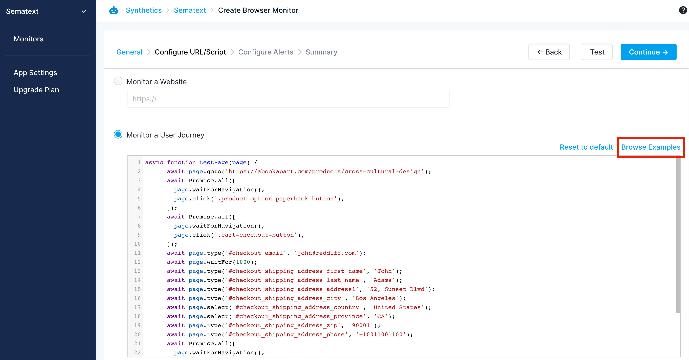

title: Sematext Experience FAQ
description: FAQ about Sematext Synthetics, a synthetics monitoring solution for APIs and websites

## General 

### What should I do if I can't find the answer to my question in this FAQ?
Check the [general FAQ](/faq) for questions that are not strictly
about Sematext Synthetics.  If you can't find the answer to your
question please email <support@sematext.com> or use our live chat.

### When should I use a Browser Monitor and when an HTTP Monitor?
Use a [Browser monitor](./browser-monitor.md) when you want to:

* Monitor the performance of your web pages (page load time, web vitals, resource performance, and [many more](./metrics/#browser-monitor-metrics))
* Simulate and monitor user journey/click path/web transactions using a real browser
* Monitor SSL certificates of your website

Use an [HTTP monitor](./http-monitor.md) when you want to:

* Monitor the uptime of your APIs, web URLs or any HTTP endpoint
* Monitor the [performance](./metrics/#http-monitor-metrics) of your APIs
* Monitor SSL certificates of your APIs or web URLs

### Can I monitor the endpoints and web pages behind the firewall?
Yes. You can use private agents to monitor the endpoints and web pages behind the firewall. 

If you do not want to run private agents yourself, you can also configure the firewall to allow the requests from Synthetics agents running in the cloud. Configure your firewall to allow HTTP requests with specific headers. All requests from HTTP Monitor will contain x-sematext-origin: synthetics in their headers. For Browser monitors, you can [configure](https://github.com/puppeteer/puppeteer/blob/main/docs/api.md#pagesetrequestinterceptionvalue) the script to include a custom header for all requests.

### Can I monitor API endpoints protected by OAuth authentication?
No. The HTTP monitor does not support OAuth authentication before sending the actual request. HTTP monitor supports header-based authentication. 

### Can I monitor API endpoints protected by Basic authentication?
Yes, the HTTP monitor supports header-based authentication. Custom HTTP request headers can be specified when creating a monitor.  For Basic authentication add the `Authorization: Basic XYZ` header where XYZ is the Base64 encoding of the username:password string.

### Can I stop Synthetics Alerts during scheduled maintenance?
Yes. You can temporarily disable the notifications from Edit Configuration -> Configure Alerts -> Notifications. Once the maintenance window is over, you can enable the notifications.

### Can I configure a monitor to alert only after N successive failures?
Yes. You can update the below setting in Edit Configuration -> Configure Alerts -> Notifications to notify only when there are N consecutive failures from any location. The default value is 1.

### What are the default timeouts for HTTP & Browser monitors?
The default timeouts for the HTTP and Browser monitors are documented in their respective environment settings.

* [HTTP Monitor](./http-monitor/#run-environment)
* [Browser Monitor](./browser-monitor/#run-environment)

Currently, it is not possible to change the default settings, except for the default navigation timeout in the Browser monitor scripts. It can be changed using the [page.setDefaultNavigationTimeout(timeout)](https://github.com/puppeteer/puppeteer/blob/main/docs/api.md#pagesetdefaultnavigationtimeouttimeout) API.

### How can I filter requests from HTTP & Browser monitors?
Both HTTP and Browser monitor requests will have the string "SematextSyntheticsRobot" in the User-Agent header. If your analytics software doesn't already filter out requests from Synthetics, you can use the User-Agent header to filter requests from Synthetics.

### Where can I find user journey scripts that I can customize for my own needs?
You can find Browser monitor scripts for common use cases by selecting the Browse Examples link in the Create Monitor page. You can directly import a script from the example and change it to suit your needs. You can also find more examples [here](https://github.com/transitive-bullshit/awesome-puppeteer#examples).

## Sharing

### How can I share my Sematext Apps with other users?

See [sharing FAQ](/faq/#sharing).

### What is the difference between OWNER, ADMIN, BILLING_ADMIN, and USER roles?

See info about user roles in [sharing FAQ](/faq/#sharing).

## Alerts

### Can I send alerts to HipChat, Slack, Nagios, or other WebHooks?

See [alerts FAQ](/faq/#alerts).
