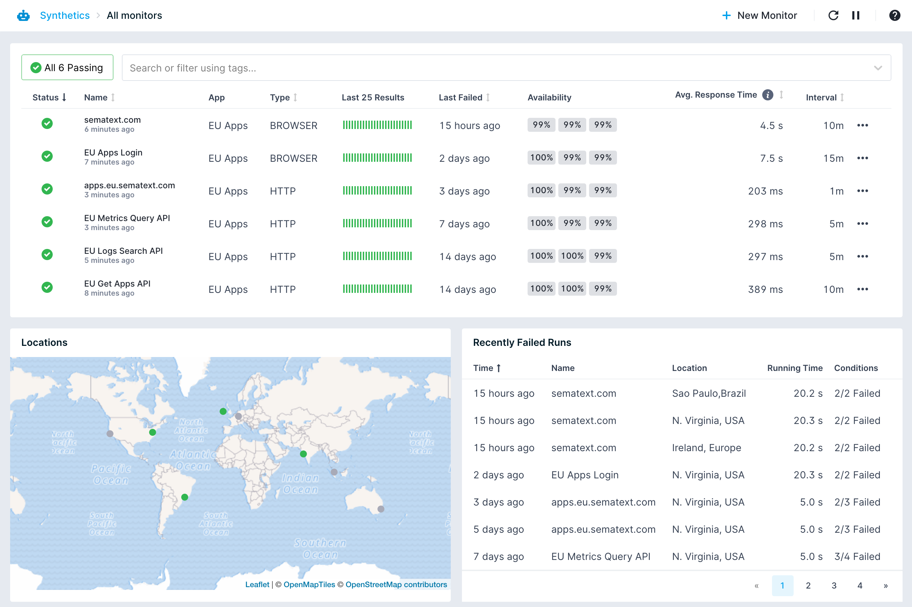

title: Sematext Synthetics Overview
description: Overview of Synthetics for API, Web URL, website and user journey monitoring

Sematext Synthetics provides the ability to actively monitor APIs, Web URLs, websites and user journeys from multiple locations around the globe. Synthetic monitoring helps you ensure the availability and performance of your APIs and websites. While [Experience](/experience) helps you track real user performance of your websites, Synthetics will help you identify downtime and performance by simulating the user requests and interactions with your web page. 

## How it works

You start by creating a Synthetics [App](/guide/app-guide/). Under the App, you can create an HTTP or Browser monitor. HTTP monitor can be used to monitor any HTTP endpoints like HTTP APIs or Web URLs. HTTP monitor sends an HTTP request to the specified URL with configured request settings and records the timings and response details. Browser monitor can be used to monitor websites and user journey by writing a script that simulates user actions. Browser monitor script executes in a browser and the performance is recorded.  While creating the monitor you can specify a list of conditions that decides the result of the run.

The monitors will be periodically scheduled to run from specified locations in an isolated environment. No agent installation is required. For example, a monitor scheduled to run every minute from 2 locations will run 120 times in an hour. The result of each run will be evaluated against the set of conditions specified during the creation. When a condition fails, the run is considered failed. On run failure, you will be alerted based on configured [notification hooks](/integration/#notification-hooks).

Current supported locations are N. Virginia, USA, and Ireland, Europe.
