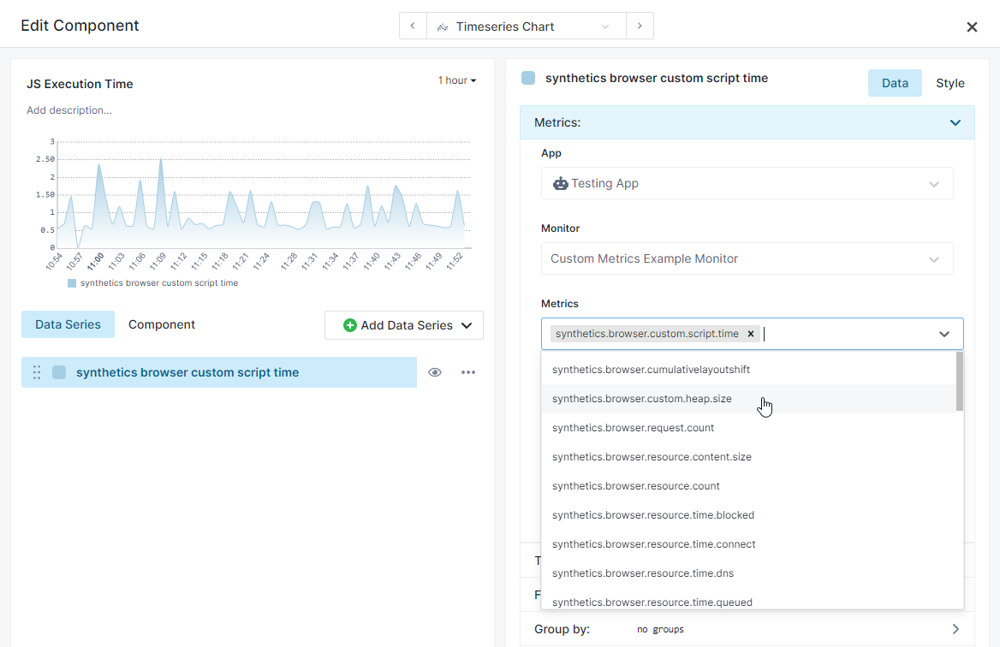
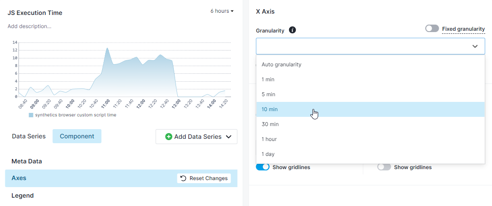
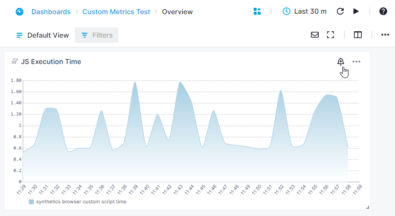
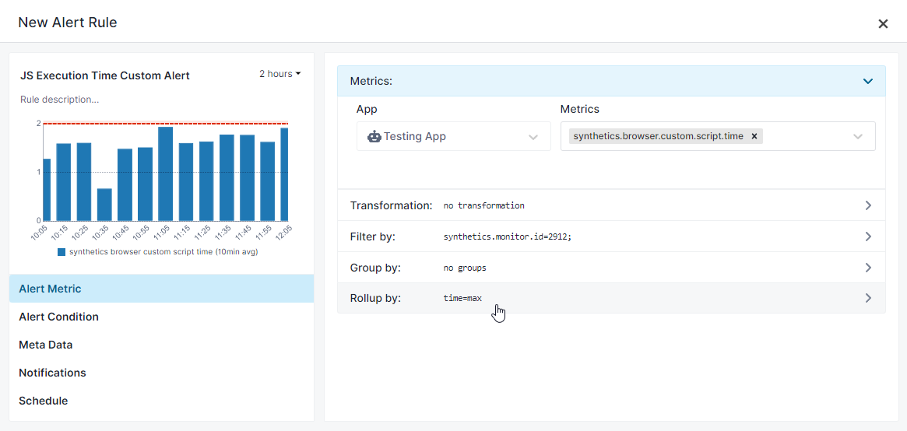
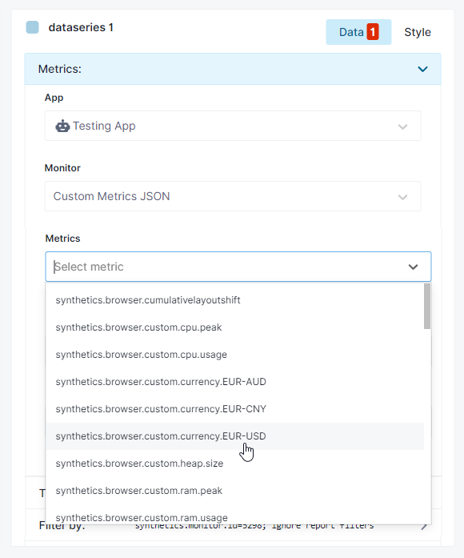

title: Synthetics Metrics
description: List of metrics collected as part of HTTP and Browser monitor

Synthetics monitors collect the following metrics as part of every run. You can create custom charts using [Chart Builder](../dashboards/chart-builder/) for Synthetics metrics. The custom charts can be used to compare Synthetics metrics across multiple monitors.

## HTTP Monitor Metrics

| Name  | Label  | Description  | Unit  |
|---|---|---|---|
| synthetics.time.response  | Response time  | Total time taken for the complete request & response | ms  |
| synthetics.http.time.dns  | DNS lookup time  | DNS resolution time | ms |
| synthetics.http.time.connect  |  Socket connect time | Socket connection time  | ms |
| synthetics.http.time.tls  | TLS handshake time  |  TLS handshake time  | ms |
| synthetics.http.time.firstbyte  | Time to first byte (TTFB)  | Time taken to receive the first response byte from the server. Also called server or wait time | ms  |
| synthetics.http.time.download  |  Download Time | Time taken to download the response body  | ms  |
| synthetics.http.response.size  |  Response Body Size | Size of the response body  | bytes  |

## Browser Monitor Metrics

### Run Metrics

The following run-level metrics are collected for every Browser monitor run:

| Name  | Label  | Description  | Unit  |
|---|---|---|---|
| synthetics.time.response  | Response time  | Total time taken for the script to finish | ms  |
| synthetics.browser.request.count | Request count | Total number of HTTP requests sent during the execution of the script | |
| synthetics.browser.transfer.size | Transfer size | Total number of network bytes downloaded during the execution of the script | bytes |

### Page Load Metrics

The Browser monitor collects the below page load (navigation) metrics for every run. If there are multiple page loads during the execution of the script, the last page-load metrics are collected.

| Name | Label | Description | Unit |
|---|---|---|---|
| synthetics.browser.time.frontend | Frontend time | Time taken for the browser to parse and create the page | ms |
| synthetics.browser.time.backend | Backend time | Time taken for the network and the server to generate and start sending the HTML | ms |
| synthetics.browser.time.pageload | Page load time | Time taken for the page to load, from initiation of the page load (e.g., click on a page link) to load completion in the browser | ms |
| synthetics.browser.time.dns | DNS time | DNS resolution time for the URL of the page | ms |
| synthetics.browser.time.connection | Socket connect time | Time taken to connect to server | ms |
| synthetics.browser.time.response | Time to first byte | Time taken for the server to send the response | ms |
| synthetics.browser.time.download | Download time | Time taken to download the page contents | ms |
| synthetics.browser.time.dom.interactive | DOM interactive time | Time taken by the browser to parse the document, including the network time from the user's location to your server | ms |
| synthetics.browser.time.dom.contentload | DOM content load time | Time taken by the browser to parse the document and execute deferred and parser-inserted scripts, including the network time from the user's location to your server | ms |
| synthetics.browser.time.paint.first | First Paint (FP) | The time from navigation to the time when the first paint happens on the screen | ms |
| synthetics.browser.time.paint.firstcontentful | First Contentful Paint (FCP) | The time from navigation to the time when the browser renders the first bit of content from the DOM | ms |
| synthetics.browser.time.paint.largestcontentful | Largest Contentful Paint (LCP) | The time for largest content element to be visible in the viewport. | ms |
| synthetics.browser.cumulativelayoutshift | Cumulative Layout Shift (CLS) | The sum total of all individual layout shift scores for every unexpected layout shift that occurs during the entire lifespan of the page |  |

### Resource Metrics

Browser monitor collects the below metrics for every resource loaded during the execution of the script:

| Name  | Label  | Description  | Unit  |
|---|---|---|---|
| synthetics.browser.resource.transfer.size | Transfer size | Network size of the resource content | bytes |
| synthetics.browser.resource.time | Resource time | Total time taken to fetch the resource | ms |

### Custom Metrics

You can script the Browser monitor to collect custom metrics that are specific to your website or use case. For example, you might need to measure the time it takes to display auto-suggestions on your website or collect & monitor the value from an element on your webpage. You can use the `context.setMetric(name, value)` method in the Browser monitor script in order to define a custom metric. All metrics defined in monitors within one Synthetics App should have unique names and will be automatically prefixed with `synthetics.browser.custom.`.

Here's an example of a User Journey script which defines two custom metrics: the used JavaScript heap size and how long the combined duration of JavaScript execution is. For your convenience, this example is also listed as **Using Custom Metrics** under the **Browse Examples** section while creating the Browser monitor.

```javascript
async function testPage(page, context) {
  // Create a Chrome DevTools Protocol (CDP) session and start measuring performance metrics
  const client = await page.target().createCDPSession();
  await client.send('Performance.enable');
  await page.goto('https://youtube.com/');
  
  // Fetch the performance metrics and choose the metrics we want from the performance metrics array
  const performanceMetrics = await client.send('Performance.getMetrics');
  const scriptDuration = performanceMetrics.metrics.find((x) => x.name === 'ScriptDuration').value;
  const usedHeap = performanceMetrics.metrics.find((x) => x.name === 'JSHeapUsedSize').value;
  
  // Define the chosen metrics as custom metrics in Sematext Synthetics
  // The metric names should be unique for this Synthetics application
  context.setMetric('heap.size', usedHeap);
  context.setMetric('script.time', scriptDuration);
}

module.exports = testPage;
```

Once you have defined your chosen custom metrics, you can then proceed to chart them using [Chart Builder](../dashboards/chart-builder/). Go to your **Dashboards** and create a new component. In this example we'll use the **Time Series Chart**. You will then be able to find the custom metrics you've defined in the **Metrics** dropdown. In the script above, we've defined two metrics: `heap.size` and `script.time`. With the previously mentioned added prefix, these will be displayed as `synthetics.browser.custom.heap.size` and `synthetics.browser.custom.script.time`.



Because Browser monitors run once every several minutes, you might want to navigate to the **Component** tab on the left side, under the preview of the chart, and then set the **Granularity** to a value which will fit the interval you selected for the monitor in order to produce a nice looking chart.



You can also create a threshold or anomaly alert on this metric. Let's say that you want to be alerted if the JS execution time is over two seconds. The first thing you need to do is click on the alert bell icon in the top right corner of the chart.



After that, set the **Rollup by** field to **max** and set the alert condition to alert you if the metric value is greater than two and you're good to go.



___

Here's an additional example of getting custom metrics from a response body JSON. Let's say some API returns information about current and peak values of CPU and RAM usage, and that we want to use those as custom metrics to chart and alert on. This example is likewise listed in the **Browse Examples** section found in the Browser monitor creation/editing flow.

```javascript
async function testPage(page, context) {

  /* This is an example of a response the API generates
    {
        "cpuUsage": {
            "average": 52,
            "peak": 89
        },
        "ramUsage": {
            "average": 31,
            "peak": 56
        }
    }
  */

  const response = await page.goto("https://private-c82e7-stcloudtest.apiary-mock.com/getData");
  bodyJSON = await response.json();

  // Extract the values from the response JSON and define them as custom metrics
  const avgCPU = bodyJSON.cpuUsage.average;
  const peakCPU = bodyJSON.cpuUsage.peak;
  const avgRAM = bodyJSON.ramUsage.average;
  const peakRAM = bodyJSON.ramUsage.peak;
  console.log(avgCPU, peakCPU, avgRAM, peakRAM);
  context.setMetric('cpu.usage', avgCPU);
  context.setMetric('cpu.peak', peakCPU);
  context.setMetric('ram.usage', avgRAM);
  context.setMetric('ram.peak', peakRAM);
}

module.exports = testPage;
```

The charting and alerting process is identical as in the previous example, and once again you will be able to see the custom metrics you've defined in the **Metrics** dropdown.


