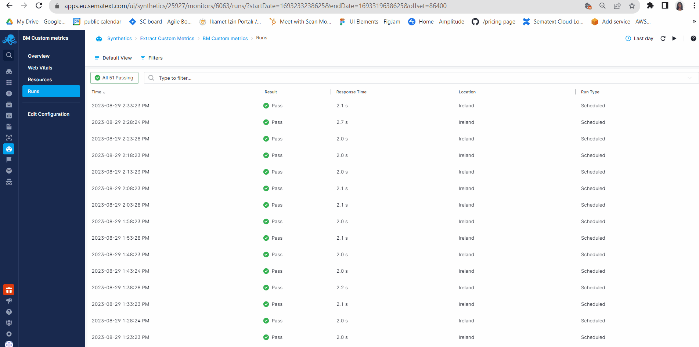
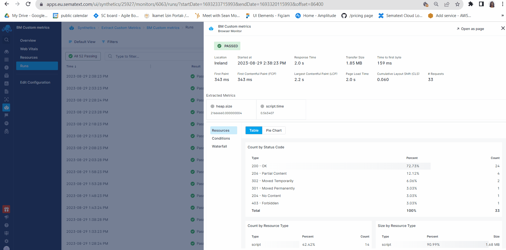

title: Synthetics Metrics
description: List of metrics collected as part of HTTP and Browser monitor

Synthetics monitors collect the following metrics as part of every run. You can create custom charts using [Chart Builder](../dashboards/chart-builder/) for Synthetics metrics. The custom charts can be used to compare Synthetics metrics across multiple monitors.

## HTTP Monitor Metrics

| Name  | Label  | Description  | Unit  |
|---|---|---|---|
| synthetics.time.response  | Response time  | Total time taken for the complete request & response | ms  |
| synthetics.http.time.dns  | DNS lookup time  | DNS resolution time | ms |
| synthetics.http.time.connect  |  Socket connect time | Socket connection time  | ms |
| synthetics.http.time.tls  | TLS handshake time  |  TLS handshake time  | ms |
| synthetics.http.time.firstbyte  | Time to first byte (TTFB)  | Time taken to receive the first response byte from the server. Also called server or wait time | ms  |
| synthetics.http.time.download  |  Download Time | Time taken to download the response body  | ms  |
| synthetics.http.response.size  |  Response Body Size | Size of the response body  | bytes  |

## Browser Monitor Metrics

### Run Metrics

The following run-level metrics are collected for every Browser monitor run:

| Name  | Label  | Description  | Unit  |
|---|---|---|---|
| synthetics.time.response  | Response time  | Total time taken for the script to finish | ms  |
| synthetics.browser.request.count | Request count | Total number of HTTP requests sent during the execution of the script | |
| synthetics.browser.transfer.size | Transfer size | Total number of network bytes downloaded during the execution of the script | bytes |

### Page Load Metrics

The Browser monitor collects the below page load (navigation) metrics for every run. If there are multiple page loads during the execution of the script, the last page-load metrics are collected.

| Name | Label | Description | Unit |
|---|---|---|---|
| synthetics.browser.time.frontend | Frontend time | Time taken for the browser to parse and create the page | ms |
| synthetics.browser.time.backend | Backend time | Time taken for the network and the server to generate and start sending the HTML | ms |
| synthetics.browser.time.pageload | Page load time | Time taken for the page to load, from initiation of the page load (e.g., click on a page link) to load completion in the browser | ms |
| synthetics.browser.time.dns | DNS time | DNS resolution time for the URL of the page | ms |
| synthetics.browser.time.connection | Socket connect time | Time taken to connect to server | ms |
| synthetics.browser.time.response | Time to first byte | Time taken for the server to send the response | ms |
| synthetics.browser.time.download | Download time | Time taken to download the page contents | ms |
| synthetics.browser.time.dom.interactive | DOM interactive time | Time taken by the browser to parse the document, including the network time from the user's location to your server | ms |
| synthetics.browser.time.dom.contentload | DOM content load time | Time taken by the browser to parse the document and execute deferred and parser-inserted scripts, including the network time from the user's location to your server | ms |
| synthetics.browser.time.paint.first | First Paint (FP) | The time from navigation to the time when the first paint happens on the screen | ms |
| synthetics.browser.time.paint.firstcontentful | First Contentful Paint (FCP) | The time from navigation to the time when the browser renders the first bit of content from the DOM | ms |
| synthetics.browser.time.paint.largestcontentful | Largest Contentful Paint (LCP) | The time for largest content element to be visible in the viewport. | ms |
| synthetics.browser.cumulativelayoutshift | Cumulative Layout Shift (CLS) | The sum total of all individual layout shift scores for every unexpected layout shift that occurs during the entire lifespan of the page |  |

### Resource Metrics

Browser monitor collects the below metrics for every resource loaded during the execution of the script:

| Name  | Label  | Description  | Unit  |
|---|---|---|---|
| synthetics.browser.resource.transfer.size | Transfer size | Network size of the resource content | bytes |
| synthetics.browser.resource.time | Resource time | Total time taken to fetch the resource | ms |

### Custom Metrics

#### HTTP Monitors

To extract custom metrics from HTTP monitors, navigate to the **Configure Response** tab and enable **Save Response Body**. Select either JSON or XML, depending on the format of the HTTP response body. Fetch a sample response from the specified HTTP URL or manually provide the response body, then enter the path to extract the metric. You will see the output within the **Extracted Value** box, and you will need to specify a name for the extracted metric.


Note that **+ New JSON Path** in the screenshot above.  This lets you extract multiple different metrics.

#### Browser Monitors

You can script the Browser monitor to collect custom metrics that are specific to your website or use case. For example, you might need to measure the time it takes to display auto-suggestions on your website or collect & monitor the value from an element on your webpage. You can use the `context.setMetric(name, value)` method in the Browser monitor script in order to define a custom metric. All metrics defined in monitors within one Synthetics App should have unique names and will be automatically prefixed with `synthetics.browser.custom.`. All names should be alphanumeric and can contain underscores and dots for example: `heap.size` or `heap_size`. Otherwise they will be ignored while being fetched in the UI.

Here's an example of a User Journey script which defines two custom metrics: the used JavaScript heap size and how long the combined duration of JavaScript execution is. For your convenience, this example is also listed as **Using Custom Metrics** under the **Browse Examples** section while creating the Browser monitor.

```javascript
async function testPage(page, context) {
  // Create a Chrome DevTools Protocol (CDP) session and start measuring performance metrics
  const client = await page.target().createCDPSession();
  await client.send('Performance.enable');
  await page.goto('https://youtube.com/');
  
  // Fetch the performance metrics and choose the metrics we want from the performance metrics array
  const performanceMetrics = await client.send('Performance.getMetrics');
  const scriptDuration = performanceMetrics.metrics.find((x) => x.name === 'ScriptDuration').value;
  const usedHeap = performanceMetrics.metrics.find((x) => x.name === 'JSHeapUsedSize').value;
  
  // Define the chosen metrics as custom metrics in Sematext Synthetics
  // The metric names should be unique for this Synthetics application
  context.setMetric('heap.size', usedHeap);
  context.setMetric('script.time', scriptDuration);
}
module.exports = testPage;
```
### How to visualize and alert on metrics

Once you have defined your chosen custom metrics either with HTTP or Browser monitor, wait for the monitor to run a few times for the metrics to be recorded and taken into account (you can speed up this process by manually scheduling an on-demand run). Extracted metrics are visible for each run in the run flyout.


You can then proceed to chart them using [Chart Builder](../dashboards/chart-builder/) by hovering over the metric and clicking on the **Add to Dashboard** icon. In this example, we'll create a **Time Series Chart** to chart `synthetics.browser.custom.heap.time` metric that we extracted from the Browser Monitor user jurney script sample above. 



After configuring and saving your chart, navigate to the **Dashboards** using the left menu panel, and then select the specific **Dashboard** you chose when creating the chart. 



Because monitors run once every several minutes, you might want to navigate to the **Axes** tab on the left side, under the preview of the chart, and then set the **Granularity** to a value which will fit the interval you selected for the monitor in order to produce a nice looking chart.


You can also create a threshold or anomaly alert on this metric. Let's say that you want to be alerted if the script duration is over two seconds. The first thing you need to do is click on the alert bell icon in the top right corner of the chart.


After that, set the **Rollup by** field to **max** and set the alert condition to alert you if the metric value is greater than two and you're good to go.


___

Here's an additional example of getting custom metrics from a response body JSON. Let's say some API returns information about currency exchange rates, and that you'd like to chart these exchange rates over time and perhaps set up alerts if they reach certain points. This example is likewise listed in the **Browse Examples** section found in the Browser monitor creation/editing flow.

```javascript
// This script gets the exchange rates of various currencies and defines the results as custom metrics
async function testPage(page, context) {
  const response = await page.goto("https://api.exchangerate.host/latest");
  bodyJSON = await response.json();
  
  // Extract the values from the response JSON and define them as custom metrics
  const USD = bodyJSON.rates.USD;
  const AUD = bodyJSON.rates.AUD;
  const CNY = bodyJSON.rates.CNY;
  context.setMetric('currency.EUR_USD', USD);
  context.setMetric('currency.EUR_AUD', AUD);
  context.setMetric('currency.EUR_CNY', CNY);
}
module.exports = testPage;
```

The charting and alerting process is identical as in the previous example, and once again you will be able to see the custom metrics you've defined in the **Metrics** dropdown.


## How to add availability as metric in Dashboards

[Dashboards](https://sematext.com/docs/dashboards/) are your central location where you put everything together. Logs, service metrics, infrastructure inventory and processes. They let you see everything in one place. If you want to see any of your monitor’s availability within a Dashboard and compare it with performance metrics that are shipped from services hosting your websites and APIs. Here is how to do it.

Availability is shown for each HTTP and Browser monitor within the All Monitors page and Overview pages of monitors.


When you want to add monitor availability as a metric to any of your [Dashboards](https://sematext.com/docs/dashboards/), you can use [Chart Builder](../dashboards/chart-builder/)’s  transformation feature to do it. 

To do this, navigate to the Dashboards page and click on any of your existing Dashboards or create a new one. Then click on “add component” in the top right corner of the report.


Select the component type you want to add. We will use the Timeseries chart in this example. This will open the [Chart Builder](../dashboards/chart-builder/). 

Select a Synthetic App and a monitor, pick ```synthetics.run.passed``` and ```synthetics.run.failed``` as metrics.


Within Transformation box enter the expression below:

```
ifNull(synthetics.run.passed, 1) / (synthetics.run.failed + ifNull(synthetics.run.passed, 1)) * 100
```

Click on save and the time series chart showing availability for the selected monitor will be added to the Dashboard.


