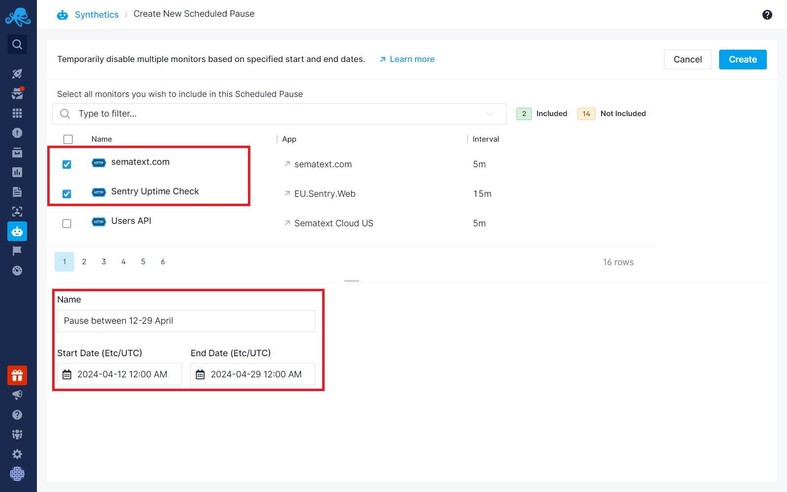
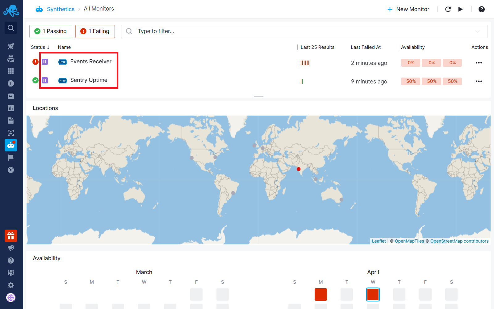
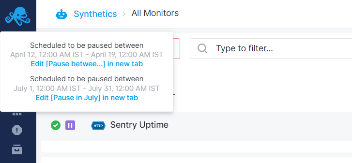
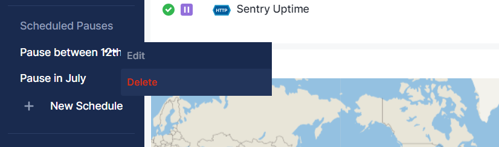

title: Scheduled Monitor Pauses
description: Create scheduled pauses for multiple Synthetics monitors simultaneously

[Sematext Synthetics](https://sematext.com/docs/synthetics/) offers the capability to create scheduled pauses for multiple monitors simultaneously. This is useful when you know monitors will start failing during a certain time period, such as during a planned maintenance.  Instead of disabling a monitor or deleting it, you can simply specify one or more time periods during which a monitor should be paused.

To create a scheduled pause:

- Navigate to the "Scheduled Pauses" section in the left menu panel.
- Click on "+ New Schedule".

This will open a screen where you can select multiple monitors and define the time during which these monitors’ runs will be automatically paused.  When the time is up they will be automatically unpaused.

Once a scheduled pause is created for a monitor, you will notice a pause icon next to it in the Monitors table. Also, if you have a [Status Page](https://sematext.com/docs/synthetics/status-pages/) including that monitor, the pause icon and schedule information will appear next to the monitor name in the [Status Pages](https://sematext.com/docs/synthetics/status-pages/).

Hovering over this icon will display the details of the schedule(s).  As seen in the screenshot below, you can define multiple pause periods scheduled for some time in the future for a monitor.

To edit a schedule, you can either click on the schedule within the tooltip or using the menu panel.

