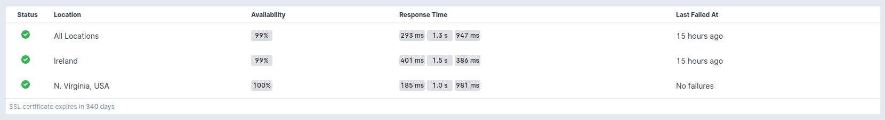
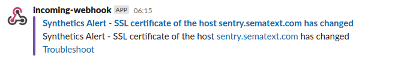
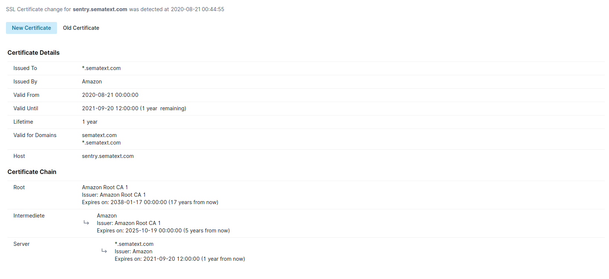
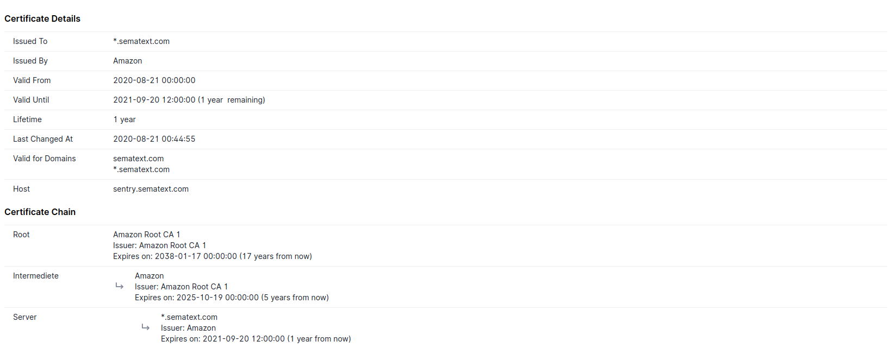

title: SSL/TLS Certificate Monitoring
description: Monitor & get notified on SSL/TLS certificate expiry and change. 

Issues with SSL/TLS certificates not only cause downtime of APIs and websites but also hurt their reputation. Sematext Synthetics performs the following SSL certificate checks on all the certificates in the chain - the leaf, intermediate, and root certificates.

* **Certificate Validation** - Validate the SSL certificates of the API/websites in every run
* **Certificate Expiry** - Check for the expiration of the certificates every day and alert you 30, 14, 7 and 3 days before the expiry
* **Certificate Change** - Check for certificate change every 10 mins and alert you on detecting any changes, with a detailed change report

Sematext Synthetics alerts you on the failure of these checks via the configured monitor [alert notification hooks](../alerts/alert-notifications.md). Apart from these checks, Synthetics also provides an SSL certificate report, with details of all the certificates in the chain.

Both the HTTP and Browser monitors perform these checks except for Browser monitors with user journey script configured.

## Certificate Validation

For every run of the monitor, Synthetics performs a set of validity checks on SSL certificates sent by the server. Synthetics will mark the monitor status as failing if any of these checks fail. Synthetics will raise a run failure alert with the details of the failure. Self-signed certificates are not supported. Any websites or APIs using self-signed certificates will fail.

The HTTP monitor performs the following checks:

* If there is a valid chain, connecting the leaf certificate of the server to a trusted root
* Certificate has not expired
* Certificate is active (if the certificate is not used before its validity starts)
* Verify name constraints, if any
* Verify if there are too many intermediate certificates (more than 3 intermediates)
* Hostname validation, check if the hostname of the website/API is present in the list of allowed DNS names of the certificate

The Browser monitor loads the website in a real Google Chrome browser and all the checks done by the Google Chrome browser. We update the Chrome browser periodically, so the list of checks stays up-to-date with recent implementations. Alongside all the checks above done by the HTTP monitor, the Browser monitor performs the following extra checks:

* Certificate is revoked
* Certificate uses a weak signature algorithm (e.g. SHA-1)
* Certificate authority is not trusted
* Certificate validity is too long
* Certificate uses a weak key ( e.g. too small RSA key)
* Certificate has Certificate Transparency data

## Certificate Expiry

Sematext Synthetics checks the certificate expiry every day and alerts you via the configured monitor [alert notification hooks](../alerts/alert-notifications.md) multiple times before it expires. We make sure you're reminded about the expiry multiple times.

The monitor performs the expiry check for all the certificates in the chains - leaf, intermediate, or root certificates. The Monitor Overview page displays the expiry time of the recently expiring certificate.

## Certificate Change

In modern, dynamic application environments, the SSL certificates are managed by a certificate manager, which can update the certificates automatically. This could sometimes cause issues like missing `hostname` in certificates or if the client time is not correct, certificate validation will fail. 

Sematext Synthetics checks for the certificate change every 10 mins and notifies you via the configured monitor [alert notification hooks](../alerts/alert-notifications.md) about the change. The monitor detects the change based on the fingerprint of the certificate. The change alert contains a detailed change report.

**Certificate Change Alert**

**Certificate Change Report**

## SSL Certificate Report

The SSL certificate report provides an overview of the certificate along with the details of the intermediate and root certificates. It contains the following details:

* Common name of the subject and issuer
* Validity period
* List of domain names for which the certificate can be used
* Hostname where the certificate was retrieved
* Last changed timestamp (if available)
* Certificate chain details

