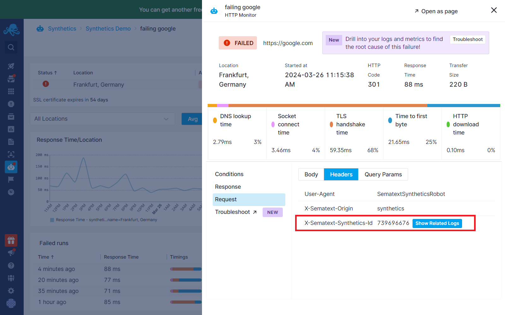
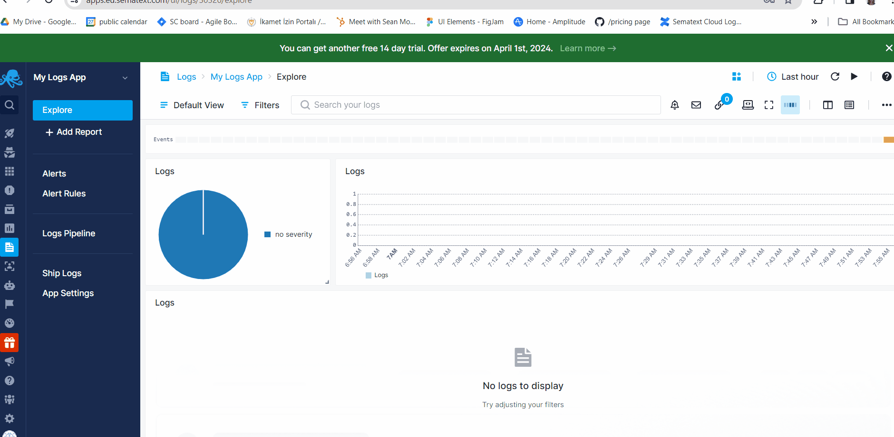
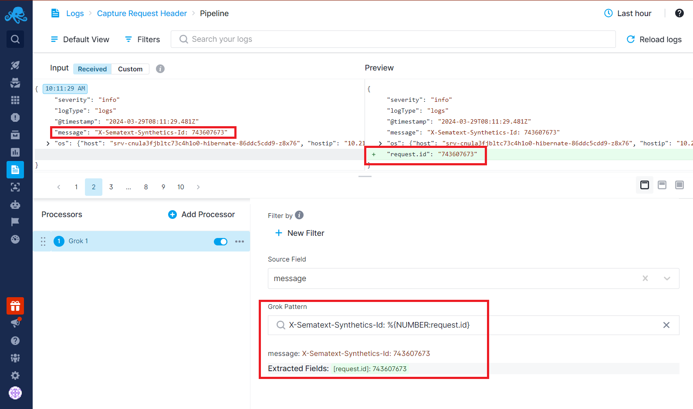
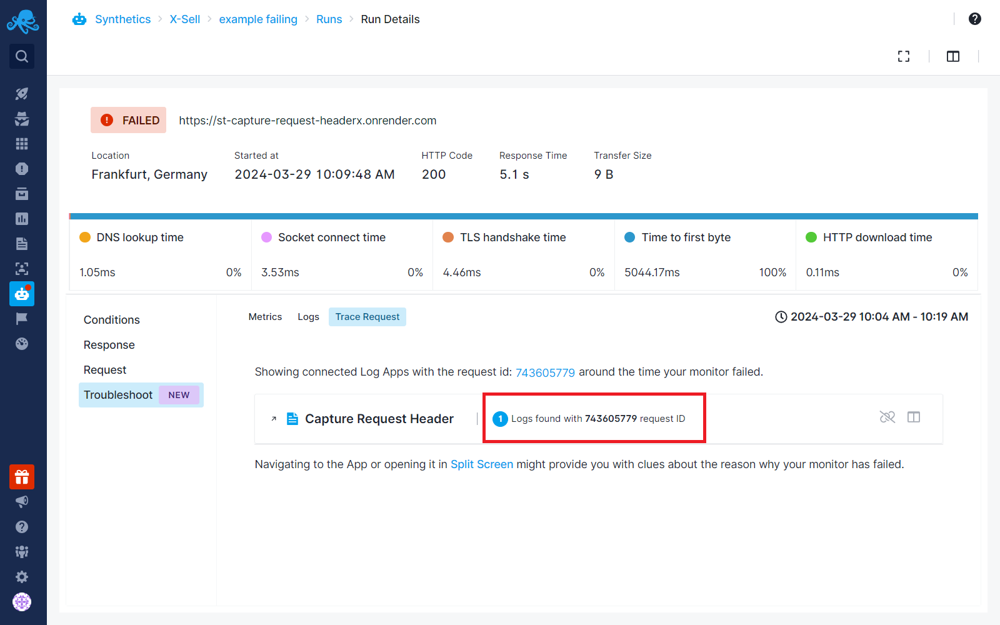
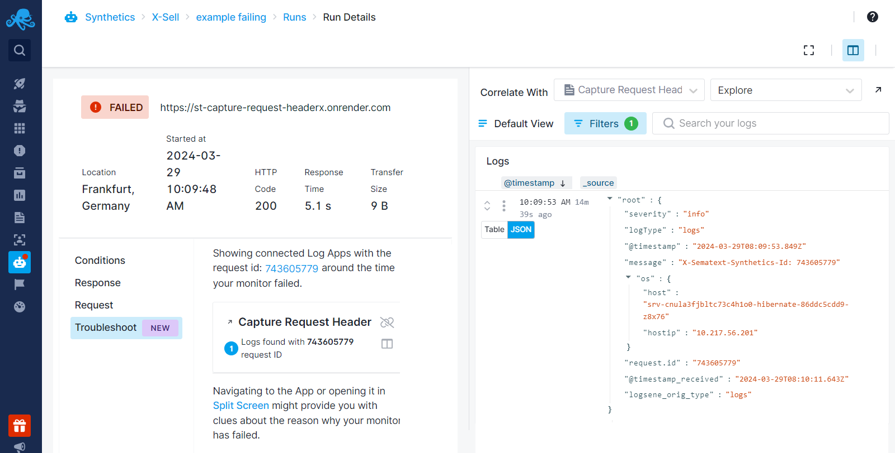
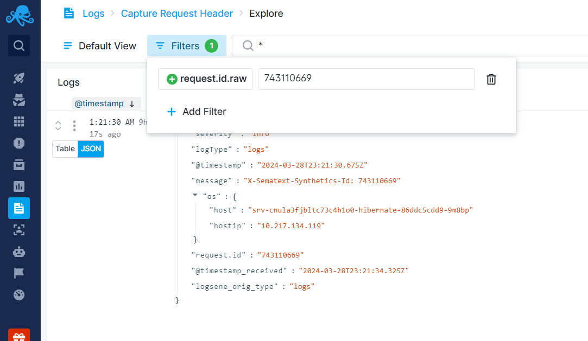
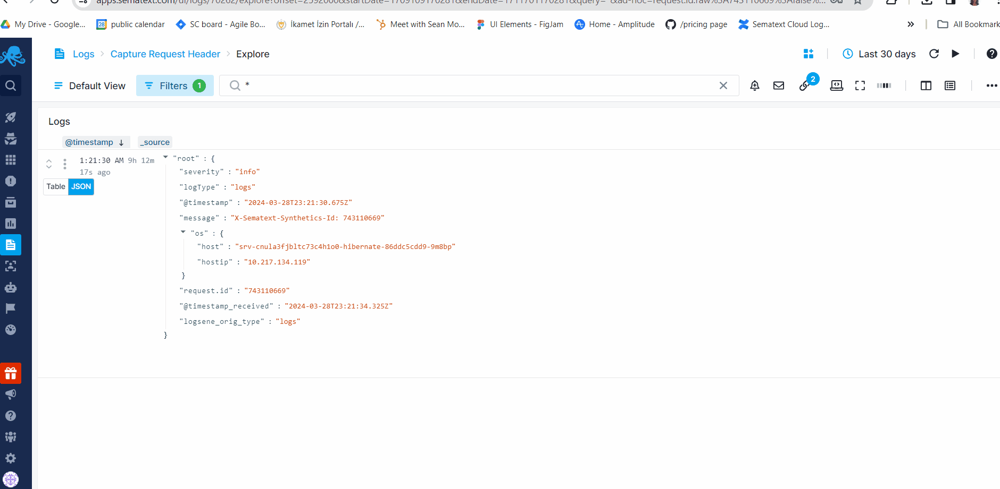

title: Using Synthetics Request ID for Troubleshooting
description: Find the needle in the haystack. Eliminate noise by pinpointing logs specific to a single run using unique request IDs, ensuring focus on crucial information.

Synthetics monitors are used for monitoring and detecting failures and performance issues of websites and APIs, alerting us when things go wrong. Sometimes failures are caused by frontend issues, sometimes by network glitches or slowness, and sometimes failures are actually caused by something in your backend - applications, services, databases, etc. Sometimes, a failure can be correlated with backend performance or availability issues. When monitor runs fail because of something in your backend a good place to find the root cause is in your logs.
 
However, finding only those logs that are relevant to the synthetic monitor failure can be tricky.  Typically, there are many logs in the backend, logs from different applications and services are interleaved, etc. To troubleshoot effectively you need to look at logs related to a specific failed synthetic monitor run. But how do you do that if you are presented with hundreds or thousands of log events?  Synthetic monitor ID to the rescue.

## Synthetic Monitor Request ID

Each Synthetics monitor run has a unique request ID. Use this ID and include it in your backend logs. It's like tagging each log with a specific monitor run. This makes it super easy to find just the right logs when something goes wrong. It allows us to filter out all the noise and focus only on the logs that matter for that specific monitor run.

Let’s see how to set up and use this integration.

## The X-Sematext-Synthetics-id HTTP Request Header

The Synthetic monitoring run ID is included in each request the monitor makes to your API, URL, or whatever you are monitoring.  It is included as an HTTP request header called X-Sematext-Synthetics-id. The request ID for each monitor run can be found in the run result flyout under the request tab:

## Including Request ID to Application Logs

In the application code that’s executed when the endpoint specified in your synthetic monitor is called you need to do two things:

- Get the Synthetics request ID included in the request header
- Include this ID in your application and service logs

### Get the Request ID

The code for getting the HTTP request header will vary from one programming language and framework to another.  For example, if your application is written in Node.js that code might look something like this:

`const headerValue = req.headers['X-Sematext-Synthetics-id'];`

### Add the Request ID to Application Logs

Next, you want to add the request ID information to your existing log messages. If your logging framework let’s you add a specific log event field, that’s ideal. Just make sure the field name is XXXX. This is important.  If you cannot add a field to your log event, simply append it to your log messages.

For example, you might be logging something like this:

`logger.log(error', `Data could not be stored. Connection to the database failed.`);`

Simply append the request ID to it:

`logger.log(error', `Data could not be stored. Connection to the database failed. X-Sematext-Synthetics-Id: ${headerValue}`);`

Include the request ID in all relevant logs. Again, the code for logging will vary from one programming language and framework to another.

### Adding the Request ID to Service Logs

In addition to capturing the individual request IDs in your own application code, you can configure the service hosting your endpoint by accessing its logging configuration to include HTTP request IDs.  For example, endpoints that Synthetic monitors hit are likely hosted by Nginx, Apache, or a similar sort of service. Their documentation will show you how to log HTTP request header values and include them in their log files.

## Shipping Logs

To be able to dig into your logs from a failed Synthetic monitor run your logs should be shipped to one or more Logs Apps in Sematext.  If your logs are not already in Sematext, the easiest way to ship logs is via [Logs Discovery](https://sematext.com/docs/logs/discovery/intro/) or one of the [alternative log shipping methods](https://sematext.com/docs/logs/sending-log-events/). 

## Connecting Synthetics with Logs App

After forwarding your logs to your Logs App, [connect](https://sematext.com/docs/guide/connected-apps/) your Synthetics App with your Logs App.  This will let you dig into your logs from the  failed runs screen . To connect Apps, open the connect Apps modal from one of your Apps and then choose the App to connect.

## Setting the Correct Field

Keep in mind that correlating individual monitor runs with logs requires a specific field name called request.id. So when you are shipping logs to your logs App, make sure you send the Synthetics request ID that you’ve captured under the field called request.id, as shown earlier.

If you are not able to do this in your application code, you can use [Logs Pipelines](https://sematext.com/docs/logs/pipelines/) to extract this information into the request.id field. For instance, perhaps you added the request ID to your log messages as in our earlier example:

`logger.log(error', `Data could not be stored. Connection to the database failed. X-Sematext-Synthetics-Id: ${headerValue}`);`

In this case, this whole log message will likely end up in a field called `message` in your Logs App.  You’ll want to extract this request ID value and store it in a new field called request.id. Why? Because this is the log event field that is used for filtering your logs for a given monitor run.

Below is an example of shipped logs that have request ID within the message field. By using the [Field Extractor processor](https://sematext.com/docs/logs/field-extractor-processor/), you can extract the request ID from the text message and assign it to a new field called request.id.

## Dig Into Logs to Troubleshoot

Once both Apps are connected and the request.id is captured and shipped to the Logs App, whenever your monitor run fails you will now be able to dig into the relevant logs to look for the root cause:

- Navigate to the troubleshoot tab from the failed run flyout.
- Click on the "Trace Request" option.
- You can see how many logs are associated with that specific monitor run within this tab.

To see the logs, you can open the Logs App in a new tab by clicking on the new tab icon next to the App name. Or you can click to see them in [Split Screen](https://sematext.com/docs/guide/split-screen/) to correlate logs within a single page while viewing the failed run details.

The request ID is filtered automatically, and the time range for logs is set to the time your monitor has failed. You will only see the logs that are directly associated with that monitor run. This gives you the ability to explore what is going on in your application that might have caused the failed run and get to the bottom of the root cause of the problem.

## Context View for Logs

The [Context View](https://sematext.com/blog/log-event-context/) might come in handy when troubleshooting your failed monitor runs' application logs. When you are navigated to the Logs App associate with your Synthetics App, the request ID for that individual monitor run is already set as a filter automatically in your logs.

To dig deeper into the root cause, you might want to see what happened in your application before and after this request was made and captured. The Context View lets you see the logs coming before and after an individual log, which helps you analyze logs to understand the sequence of events leading up to and following the failed endpoint request.

