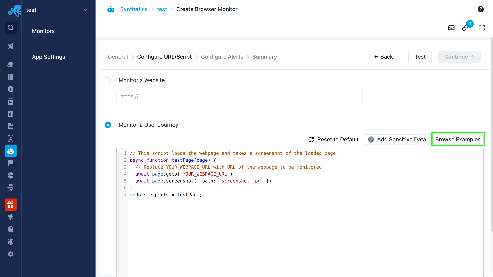

title: User Journey Script Examples
description: Examples of how to write User Journey scripts to perform various tasks

Several examples of some common use-cases which can be used as a starting point are available when creating a new monitor. These can be accessed by clicking the `Browse Examples` button on the `Configure URL/Script` page when creating a new monitor.

These examples are also publicly available [here](https://github.com/sematext/docs/tree/master/docs/synthetics/puppeteer-scripts), while a description for each of these can be found below.

Also check out the [awesome-puppeteer](https://github.com/transitive-bullshit/awesome-puppeteer) GitHub repository for more examples and tips for writing Puppeteer scripts.

## Examples List

### [Load a web page](../puppeteer-scripts/load-web-page.js)

This is a simple example of a browser script that loads a website and takes a screenshot of a page when the navigation is complete. JPEG and PNG formats are supported for screenshot images. Only one screenshot is allowed per script for Pay-As-You-Go and Standard plans, while the Pro plan supports up to three screenshots per script. The `testScript()` function inside of which you write your script gets the Puppeteer `page` object as a parameter.

### [Navigate to a specific page](../puppeteer-scripts/navigate-specific-page.js)

This script visits a web page, navigates to a specific page and verifies that the title of the page is as expected. The Node.js assert API can be used for verification. When an assertion fails, the script will fail and details of the failure can be seen in the logs. This example uses the Puppeteer click API with a specific selector to navigate to a specific page.

For more info on selectors check out [this page](https://developer.mozilla.org/en-US/docs/Web/CSS/CSS_Selectors).

### [Search](../puppeteer-scripts/open-search-page.js)

This script loads the DuckDuckGo search page, enters a search term, submits the page using the Enter key (simulates key press event) and waits for the results to load. Then it extracts the first item from the search result and verifies the value of the link.

### [Login](../puppeteer-scripts/login-wiki.js)

This script loads the web page, navigates to the login page, fills in the login details and submits the form. After logging in it navigates to the user profile page and verifies the logged-in user name by extracting the value from the page content. You can read the values from page content using page.evaluate() API.

### [Use Sensitive Data](../puppeteer-scripts/use-sensitive-data.js)

This script utilizes our [Sensitive Data protection feature](./sensitive-data.md) to load possible user secrets such as usernames and passwords. We navigate to our desired page and fill in the form. For sensitive data we use the secret keys instead of the actual credentials. When this script is run, our script manager will automatically replace the secret key with the actual value.

### [Fetch and use a token](../puppeteer-scripts/fetch-use-token.js)

This script demonstrates how to fetch a token from an authentication API, then use that token in a different request to a secure endpoint.

We recommend using our [Sensitive Data](./sensitive-data.md) feature (covered in the previous example) to store the passwords and other credentials you use for performing the authentication. 

### [Shopping Cart](../puppeteer-scripts/shopping-cart.js)

This script navigates to a Shopify based e-commerce website, adds a book to the cart and fills in the form for the checkout process.

### [Single Page Application](../puppeteer-scripts/single-page-app.js)

In single-page apps, the page load event happens only during the initial launch. Any navigation across the app does not trigger a new page load/navigation event. The script has to rely on the visibility/availability of elements for the navigation. 

This script launches a single-page app. The elements are loaded asynchronously, so we cannot rely on the navigation event. It waits for a specific element (sign up link) to appear, clicks the element, then waits for sign up form to load and then goes back to the login page. In the whole script, there is only a single page load during the initial launch of the web page. No instances of navigation after the initial launch trigger any page loads.

### [Booking](../puppeteer-scripts/booking.js)

This script launches a booking website (AirBnB) and searches for properties in a specific location and date by filling out a form. It submits the form and waits for listings to load, after which it fetches the name of the first listing and prints it.

### [Using custom metrics](../puppeteer-scripts/custom-metric.js)

Browser monitors allow you to define and collect custom metrics in the script. Custom metrics can be a value from a web page element, any performance metric that is not supported out of the box in Sematext Browser monitor, or any custom measurement (e.g. time to display suggestions in autocomplete) that needs custom logic. Once the measurement is added in the script, you can see its value in run results and chart it in your Dashboards.

This example uses the Performance API of the Chrome browser to fetch script duration & JavaScript Heap Size and adds them as custom metrics using the `context.setMetric(name, value)` API. Note that `context` is defined as the second parameter of the `testPage()` function, so remember to include it in your script.

### [Defining custom metrics from JSON](../puppeteer-scripts/custom-metric-json.js)

Custom metrics can also be collected from sources other than CDP. In this example, a JSON response is grabbed from an API response and used to define custom metrics. Like in the previous example, custom metrics defined this way can be used as data sources for charts. With custom metrics you can do a lot more than just monitor performance, such as keeping an eye out if it'll be rainy tomorrow from some weather report API and sending yourself an alert, or charting the number of users on the various services you offer over time to analyze trends.

This example showcases invoking an endpoint which provides information about currency exchange rates, then defining custom metrics based on those values. These could then be used as a basis for charts, and alerts could be created if these exchange rates reach a certain point.

### [Request interception](../puppeteer-scripts/request-interception.js)

This script utilizes Puppeteer's request interception feature to intercept and then block any URLs containing a string from a pre-defined list. If a requested URL contains any of these strings, the request will be blocked and logged.

### [Text search](../puppeteer-scripts/text-search.js)

This script uses [waitForXpath](https://pptr.dev/api/puppeteer.page.waitforxpath) to search for the text “Troubleshooting Just Got Easier” on the page.