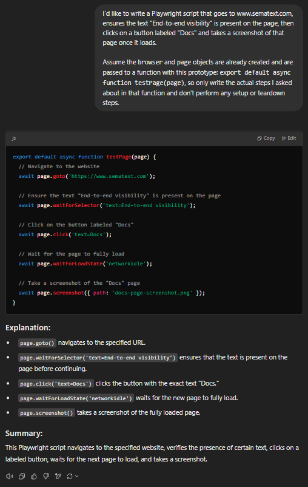
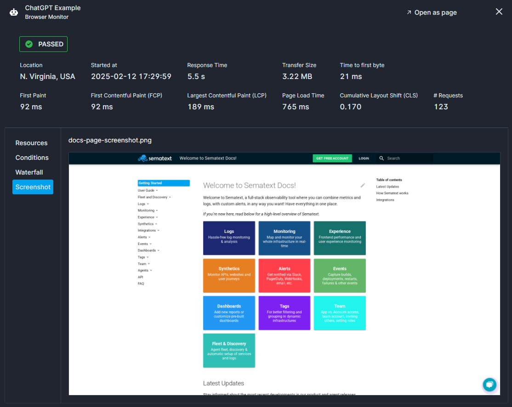

title: Tips & Tricks
description: Tips and Tricks for writing Playwright scripts

Even though it might seem daunting at first to dive right in and start writing your own Playwright scripts, it's actually fairly simple for the vast majority of use-cases. This page will show you some tips and tricks on how to write Playwright scripts as painlessly as possible, especially if you aren't familiar with Javascript or Playwright.


## Make use of the various examples we provide

If you haven't already, then check out our [various examples](examples.md) on tackling various use-cases with Playwright, such as:
* Logging in
* Searching for text on a page
* Adding an item to a shopping cart
* Intercepting and modifying requests

and many more! By emulating what we do in those examples, you should be able to implement most of the flows you want. If your use-case isn't covered in those examples or if you can't quite get your script to work the way it's supposed to, then read on.


## Using generative AI to help you create your script

Generative AI tools such as ChatGPT and Claude are getting better and better at writing code, including Playwright scripts. They can help you generate a general outline for your script which you may have to fix up a little depending on how descriptive you are with the requirements and how complex your flow is. If the flow you're looking to implement is very simple, then these AI models might even generate a working script outright.

Take a look at the following example that uses ChatGPT.



The first paragraph of the prompt is what we actually want the script to do - i.e. the User Journey which you're trying to emulate - while the second part is there just to let the AI know about the format used by Sematext Cloud Synthetics Monitors, making it easy for us to copy-paste the generated script right into Sematext Cloud.

Here's that second part so that you can easily use it in your own prompts:
```
Assume the `browser` and `page` objects are already created and are passed to a function with this prototype: `export default async function testPage(page)`, so only write the actual steps I asked about in that function and don't perform any setup or teardown steps.
```


In this case, we managed to get a fully working script right off the bat.



This script could definitely be improved upon, but it's a good start that you can work on and refine. Keep in mind that you also might have to look into your page a bit to find the exact selectors you want (especially if you're using a page that isn't public), but this shouldn't take long and it should be easy to iterate over the initial output you get from the AI.


## Running your scripts locally for easier troubleshooting

It's always neat to be able to run your scripts locally, since it'll allow you to see how the automated Chrome browser behaves as Playwright executes each action in your script. This can help you see which parts of the page load slowly and add the appropriate logic to remedy that, or catch some things that might never even pop up when you access the page through your regular browser (cookie warnings, various one-time banners which you've dismissed long ago, bot protection etc.).

A step-by-step guide on how to set up this local environment, along with all the files you'll need, can be found [here](https://github.com/sematext/docs/blob/master/docs/synthetics/playwright-template/README.md).


## Consult the official Playwright docs

Playwright is constantly updated and improved, and it features many useful functions out of the box. It's possible that there might be a function for exactly the use-case you need listed in [the official docs](https://playwright.dev/docs/api/class-locator), so make sure to check those out if you want to improve the robustness and reduce the complexity of your scripts.


## Using the official Playwright test generator

Playwright also offers their excellent Test Generator tool that opens up a browser for you and records the actions you take, converting each action into Playwright code. As you browse the page, Playwright will try to automatically deduce the best selectors for each element you interact with, thus (usually) avoiding the hassle of having to find them yourself.

Here's a demo on how it works.
<div class="video_container">
<iframe src="https://www.youtube.com/watch?v=5XIZPqKkdBA" 
frameborder="0" allow="autoplay; encrypted-media" 
allowfullscreen class="video"></iframe>
</div>

To use the Playwright Test Generator, you'll need to have Visual Studio Code installed on your machine, which you can download for free [here](https://code.visualstudio.com/download). You can then follow [this guide](https://playwright.dev/docs/codegen) to set everything up and start recording scripts.

Once you've recorded a script and ensured it works the way you'd like, copy everything from the generated `test` function over to the `testPage` function we use in Sematext Cloud and try the monitor out. For simple actions these scripts can work out of the box, but there are cases where the script recorder doesn't have the full context needed to get everything running smoothly (such as dynamic elements that only appear when you hover over others, or geolocation-dependent elements). If there are certain issues, you can see where the script gets stuck when you run it locally, then you can make the necessary modifications to get everything up and running again.


## When in doubt - reach out!

If you run into further trouble, remember that you can always contact our support email (support@sematext.com) with questions regarding what to do with your Playwright scripts if they aren't running properly on Sematext Cloud.
