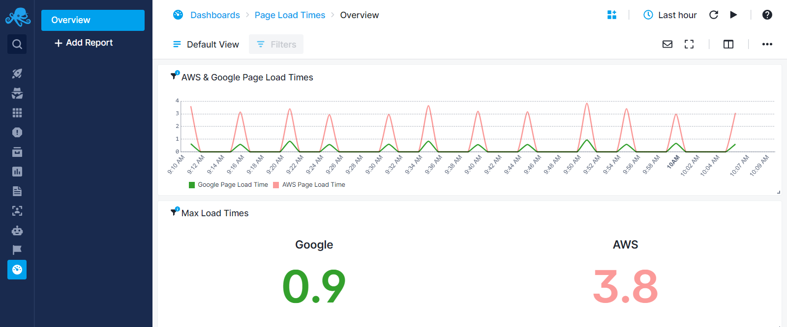

title: Track individual URL timings
description: Example of how to track individual page load times within a User Journey script

With Synthetics [Browser Monitors](https://sematext.com/docs/synthetics/browser-monitor/) you can monitor user journeys across multiple pages. It records various performance metrics during the script execution. Along with performance metrics, users can extract custom metrics for further analysis and monitoring. In this page, we’ll show how to extract the load times of each page you are calling within your [user journey script](https://sematext.com/docs/synthetics/user-journey-scripts/overview/). After extraction, you can chart these metrics with [custom dashboards](https://sematext.com/docs/dashboards/) and create [alert rules](https://sematext.com/docs/alerts/).

## Extracting page load times

When you call a page within your script using the `page.goto` method:

`await page.goto("https://www.my-company-page.com/");`

Record the start time just before calling the page:

`let start = new Date();`

Then, record the end time after the page has loaded in the next line. By subtracting these two timestamps, you can calculate the page load time. This result can be converted into the desired metric format and extracted as a custom metric.

Here’s an example:

`let start = new Date();
await page.goto("https://www.my-company-page.com/");
let end = new Date();
console.log('google', start, end);
let seconds = (end.getTime() - start.getTime()) / 1000;
context.setMetric('googlePageLoadTime', seconds);`

Complete examples of two different user journey scripts, demonstrating how to extract page load time, can be found here. One example shows the simple method described above, while the other shows how to extract page load times when using the `waitForTimeOut` function.

After extracting page load time metrics, you can visualize and create alert rules by following the instructions [here](https://sematext.com/docs/synthetics/metrics/#how-to-visualize-and-alert-on-metrics). This process will result in a dashboard where you can view individual page load times for each monitor run.

