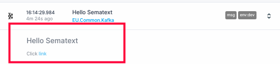

title: Sematext Common Schema
description: The following tags are treated as special in Sematext Cloud and cannot be used as custom tags or in App agent YAMLs. They are used to correlate data across multiple Apps.

Tags are sent by the Sematext Agent as part of every data point or log event and they are shown in UI as filters.

The following tags should not be used as [custom tags](./custom-tags) or in in [App agent](../agents/sematext-agent/app-agent/) YAMLs.


## Common Tags

The tags below are applicable to all metrics/logs types:

| Tag Name  | Description  | Synonymous Tags
|:--|:--|:--
| os.host | Hostname of the host where the agent is running | host, hostname, host.id, host.name, server.name |
| token | Sematext App Token |
| measurement | Reserved as per Influx Line Protocol |
| tag.alias.type | Denotes the Tag Alias type |

## Logs Tags

Refer to this list of default fields for Logs Apps. The tags below are applicable to all logs types:

| Tag Name  | Description  | Synonymous Tags
|:--|:--|:--
| host | A single-valued field and should contain the ID, typically a hostname, of the device or server sending logs. |
| source | A single-valued field and should contain the ID or descriptor of where the data is coming from. For example, this could be a file name or even a full path to a filename, or the name of the application or process |
| facility | A single-valued field used by syslog to indicate the [facility level](https://en.wikipedia.org/wiki/Syslog#Facility_levels). Sematext stores the keyword values of these levels (such as *user* or *auth*). |
| severity | A single-valued field and should contain the log level, such as *error* or *info*. |
| syslog-tag | A single-valued field used by syslog to indicate the name and the PID of the application generating the event (for example, **httpd\[215\]:**). |
| tags | A multi-valued array field that can contain zero or more tags (for example, `"tags": ["solr", "search"]`). When searching for logs with these tags you can filter by using `tags:solr AND tags:search`. Tags can also contain multiple tokens separated by space, but they are still treated as a single value (for example. `"tags": ["solr search"]`). |
| message | A string field that can contain any sort of text (usually the original log line or some other free text). |
| @timestamp | A date field, on which log retention is based. If it's not present, it will be added automatically when the log event is received by Sematext. See [Supported Date Formats](../logs/supported-date-formats). |
| error.id | A reserved field for errors |
| error.message | A reserved field for errors |
| error.type | A reserved field for errors |
| span.id | Building block of a trace in distributed tracing |
| trace.id | Building block of a trace in distributed tracing |
| geo.ip | IP address defining the location associated with the log line |
| geo.location | A latitude and longitude defining the location associated with the log line |
| geo.city_name | The city associated with the log line |
| geo.region | The region associated with the log line |
| geo.region_iso_code | The region ISO code assiciated with the region in the log line |
| geo.country_name | The country associated with the log line |
| geo.country_iso_code | The ISO code associated with the country in the log line |
| geo.continent_name | The continent associated with the log line |

All of these fields are optional, but their use is strongly encouraged. If found in logs with low-enough cardinality, all distinct values of these fields will be loaded and shown in the UI as filters and thus allowing one to very quickly narrow down the search.


## Operating System Tags

Below are the OS related tags sent as part of OS metrics/logs. They are collected from the host the [Sematext Agent](../agents/sematext-agent) is running on. They're mapped to the `os.host` tag.

| Tag Name  | Description
|:--|:--
| os.disk | Human readable name of the block device |
| os.disk.mountpoint | Mount point for the disk in the file system |
| os.disk.fs.type | Type of the file system associated with the device |
| os.network | Name of the network interface |
| os.uuid | Unique ID based on SMBIOS specification |
| os.distro.name | Distribution name of the OS. e.g. `ubuntu` |
| os.distro.version | Version of the OS. e.g. `16.04` |
| os.kernel | Version of the Kernel. e.g. `4.4.0-130-generic` |
| os.name | Name of the OS. e.g. `linux` |
| os.arch | Name of the architecture e.g. `amd64` |
| jvm.version | Version of JVM, if available in `PATH` |
| virtualization | Virtualization Type. Possible values are `BareMetal`, `VM`, `Container` |
| - | All user-defined container labels. These tag are mapped to `os.host` and `container.id` |

## Cloud Tags

The cloud metadata from AWS, Azure and GCE instances are collected as tags. They're mapped to the `os.host` tag.

| Tag Name  | Description | Supported Cloud Providers
|:--|:--|:--
|  cloud.type |  Provider Type |  AWS, GCE, Azure |
|  cloud.instance.id | Instance Identifier |  AWS, GCE, Azure |
|  cloud.instance.name | Instance Name |  Azure, GCE |
|  cloud.instance.type | Instance Type |  AWS, GCE, Azure |
|  cloud.region |  Region |  AWS, Azure |
|  cloud.zone | Availability Zone |  AWS, GCE |
|  cloud.project | Project Identifier |  GCE |
|  -  | User-defined tags |  AWS, GCE, Azure |

To collect user-defined cloud tags from AWS, Azure or GCE environment you need to define the IAM roles listed below:

1. AWS - EC2 Instances should be created with AWS IAM Role that has policy `AmazonEC2ReadOnlyAccess`.
    See [AWS/EC2 User Guide](http://docs.aws.amazon.com/AWSEC2/latest/UserGuide/iam-roles-for-amazon-ec2.html) for more info.
2. Azure - To fetch resource tags for Virtual Machines, you need to grant `Reader` role to its Resource Group in Azure Resource Manager.
    See [Access Azure Resource Manager API](https://docs.microsoft.com/en-gb/azure/active-directory/managed-identities-azure-resources/tutorial-linux-vm-access-arm) for more info.
3. GCE - In GCE user-defined tags are called labels. To read labels, the instance needs `roles/compute.viewer` IAM role.
    See [Granting Roles to Service Accounts](https://cloud.google.com/iam/docs/granting-roles-to-service-accounts#granting_access_to_a_service_account_for_a_resource) for more info.

Cloud tags collection is enabled by default.  To disable Cloud tags
collection set `cloud.metadata-enabled` to `false` in `/opt/spm/properties/st-agent.yml` and
restart Sematext Agent using `sudo service sematext-agent restart`.

## Process Tags

Below are Process related tags sent as part of process info:

| Tag Name  | Description  | Synonymous Tags
|:--|:--|:--
| process.name | Process/program name |
| process.pid  | Process identifier |
| process.ppid  | Parent process identifier |
| process.type  | Process type. An example of a process type can be `master` or `child` for Node.js processes. |

## Network Traffic Stats Tags

Below are the tags sent as part of Network Traffic Status info:

| Tag Name  | Description  | Synonymous Tags
|:--|:--|:--
| network.address | Local address of the network connection |
| network.destination.address | Remote host address of the network connection |
| network.destination.port | Remote port |
| network.protocol | Protocol name (TCP or UDP) |
| network.outgoing | Determines whether the connection is incoming (local process serves the connection) or outgoing (local process connects to remote server) |

## Container Tags

Below are container related tags sent as part of metrics/logs in the container environment:

| Tag Name  | Description  | Synonymous Tags
|:--|:--|:--
| container.type | Type of container engine (e.g. docker, rkt, crio) |
| container.name | Container name |
| container.id | Container identifier |
| container.image.name | Container image name |
| container.hostname | Hostname of the container being monitored |
| container.host.hostname | Hostname of the host where the container is running |

## Kubernetes Tags

Below are Kubernetes related tags sent as part of metrics/logs in the Kubernetes environment.

| Tag Name  | Description  | Synonymous Tags
|:--|:--|:--
| kubernetes.pod.name | Name of the kubernetes pod | pod
| kubernetes.pod.ip | IP of the kubernetes pod |
| kubernetes.pod.uid | Unique identifier of the kubernetes pod |
| kubernetes.node.name | Node name where the pod is running |
| kubernetes.cluster.name | Kubernetes cluster name |
| kubernetes.deployment.name | Kubernetes deployment name |
| kubernetes.namespace | Kubernetes namespace |
| kubernetes.pvc.name | Kubernetes Persistent Volume Claim name |
| kubernetes.pod.controlledby | Controller of the pod (deployment or DaemonSet or StatefulSet) |

## Serverless Tags

Below are Serverless related tags sent as part of metrics/logs in the Serverless environment:

| Tag Name  | Description  | Synonymous Tags
|:--|:--|:--
| function.name | Name of the Lambda function |
| function.version | Version of the Lambda function |
| function.request.id | Identifier of the invocation request |

## Synthetic Monitoring Tags

Below are tags sent as part of metrics in Sematext Synthetic Monitoring:

| Tag Name  | Description  | Synonymous Tags
|:--|:--|:--
| synthetics.monitor.id | Identifier of the Monitor |
| synthetics.run.id | Identifier of the Monitor run |
| synthetics.location.id | Identifier of the Monitor location |
| synthetics.content.type | Type of the resource content |
| synthetics.domain | The resource URL of the domain  |
| synthetics.response.code | The resource HTTP response status code  |

## Other Special Tags

Below are tags that are reserved for future use:

| Tag Name  | Description  | Synonymous Tags
|:--|:--|:--
| os.host.ip | IP Address of the host/server | server.ip, server.address, host.ip, host.address, source.ip, source.address
| service.name | Name of the service where the data is collected from |
| service.id | Unique service identifier |
| service.type | Service type e.g. `hadoop` |
| span.id | Building block of a trace in distributed tracing |
| trace.id | Building block of a trace in distributed tracing |

## Events Tags

When you create an event you can send a ```JSON``` document which consists of multiple
fields. Each field can contain event main information or metadata. Even though there is
no strict format of such a ```JSON``` document we recommend to some of fields. An event
can contain the following set of fields, most of which are optional:

Field Name | Field Type | Required | Notes 
-----------|------------|----------|-------
```timestamp``` | date       | no       | Time when event happened (if not specified,current time will be assumed). The format is [dateOptionalTime](https://joda-time.sourceforge.netapi-release/org/joda/time/format/ISODateTimeFormat.html#dateOptionalTimeParser) e.g.: ```2014-02-17T21:37:04+0100``` or```  2014-02-17T14:15:01.534471+02:00```.
```os.host``` | string       | no       | Name of the host where the event has occurred.
```type``` | string | yes | Event type which could be e.g. ```alert```, ```deployment```, etc. Events are later grouped in timeline based on event type which significantly improves visibility.
```message``` | string       | yes       | Short description of event, e.g. ```Elasticsearch node03 on host somehost06 restarted```. This is a default search field in Sematext UI, so it is good to keep it concise, but search-friendly. Data in this field can be stored in Markdown format to make your messages more pretty and easier to read. For more details [see](#markdown-in-events).
```title``` | string       | no       | Event title, can be used as a short label for event, e.g. ```Elasticsearch restart```.
```tags``` | string array     | no       | Multivalued field. Each tag should be specified as aseparate array element e.g., <br> ```"tags":[ "elasticsearch", "restart", "emergency fix"]```
```severity``` | string | no | A single-valued field which says what kind of an event it is. It should have such values as ```error```,  ```info``` or ```warning``` and lets you easily navigate through important and less important events.
```creator``` | string       | no       | Person, application, or component that created an event. E.g. ```John Smith```, ```Elasticsearch```, ```Some Batch Job```
```data``` | string       | no       | Additional event data. It can be anything you may find useful to have along inside of event object. E.g., it could be  stacktrace in case of ```app_error``` event, base64 encoded content of file, etc.

### Kubernetes Event Tags
Kubernetes events show what's happening inside a cluster, node, pod, or container.

Field Name                 | Field Type   | Required | Notes 
---------------------------|--------------|----------|-------------
```kubernetes.namespace``` | string       | no       | Namespace of the resource that originated the event
```kubernetes.name```      | string       | no       | Name of the resource associated to this event
```kubernetes.reason```    | string       | no       | Reason for the transition into the object's current status
```message```              | string       | no       | Human-readable description of the status of this operation
```kubernetes.kind```      | string       | no       | Identifier of Kubernetes resource
```kubernetes.node```      | string       | no       | Name of Kubelet node
```title```                | string       | no       | Short title for this event
```tags```                 | []string     | no       | List of custom tags for Kubernetes event


When you ship events to Sematext Cloud, we recommend using the common fields listed in this page. This way you can easily correlate between your events, metrics and logs. For example, when you see CPU usage spikes or start seeing more error logs and you want to investigate it further. You can use [Split Screen](../guide/split-screen) and load the Events in the right half of the screen and see if there was any deployment type of event that might be the cause of that spike. Or search for events that are shipped from a specific host that started using more resources than expected. This way you can pinpoint the source of the problems easily.

### Types

[Sematext Cloud](https://sematext.com/cloud/) helps you manage your events better and
distinguish between different kinds of events when you provide an event type. There are no limitations to the number of possible values of ```type``` field. 
To get the most value out of typed events we strongly suggest using a
smaller number of distinct event types (1-10) to keep things manageable.
Keeping the list of unique types concise help with faster navigation. Examples of
recommended types: ```alert```, ```server-info```, ```deployment```, ```infra```,
```outage```.


Note: when using curl to call the Events API, you may experience **"SSL certificate
problem"** errors. The reason is that curl doesn't bundle any CA certs
any more.  For more info see
[this](https://curl.haxx.se/docs/sslcerts.html). Regardless of curl
errors, HTTPS communication should be successful.


### Example of well defined event

```json
{
  "timestamp": "2019-05-30T09:58:43.455Z",
  "creator": "Jenkins",
  "os.host": "jenkins-host",
  "title": "Starting deployment",
  "message": "Started deployment of Test v1.23 to production",
  "severity": "info",
  "type": "deployment",
  "tags": ["version:1.23", "env:prod"],
}
```


### Markdown in events

Event message supports [markdown](https://daringfireball.net/projects/markdown/syntax).

An example below. Notice message field which contains a text formatted with Markdown.

```json
{
  "title": "Hello Sematext",
  "message": "### Hello Sematext\nClick [link](https://sematext.com/ \"Sematext\") \n",
  "tags": ["msg", "env:dev"],
  "severity": "info"
}
```


