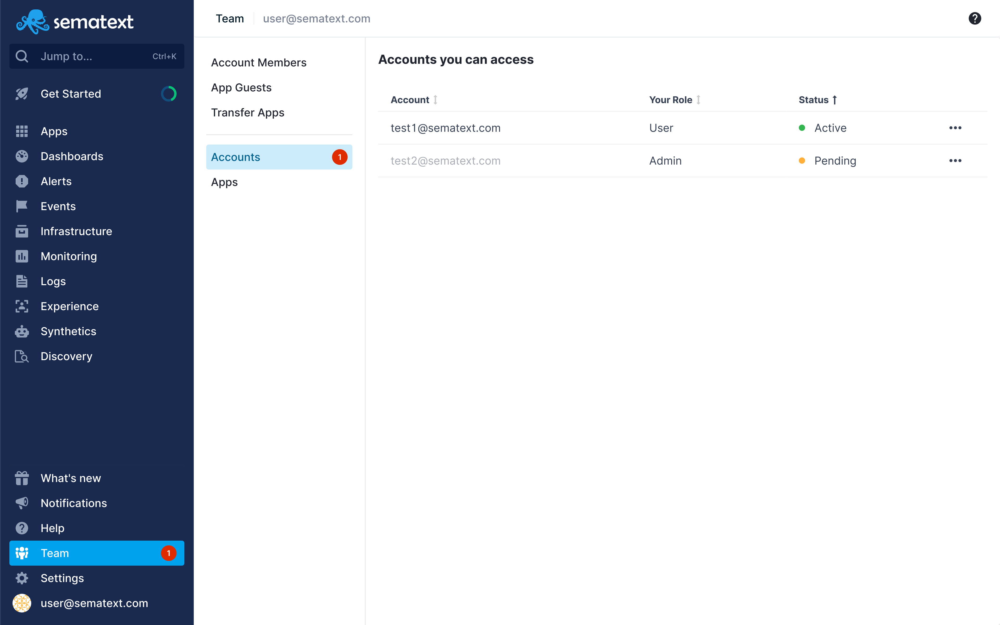

title: Sematext Account Members
description: Inviting team members to your account means they get access to all your Apps, dashboards, notification hooks, alert rules, and everything else!  

By inviting a user to your Account, you invite them to your **whole account**, 
so they get access to **all** your Apps, Dashboards, notification
hooks, alert rules, and integrations.

To share your Account with other users, go to the 
[Team page](https://apps.sematext.com/ui/team/account-members) on Sematext Cloud.

<video style="display:block; width:100%; height:auto;" controls autoplay loop>
  <source src="https://cdn.sematext.com/videos/account-members.mp4" type="video/mp4" />
</video>

## Accounts You Can Access

To see the list of all the accounts you can access click on the **Accounts** section. 

If you have a pending invite, a red circle is displayed next to the **Team** menu item in the main navigation 
as well as next to the **Accounts** section. 

Pending invites are in the **Pending** state and by clicking on the **three dots(...)** you will open 
the action menu that will give you options to **Accept** the invite, **Accept and switch to that account** or **Decline** the invite.

Accounts that you have access to are in the **Active** state and by clicking on the **three dots(...)** you 
will open the action menu that will give you an option to **Leave** that account.

