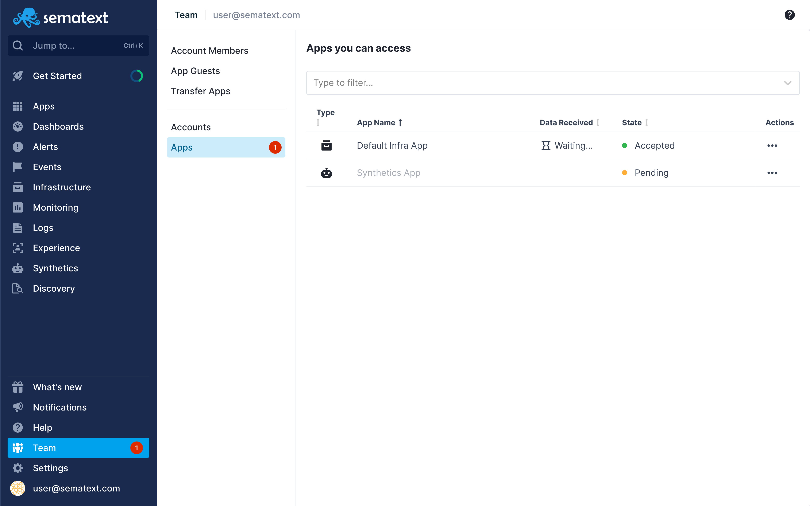
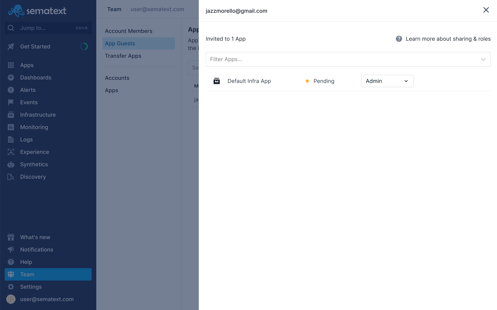

title: Sematext App Guests
description: App Sharing is restricted only to a particular app. Nothing besides the shared app is accessible to the invited user for example, dashboards are at the account level can can thus be shared only through Account Sharing.

App guests is **restricted only to a particular App**. Nothing besides the 
shared App is accessible to the invited user. 

*__Note__: Dashboards are at the account level can can thus be shared only through Account Members.*

This option is useful if you want to be restrictive about which Apps can be 
seen by others or what kind of effect they have on your team. 

By only configuring App guests, guests **can't see or edit alert rules** created 
by your team, they **can't use your team's notification hooks**, meaning they're 
**limited only to the App they have access to**.

To share one of your Apps with other users, go to the 
[App guests page](https://apps.sematext.com/ui/team/app-guests) on Sematext Cloud.

<video style="display:block; width:100%; height:auto;" controls autoplay loop>
  <source src="https://cdn.sematext.com/videos/app-guests.mp4" type="video/mp4" />
</video>

## Apps you can access

To see the list of all the apps you can access click on the **Apps** section. 

If you have a pending invite red circle is displayed next to the **Team** menu item in the main navigation 
as well as next to the **Apps** section. 

Pending invites are in the **Pending** state and by clicking on the **three dots(...)** you will open the action menu that will give you options to **Accept** or **Decline** the invite.

Apps that you have access to are in the **Accepted** state and by clicking on the **three dots(...)** you will open the action menu that will give you an option to **Leave** that app.

## Your apps that other users can access

To show the list of your apps that other users can access click on the **App Guests** section. For the detailed information about a specific user click on the member email and that will open a side modal with the list of all the apps the specific user has access to.

