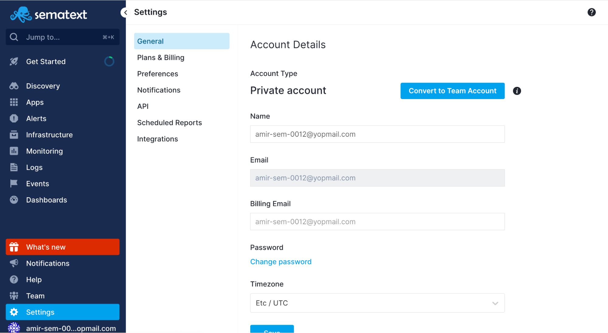
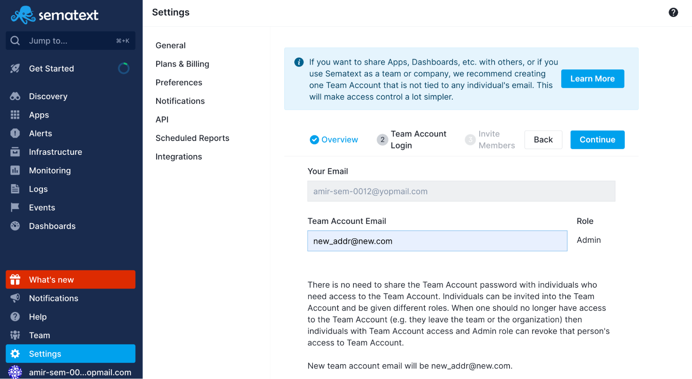

title: Sematext Team and Access Sharing
description: There are two levels of access rights. Account Members and App Guests. Inviting team members to your account means they get access to all your Apps, Dashboards, notification hooks, alert rules, and everything else! You can invite team members to individual Apps and access Apps you’ve been invited to. 

There are two levels of access rights: 

- **Account Members** - invite others to your **whole account**
- **App Guests** - invite others **only to a particular App**

And a third option called:

- **Transfer Apps** - transferring ownership status of an App to another user

You can assign three different Roles for users you give access to your account 
or particular Apps:

- **User**
- **Admin**
- **Billing Admin**

And a fourth option: 

- **Owner** - assigned if you transfer the ownership of an App to another user.

## Account Members vs. App Guests
Account members and App guests are not exclusive. You can use both of
these two access types at the same time. You could share your account with
some users, and share specific Apps with other users.  However, if you invite
another user to your account with an ADMIN role there is no point in also 
inviting them to any of your Apps - they will already have access to them just
by switching into your account.

## Account Members
By [inviting a user to your account](./account-members), you invite them to your **whole account**, 
so they get access to **all** your Apps, Dashboards, notification
hooks, alert rules, and integrations.

They can also create new Apps under your account and invite other users. 
Depending on the role you assign to invitees, they may be able to administer 
your Apps, Dashboards, users and even billing info (change App plan, assign 
credit card, etc). 

Account Sharing is very convenient because as soon as a new
Sematext App is added to your account or new Dashboard is created, all
users added to your account get access to it. Of course, the level of
access depends on the role you assigned to each person.

## App Guests
[App Guests](./app-guests) is **restricted only to a particular App**. Nothing besides the 
shared App is accessible to the invited user. 

*__Note__: Dashboards are at the account level and can thus be shared only through account Members.*

This option is useful if you want to be restrictive about which Apps can be 
seen by others or what kind of changes they can make. 

By only configuring App Guests, guests **can't see or edit alert rules** created 
by your team, they **can't use your team's notification hooks**, meaning they're 
**limited only to the App they have access to**.

## Transfer Apps
No level of Access can change the Owner status of an App. To transfer the 
ownership of an App, use the [Transfer Apps](./transfer-apps) feature. Click the **Start Ownership Transfer** 
button to open the side modal, select an App, click **Transfer to...** to proceed, enter the email of the
user you want to transfer the App to, and hit **Transfer Ownership**.

## Team Account
If you want to share Apps, Dashboards, etc. with others, or use Sematext as a team or company, we recommend creating one account that is not tied to any individual's email.  Instead, if you have a group/team email such as dev@... or engineering@... or monitoring@... or even sematext@... at your organization, we suggest you sign up with that email and then invite to that account everyone else who needs to be able to access Apps, Dashboards, Alert Rules, etc. in that account.  This way all assets created in Sematext remain in this team account and when individuals leave the company their access to this account can easily be removed with just a few clicks. 

Changing the ownership of the account can be done with the [Convert to Team Account](https://apps.sematext.com/ui/account/convert-to-team-account) ([EU] (https://apps.eusematext.com/ui/account/convert-to-team-account)) feature. By converting your account to a Team Account everything in your account will be transferred to the Team Account - Apps, Alert Rules, Dashboards, Payment Method, etc.
To start the conversion, go to [General Settings](https://apps.sematext.com/ui/account/info) ([EU](https://apps.eu.sematext.com/ui/account/info)) and press the Convert to Team Account button.

You will have a chance to review what will be transferred. In the second step, you will be prompted to insert the new team account email. In the third step, you will be able to edit existing team members and their roles in the team account, or even completely remove their access to the team account. Finally, in step four you will have an overview of the changes to the team and the chance to initiate the conversion. Once the conversion is initiated, you will be logged out of the Sematext account. You will then be able to use your old credentials to log in as a member of the new team account.
If there is anything in your account that you do not wish to have in the Team Account it needs to be deleted from your account first.  
After the conversion is done, your account with the old email login will be completely empty but you will have access to the Team Account and will be able to switch into it.

## Typical use of Roles in an Organization or Team
Typically you might have one person create an account by [signing up](https://apps.sematext.com/ui/registration). 
This account might be considered [a _parent_ account](./user-roles) for your whole organization or team.  

- [**Owner**](./user-roles/#owner) - that is the account itself and its role is called `OWNER`
- [**Admin**](./user-roles/#admin) - invited users can be given the `ADMIN` role, which gives them read, write, and invite rights 
- [**User**](./user-roles/#user) - the `USER` role grants read rights and limited write rights
- [**Billing Admin**](./user-roles/#billing-admin) - the `BILLING_ADMIN` is able to define, edit, and delete credit cards and choose plans to be used for Apps in the account.
