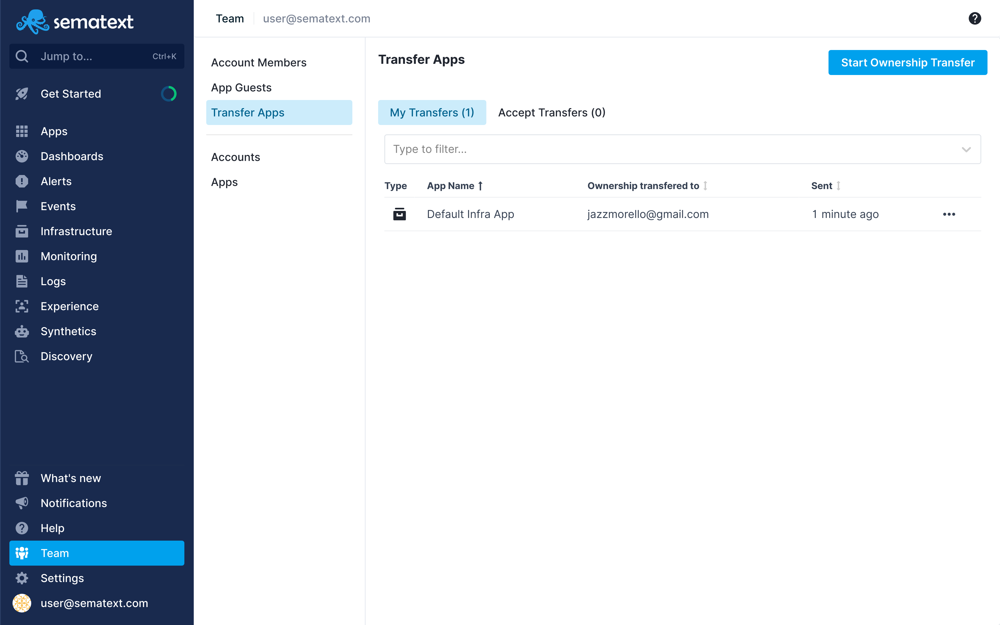
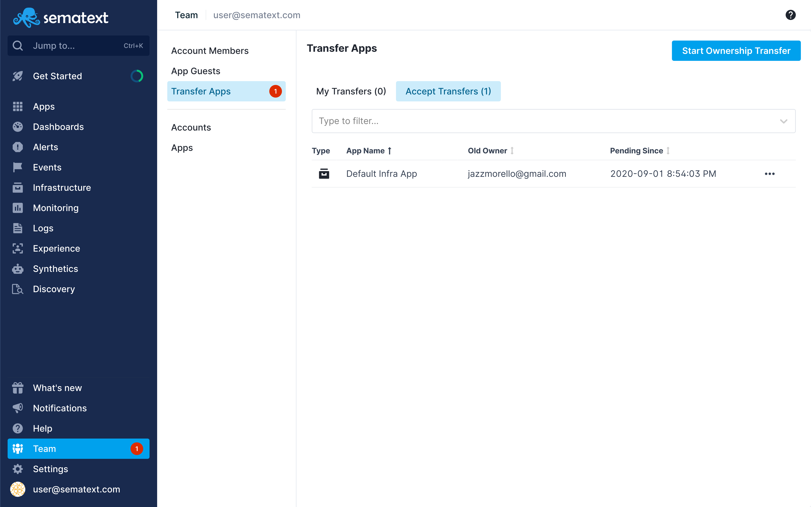

title: Sematext Transfer Apps
description: Inviting team members to your account means they get access to all your Apps, dashboards, notification hooks, alert rules, and everything else!

Only App Owner can change an App ownership by transferring that App to another user. To transfer the 
ownership of an App, use the Transfer Apps feature. Click the **Start Ownership Transfer** 
button to open the flyout, select an App, click **Transfer to...** to proceed, enter the email of the
user you want to transfer the App to, and hit **Transfer Ownership**.

*__Note__: Apps can be transferred only to existing Sematext users.*

To transfer one of your Apps to another user, go to the 
[Transfer Apps page](https://apps.sematext.com/ui/team/transfer-apps) in Sematext Cloud (or [Transfer Apps in Sematext Cloud EU](https://apps.eu.sematext.com/ui/team/transfer-apps)).

<video style="display:block; width:100%; height:auto;" controls autoplay loop>
  <source src="https://cdn.sematext.com/videos/transfer-apps.mp4" type="video/mp4" />
</video>

## My Transfers

To show the list of Apps that are in the process of being transfered to some user, and that user hasn’t accepted the transfer yet, click on the **My Transfers** section. 
By clicking on the **three dots(...)** you will open the action menu that will give you an option to **Cancel Transfer**.

## Accept Transfers

If you have a pending transfer, a red circle is displayed next to the **Team** menu item in the main navigation 
as well as next to the **Transfer Apps** section. 

The screenshot below shows the list of Apps that are being transferred to you by some user. By clicking on the **three dots(...)** you will open the action menu that will give you options to **Accept** or **Decline** transfer.

