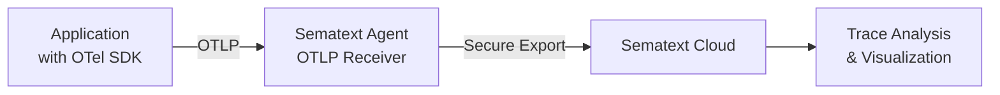

title: Sematext Tracing
description: Distributed tracing with OpenTelemetry for monitoring microservices, APIs, and distributed systems

## What is Sematext Tracing?

Sematext Tracing is a modern, OpenTelemetry-based distributed tracing solution that helps you monitor and troubleshoot complex microservices architectures and distributed systems. Built on the industry-standard OpenTelemetry protocol, it provides deep insights into your application's performance, latency patterns, and error propagation across services.

## Key Features

### OpenTelemetry Native
- **Industry Standard**: Built on OpenTelemetry (OTel), the vendor-neutral standard for observability
- **OTLP Support**: Native support for OpenTelemetry Protocol (OTLP) via HTTP and gRPC
- **Auto-Instrumentation**: Automatic instrumentation for popular frameworks and libraries
- **Language Support**: SDKs for Java, Python, Node.js, Go, .NET, Ruby, PHP, and more

### Comprehensive Trace Analysis
- **End-to-End Visibility**: Track requests across multiple services and infrastructure components
- **Service Maps**: Visualize service dependencies and communication patterns
- **Latency Analysis**: Identify performance bottlenecks with P50, P95, and P99 percentiles
- **Error Tracking**: Pinpoint errors and exceptions with detailed stack traces

### Powerful Search and Filtering
- **Traces Explorer**: Search and filter traces by service, operation, duration, and custom attributes
- **Timeline View**: Visualize trace distribution over time
- **Advanced Filters**: Filter by response status, span errors, database operations, and more

### Intelligent Alerting
- **Threshold-Based Alerts**: Set alerts on latency, error rates, and trace volume
- **Anomaly Detection**: Automatic detection of unusual patterns
- **Alert Integrations**: Connect with PagerDuty, Slack, email, and other notification channels

### Seamless Correlation
- **Logs Integration**: Jump from traces to related logs for deeper investigation
- **Metrics Correlation**: View infrastructure and application metrics alongside traces
- **Unified Observability**: Part of the complete Sematext Cloud observability platform

## How It Works

1. **Instrument Your Application**: Add OpenTelemetry SDK to your application (auto or manual instrumentation)
2. **Configure Sematext Agent**: Deploy Sematext Agent with OTLP receiver enabled
3. **Send Traces**: Your application sends traces to the local Sematext Agent
4. **View and Analyze**: Access traces through the Sematext Cloud UI

## Benefits

### Faster Problem Resolution
- Quickly identify the root cause of performance issues
- Understand error propagation across services
- Reduce mean time to resolution (MTTR)

### Optimize Performance
- Identify slow database queries and API calls
- Find inefficient service communication patterns
- Optimize critical user journeys

### Scale with Confidence
- Monitor distributed systems at any scale
- Understand system behavior under load
- Plan capacity based on real usage patterns

### Developer-Friendly
- Easy integration with existing code
- No vendor lock-in with OpenTelemetry
- Rich SDKs for all major languages

## Use Cases

- **Microservices Monitoring**: Track requests across complex microservices architectures
- **API Performance**: Monitor API latency and error rates
- **Database Performance**: Identify slow queries and connection issues
- **User Journey Analysis**: Understand end-to-end user experience
- **Troubleshooting**: Quickly diagnose production issues

## Getting Started

Ready to start tracing your applications?

1. [Create a Tracing App](/docs/tracing/create-tracing-app/) in Sematext Cloud
2. [Choose your SDK](/docs/tracing/sdks/) and instrument your application
3. [Install Sematext Agent](/docs/agents/sematext-agent/opentelemetry/) with OpenTelemetry support
4. [Explore your traces](/docs/tracing/reports/explorer/) and gain insights

## Related Documentation

- [OpenTelemetry Configuration](/docs/agents/sematext-agent/opentelemetry/)
- [Tracing SDKs](/docs/tracing/sdks/)
- [Tracing Alerts](/docs/tracing/alerts/creating-alerts/)
- [Troubleshooting](/docs/tracing/troubleshooting/)

## Need Help?

- **Documentation**: You're already here!
- **Support**: Contact us via [live chat](#) or [support@sematext.com](mailto:support@sematext.com)
- **Status**: Check [status.sematext.com](https://status.sematext.com) for service status